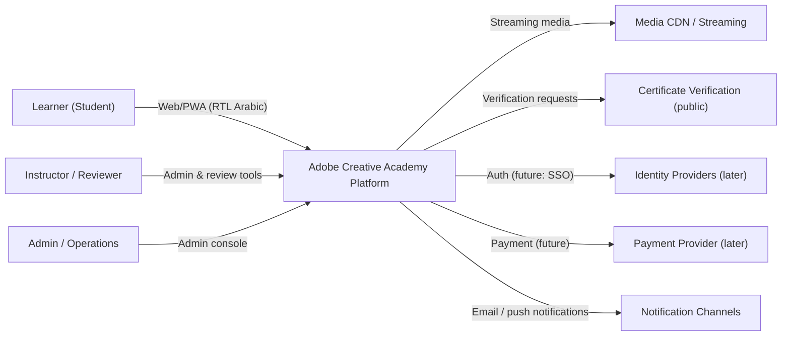
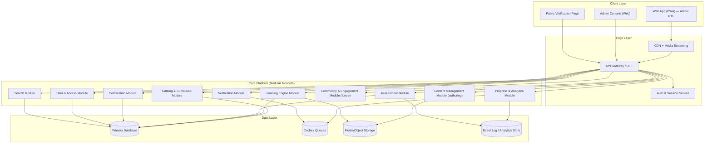

# 02 — System Architecture

> **Document ID:** DOC-02 · **Status:** Active · **Owner:** Lead Architect (role)

| Field | Value |
|-------|-------|
| **Title** | System Architecture |
| **Purpose** | Describes the overall system architecture, major components, subsystems, responsibilities, boundaries, dependencies, and future scalability of the Adobe Creative Academy platform. This document is the binding reference for all implementation work. |
| **Owner** | Lead Architect (role). The Project Foundation Architect is the interim owner. |
| **Version** | 1.0.0 |
| **Status** | Active |
| **Dependencies** | DOC-01 (vision); DOC-03 (curriculum shapes the learning engine); DOC-05 (database blueprint); DOC-09 (roadmap) |
| **Last Updated** | 2026-07-31 |
| **Review Cadence** | At every milestone; mandatory before any technology ADR (DOC-14) |

## Table of Contents

- [1. Architecture Principles](#1-architecture-principles)
- [2. System Context](#2-system-context)
- [3. Overall Architecture](#3-overall-architecture)
- [4. Major Components](#4-major-components)
- [5. Subsystems & Responsibilities](#5-subsystems--responsibilities)
- [6. Boundaries](#6-boundaries)
- [7. Dependencies](#7-dependencies)
- [8. Data & Content Flow](#8-data--content-flow)
- [9. Cross-Cutting Concerns](#9-cross-cutting-concerns)
- [10. Future Scalability](#10-future-scalability)
- [11. Technology Decisions](#11-technology-decisions)
- [Revision History](#revision-history)
- [Notes](#notes)
- [Cross References](#cross-references)

---

## 1. Architecture Principles

Every implementation in this project must satisfy these principles:

| # | Principle | Meaning |
|---|-----------|---------|
| AP-1 | **Documentation-driven** | All architecture changes start as an ADR (DOC-14) and an update to this document before code changes. |
| AP-2 | **Arabic-first, RTL-native** | The UI layer is built RTL-first. LTR is a future secondary concern (see DOC-06). |
| AP-3 | **Content/data separation** | Curriculum content is data, not code. The platform renders it; content changes never require application releases. |
| AP-4 | **Modular with clear boundaries** | The system is a modular monolith by default; modules communicate through defined interfaces. Microservices are only justified by measured scaling needs (AP-7). |
| AP-5 | **Mobile-first responsive** | All user-facing surfaces are responsive from 360 px up; the learning player is usable on phones (DOC-04). |
| AP-6 | **Accessible by default** | WCAG 2.2 AA conformance is a non-functional requirement of every component (DOC-06). |
| AP-7 | **Scale by design, not prematurely** | Design for horizontal scaling of stateless services and CDN-backed media; do not over-engineer at day one. |
| AP-8 | **Secure & privacy-respecting** | Learner data is PII; least-privilege access, audit logging, and regional data considerations apply (see DOC-15 risk R-T-06). |
| AP-9 | **Verifiable assessment integrity** | Assessment and certificate subsystems are designed so results are tamper-evident and verifiable (DOC-08). |
| AP-10 | **Observable** | Every service emits structured logs, metrics, and traces; the platform ships with dashboards. |

## 2. System Context

External systems enter scope only when an ADR (DOC-14) approves them. Currently: **none** are integrated — the platform will be built internally with provider decisions deferred (Open Decisions OPD-001…OPD-005).

## 3. Overall Architecture

The system is a **modular monolith**: one deployable application organized into strict internal modules (bounded contexts), with optional extraction of hot services (media, search, notifications) when metrics justify it. This maximizes development velocity for a small multi-agent team while keeping a clear path to scale.

**Layer rules:** Client → Edge → Core → Data. Lower layers never import higher layers. Modules inside Core may only communicate through their public interfaces (ports), never through each other's internals.

## 4. Major Components

| ID | Component | Type | Responsibility |
|----|-----------|------|----------------|
| C-01 | **Web App (PWA)** | Client | Learner-facing application: onboarding, catalog, learning player, assessments, progress, certificates, settings, notifications, search. Arabic RTL, mobile-first. Works offline for lesson content where licensed. |
| C-02 | **Admin Console** | Client | Operations-facing application: curriculum/content management, user administration, assessment moderation, certificate issuance control, analytics. Staff-only. |
| C-03 | **Public Verification Page** | Client | Public, unauthenticated page to verify certificate authenticity via serial number/QR. |
| C-04 | **API Gateway / BFF** | Edge | Single entry point, request validation, rate limiting, routing, and per-surface response shaping (learner BFF vs admin BFF). |
| C-05 | **Auth & Session Service** | Edge/Core | Authentication (email/password + OTP initially), sessions, roles, permissions enforcement, audit of security events. |
| C-06 | **Catalog & Curriculum Module** | Core | Stages/modules/lessons structure, learning paths, prerequisites, search indexing feed. |
| C-07 | **Learning Engine** | Core | Lesson player data flow, item sequencing, progress tracking, spaced repetition hooks, bookmarks. |
| C-08 | **Assessment Module** | Core | Quizzes, exercises, submissions, scoring, retake policy, rubric-based grading workflows. |
| C-09 | **Certification Module** | Core | Certificate eligibility evaluation, issuance, serial numbers, public verification, revocation. |
| C-10 | **Progress & Analytics Module** | Core | Learner progress aggregation, milestone events, analytics pipelines for product/learning analytics. |
| C-11 | **User & Access Module** | Core | Profiles, roles (student/instructor/admin), enrollments, consent records, preferences. |
| C-12 | **Content Management Module** | Core | Authoring/storage of curriculum content as structured data (JSON/Markdown + media), versioning, publishing workflow, translations. |
| C-13 | **Notification Module** | Core | In-app, email, push; preference management; batching; delivery audit. |
| C-14 | **Search Module** | Core | Full-text search over catalog, lessons, glossary; Arabic tokenization support; typo tolerance. |
| C-15 | **Community & Engagement Module** | Core (planned) | Forums, peer review, badges, streaks (future milestone — not in v1). |

## 5. Subsystems & Responsibilities

### 5.1 Learner Experience Subsystem
Components: C-01, C-04 (learner BFF), C-05, C-06, C-07, C-08, C-09, C-10, C-13, C-14.
**Responsibilities:** onboarding → catalog browsing → enrollment → learning → practice → assessment → progress → certificate. Owns all learner-facing flows in DOC-04.

### 5.2 Content Production Subsystem
Components: C-12, C-02 (authoring), media pipeline (C-12 + CDN).
**Responsibilities:** author curriculum content per DOC-03/DOC-07, review workflow (DOC-16), version, publish, and distribute content. Produces structured content packages consumed by the Learning Engine.

### 5.3 Assessment & Certification Subsystem
Components: C-08, C-09, C-10, C-03.
**Responsibilities:** implement DOC-08: scoring rules, passing thresholds, retake policy, rubric grading, certificate eligibility, issuance and public verification.

### 5.4 Operations & Administration Subsystem
Components: C-02, C-11, C-10.
**Responsibilities:** user administration, role management, enrollment operations, content moderation, support tooling, analytics dashboards.

### 5.5 Platform Foundation Subsystem
Components: C-04, C-05, C-13, data layer, observability, security tooling.
**Responsibilities:** everything that keeps the platform running: identity, reliability, monitoring, backups, compliance.

## 6. Boundaries

| Boundary | Rule |
|----------|------|
| **Client ↔ Edge** | Only through the API Gateway. No direct database access from clients. |
| **Edge ↔ Core** | Gateway authenticates and authorizes; Core never trusts client input without validation. |
| **Module ↔ Module (Core)** | Communication only through public interfaces. No shared mutable state across modules except through the data layer. |
| **Content ↔ Code** | Curriculum content (DOC-03 data) is versioned data, never compiled into the application. Platform and content release independently. |
| **Learner data ↔ Analytics** | Analytics consume anonymized/aggregated event streams; raw PII stays in the primary database with restricted access. |
| **Admin ↔ Learner** | Admin console has a separate authorization scope; admins cannot view learner assessment answers except in moderation workflows with audit trail. |
| **Now ↔ Future** | Components marked "planned/future" (C-15, IDP, PAY, native apps) are out of scope until a roadmap milestone + ADR approve them. |

## 7. Dependencies

### 7.1 Component dependency rules

- C-07 (Learning Engine) depends on C-06 (Catalog) — never the reverse.
- C-09 (Certification) depends on C-08 (Assessment) and C-10 (Progress) — certificates are computed, never hand-assigned (except admin revocation).
- C-10 (Analytics) depends on events emitted by C-07/C-08/C-09 — it never queries other modules' tables directly.
- C-12 (CMS) is independent of C-07 at the data level; C-07 consumes C-12's published content packages.
- C-13 (Notifications) is a consumer of events, not a source of truth for state.

### 7.2 External dependencies (planned, ADR-gated)

| Dependency | Purpose | Status |
|------------|---------|--------|
| Media CDN / streaming provider | Lesson video delivery | Open decision OPD-003 |
| Email delivery provider | Notifications | Open decision OPD-003 |
| Payment provider | Premium subscriptions | Open decision OPD-005 |
| Identity providers (SSO) | Enterprise login | Future (post-GA) |
| Adobe APIs/services | Software activation help content only — the academy does **not** sell or distribute Adobe software | N/A — prohibited (DOC-01 §9) |

## 8. Data & Content Flow

### 8.1 Content publishing flow
1. Authors/agents create content packages via CMS (C-12) per DOC-07 standards.
2. Content passes the DOC-16 quality gates and is versioned (semantic version per package).
3. Publishing promotes a package version to the catalog (C-06) and media to CDN.
4. Learning Engine (C-07) serves the published version to learners. Unpublished changes are invisible.

### 8.2 Learning flow
1. Learner authenticates (C-05) → catalog (C-06) → enrolls → progress record created (C-10).
2. Learner opens lesson → item sequence served by C-07 → media from CDN.
3. Exercise/quiz submissions → C-08 → score → progress updated (C-10) → eligibility events → notifications (C-13).
4. On stage/capstone completion → C-09 evaluates certificate eligibility → issues certificate → public verification (C-03).

### 8.3 Event backbone (design intent)
All state changes of consequence emit events (lesson completed, quiz passed, certificate issued). Events feed analytics (C-10), notifications (C-13), and future adaptive learning. Event schema is defined in DOC-05 (logical events).

## 9. Cross-Cutting Concerns

| Concern | Approach |
|---------|----------|
| **Security** | OWASP Top 10 as baseline; centralized auth (C-05); role-based access control; input validation at the gateway; secrets management; no PII in logs. |
| **Privacy** | Consent records per user; data export and deletion rights; regional data residency is an open decision (OPD-003/004). |
| **Observability** | Structured logs, metrics, distributed traces; uptime SLO 99.5% post-GA (DOC-01 M-16). |
| **Accessibility** | WCAG 2.2 AA in every component's Definition of Done (DOC-06, DOC-16). |
| **RTL** | RTL is the default direction; logical CSS properties; mirroring rules in DOC-06. |
| **Internationalization** | Arabic (primary) and English (UI strings) from day one via a string catalog; content translation pipeline later. |
| **Backups & DR** | Automated backups of databases and content; tested restore procedure; RPO ≤ 24h, RTO ≤ 4h (targets). |
| **Environment strategy** | Development → Staging → Production. Content may publish to staging for review before production promotion. |

## 10. Future Scalability

| Driver | Scaling Strategy |
|--------|------------------|
| Learner growth (10k → 1M) | Stateless API behind gateway scales horizontally; sessions move to shared cache; read-heavy catalog/content served via CDN edge. |
| Media load | CDN + streaming provider absorbs most traffic; media transcoding pipeline scales independently. |
| Content growth | Content is data — scale the CMS/review pipeline, not the platform. |
| Analytics volume | Event stream → analytics store (columnar) decoupled from transactional DB. |
| Extraction path | If modules (e.g., Search, Notifications) show sustained hot spots, they are extracted one at a time behind their existing public interfaces (AP-4/AP-7). |
| Multi-language | Content packages become language-versioned; platform string catalogs already support it (DOC-07). |
| Enterprise LMS | Add tenant layer + SCORM/LTI/SSO behind the same catalog/assessment APIs; gate by roadmap milestone. |
| Offline/mobile native | PWA-first; native apps later reuse the same APIs (C-04 BFFs). |

## 11. Technology Decisions

- **Decided:** modular monolith default (AP-4), RTL-first UI, content-as-data (AP-3), event-driven integration within the monolith.
- **Open (ADR-gated):** programming languages/frameworks, primary database product, hosting/cloud provider, media pipeline, payment provider, search engine. All are tracked as **Open Decisions OPD-001…OPD-005** in [DOC-14](14_DECISION_LOG.md). **No agent may select a technology stack without an approved ADR.**
- **Deferred by policy:** micro-frontends, Kubernetes-based orchestration, machine-learning services — only when metrics justify.

---

## Revision History

| Version | Date | Author | Summary of Changes |
|---------|------|--------|--------------------|
| 1.0.0 | 2026-07-31 | Project Foundation Architect | Initial baseline (DOC-02). |

## Notes

- Mermaid diagrams render on GitHub; when a diagram and text conflict, the **text** is authoritative.
- This document is architecture-intent. Concrete API contracts, data schemas, and deployment topology will be detailed in milestone-specific design documents (created later, per DOC-09).

## Cross References

| Reference | Relationship |
|-----------|--------------|
| [DOC-01 Project Vision](01_PROJECT_VISION.md) | Vision → architecture requirements |
| [DOC-04 UI Blueprint](04_UI_BLUEPRINT.md) | Screens consumed by C-01/C-02 |
| [DOC-05 Database Blueprint](05_DATABASE_BLUEPRINT.md) | Logical data model for the data layer |
| [DOC-06 Design System](06_DESIGN_SYSTEM.md) | UI/RTL/accessibility constraints |
| [DOC-08 Assessment Standard](08_ASSESSMENT_STANDARD.md) | Rules implemented by C-08/C-09 |
| [DOC-09 Project Roadmap](09_PROJECT_ROADMAP.md) | Build order of components |
| [DOC-14 Decision Log](14_DECISION_LOG.md) | ADRs + open decisions |
| [DOC-15 Risk Register](15_RISK_REGISTER.md) | Technical/performance risks |
