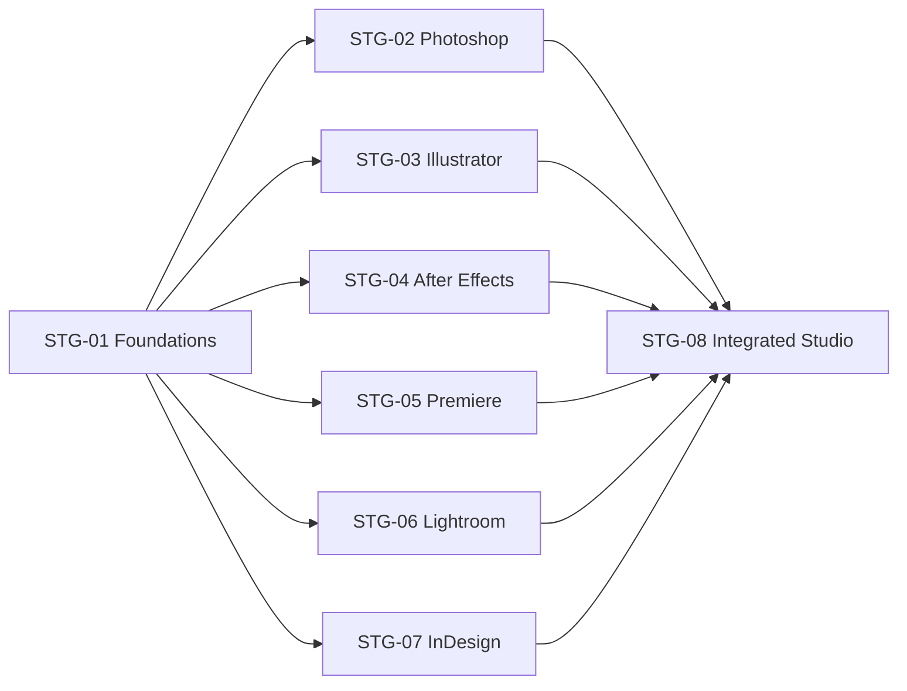
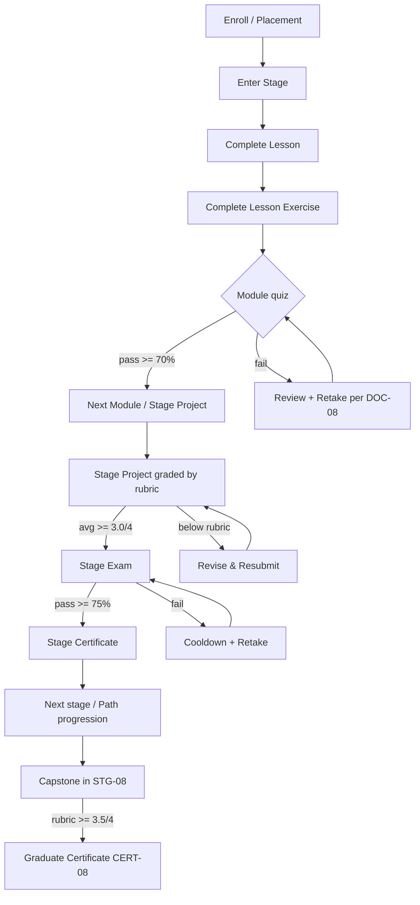

# 03 — Curriculum Blueprint

> **Document ID:** DOC-03 · **Status:** Active · **Owner:** Curriculum Director (role)

| Field | Value |
|-------|-------|
| **Title** | Curriculum Blueprint |
| **Purpose** | Defines the complete curriculum **skeleton** for the academy: stages, modules, lesson titles, learning paths, relationships, dependencies, durations, difficulty, and completion flow. **This document contains structure only — no lesson content, exercises, or quizzes are defined here** (those live under DOC-07/DOC-08 rules and are produced per roadmap milestones). |
| **Owner** | Curriculum Director (role) |
| **Version** | 1.0.0 |
| **Status** | Active |
| **Dependencies** | DOC-01 (personas & philosophy), DOC-07 (content standards), DOC-08 (assessment standard) |
| **Last Updated** | 2026-07-31 |
| **Review Cadence** | Quarterly; immediately after every Adobe major release or content pipeline change |

## Table of Contents

- [1. Curriculum Design Principles](#1-curriculum-design-principles)
- [2. Taxonomy & Naming Conventions](#2-taxonomy--naming-conventions)
- [3. Curriculum Overview](#3-curriculum-overview)
- [4. Stage 1 — Foundations of Creative Computing](#4-stage-1--foundations-of-creative-computing)
- [5. Stage 2 — Photoshop Mastery](#5-stage-2--photoshop-mastery)
- [6. Stage 3 — Illustrator](#6-stage-3--illustrator)
- [7. Stage 4 — After Effects & Motion Design](#7-stage-4--after-effects--motion-design)
- [8. Stage 5 — Premiere Pro & Video Editing](#8-stage-5--premiere-pro--video-editing)
- [9. Stage 6 — Lightroom & Photography](#9-stage-6--lightroom--photography)
- [10. Stage 7 — InDesign & Editorial Design](#10-stage-7--indesign--editorial-design)
- [11. Stage 8 — Integrated Studio & Capstone](#11-stage-8--integrated-studio--capstone)
- [12. Learning Paths](#12-learning-paths)
- [13. Prerequisites & Dependencies](#13-prerequisites--dependencies)
- [14. Durations & Difficulty](#14-durations--difficulty)
- [15. Completion Flow](#15-completion-flow)
- [16. Certificates & Badges](#16-certificates--badges)
- [17. Curriculum Versioning & Update Policy](#17-curriculum-versioning--update-policy)
- [Revision History](#revision-history)
- [Notes](#notes)
- [Cross References](#cross-references)

---

## 1. Curriculum Design Principles

| # | Principle | Meaning |
|---|-----------|---------|
| CP-1 | **Skeleton first** | This blueprint is the contract for what exists. Content producers (agents) create lessons only for modules listed here, one module at a time, per DOC-09 milestones. |
| CP-2 | **Produce, don't just watch** | Every module ends with a production exercise or project; every stage ends with a stage project and stage exam (DOC-08). |
| CP-3 | **Arabic-first** | All lesson titles, content, and UI terminology are Arabic-primary with English industry terms in parentheses (DOC-07). |
| CP-4 | **Small chunks** | Lessons ≤ 20 min of instruction; modules are coherent 4–8 h units. |
| CP-5 | **Explicit dependencies** | Nothing is hidden. Prerequisites are declared (§13) and enforced by the platform (DOC-02 C-06). |
| CP-6 | **Version-aware** | The curriculum tracks Adobe app versions; content is updated per §17. |
| CP-7 | **Pathways serve personas** | §12 paths map to personas P-01…P-06 (DOC-01 §5). |
| CP-8 | **Consistent lesson anatomy** | Every lesson follows the template in DOC-07 §3 (objectives → demonstrate → explain → practice → assess → summary). |

## 2. Taxonomy & Naming Conventions

| Level | ID pattern | Example | Owned by |
|-------|-----------|---------|----------|
| Stage | `STG-0X` | STG-02 | Curriculum Director |
| Module | `MOD-0XYY` (stage + sequence) | MOD-0203 | Curriculum Director |
| Lesson | `LES-0XYYZZ` (module + sequence) | LES-020305 | Content producer |
| Learning Path | `PATH-0X` | PATH-01 | Curriculum Director |
| Certificate | `CERT-0X` | CERT-02 | Curriculum Director + Assessment |
| Badge | `BDG-0X` | BDG-01 | Product owner |

**Rules:** IDs are permanent. A retired module is marked `RETIRED` (never renumbered). Titles are stored in Arabic (canonical) with an English working title for documentation; the canonical Arabic title is authoritative in product surfaces.

**Difficulty levels:** `B1` Beginner → `B2` Beginner+ · `I1` Intermediate → `I2` Intermediate+ · `A1` Advanced → `A2` Advanced+. Each level has a published descriptor in DOC-08 §5.

**Durations:** All durations are *learner-effort* estimates (instruction + practice). Video lengths are shorter (DOC-07 §6).

## 3. Curriculum Overview

| Stage | Title | Difficulty | Effort | Modules | Status |
|-------|-------|-----------|--------|---------|--------|
| STG-01 | Foundations of Creative Computing | B1 | 10 h | 4 | Not started |
| STG-02 | Photoshop Mastery | B1→A1 | 40 h | 5 | Not started |
| STG-03 | Illustrator | B1→I2 | 32 h | 4 | Not started |
| STG-04 | After Effects & Motion Design | B1→I2 | 32 h | 4 | Not started |
| STG-05 | Premiere Pro & Video Editing | B1→I2 | 28 h | 4 | Not started |
| STG-06 | Lightroom & Photography | B1→I1 | 24 h | 4 | Not started |
| STG-07 | InDesign & Editorial Design | B1→I2 | 20 h | 4 | Not started |
| STG-08 | Integrated Studio & Capstone | I1→A2 | 24 h | 4 | Not started |
| **Total** | | | **210 h** | **33 modules** | |

## 4. Stage 1 — Foundations of Creative Computing

**STG-01 · Difficulty B1 · 10 h · Prerequisites: none**

| Module | Title | Difficulty | Effort | Lessons (LES IDs → titles) |
|--------|-------|-----------|--------|-----------------------------|
| MOD-0101 | Welcome & Platform Orientation | B1 | 2 h | LES-010101 التعارف مع الأكاديمية ومنصة التعلم (Welcome & Platform Tour) · LES-010102 كيف نتعلم وننتج (How We Learn & Produce) · LES-010103 تجهيز جهازك ومساحة العمل (Workspace & Setup) · LES-010104 التعامل مع ملفات الوسائط الأساسية (Core Media Files) |
| MOD-0102 | Design Fundamentals | B1 | 4 h | LES-010201 أساسيات التكوين البصري (Composition) · LES-010202 نظرية الألوان عمليًا (Color Theory in Practice) · LES-010203 أساسيات الخط العربي والطباعة (Arabic Typography Basics) · LES-010204 الشبكات والتخطيط (Grids & Layout) · LES-010205 النقد والتغذية الراجعة الاحترافية (Critique & Feedback) |
| MOD-0103 | Digital Color & File Standards | B1 | 2 h | LES-010301 نماذج الألوان الرقمية (RGB/CMYK/HEX) · LES-010302 دقة الصورة وإعادة التحجيم (Resolution & Resizing) · LES-010303 الصيغ والضغط (Formats & Compression) · LES-010304 إدارة الأصول وترخيصها (Asset Management & Licensing) |
| MOD-0104 | Orientation Assessment & Path Selection | B1 | 2 h | LES-010401 تقييم تحديد المستوى (Placement Assessment) · LES-010402 اختيار مسارك التعليمي (Learning Path Selection) · LES-010403 خطة التعلم الشخصية (Personal Learning Plan) |

**Stage completion:** STG-01 project (personal learning plan + 3 self-produced practice pieces) + STG-01 exam → CERT-01.

## 5. Stage 2 — Photoshop Mastery

**STG-02 · Difficulty B1→A1 · 40 h · Prerequisites: STG-01**

| Module | Title | Difficulty | Effort | Lessons |
|--------|-------|-----------|--------|---------|
| MOD-0201 | Photoshop Fundamentals | B1 | 8 h | LES-020101 واجهة فوتوشوب وسير العمل (Interface & Workflow) · LES-020102 التحديدات (Selections) · LES-020103 الطبقات (Layers) · LES-020104 الأقنعة (Masks) · LES-020105 التعديلات الأساسية (Basic Adjustments) · LES-020106 الحفظ والتصدير (Saving & Exporting) |
| MOD-0202 | Retouching & Photo Editing | B2 | 8 h | LES-020201 سير العمل غير الهدّام (Non-Destructive Workflow) · LES-020202 أدوات الإصلاح والاستنساخ (Healing & Clone Tools) · LES-020203 تنقيح البشرة (Skin Retouching) · LES-020204 فصل الترددات (Frequency Separation) · LES-020205 تدرج الألوان (Color Grading) · LES-020206 معالجة صور احترافية (Professional Photo Polish) |
| MOD-0203 | Compositing & Effects | I1 | 8 h | LES-020301 الأقنعة المتقدمة (Advanced Masking) · LES-020302 أوضاع المزج (Blend Modes) · LES-020303 الكائنات الذكية (Smart Objects) · LES-020304 المرشحات الذكية (Smart Filters) · LES-020305 الظلال والإضاءة الواقعية (Realistic Shadows & Light) · LES-020306 تركيب المشاهد (Scene Compositing) |
| MOD-0204 | Design & Production | I2 | 8 h | LES-020401 التصميم لوسائل التواصل (Social Media Design Kits) · LES-020402 تصميم الملصقات (Poster Design) · LES-020403 الماكيتات والنماذج (Mockups) · LES-020404 الأتمتة والإجراءات (Actions & Automation) · LES-020405 المعالجة المجمعة (Batch Processing) · LES-020406 إنتاج هوية بصرية كاملة (Full Brand Kit Production) |
| MOD-0205 | Photoshop Professional Practice | A1 | 8 h | LES-020501 سير العمل مع العملاء (Client Workflow) · LES-020502 تسليم الملفات (File Handoff) · LES-020503 التكامل مع إليستريتور (Photoshop ↔ Illustrator Integration) · LES-020504 مشروع ختامي: حملة بصرية (Capstone: Visual Campaign) |

**Stage completion:** STG-02 stage project (complete visual campaign) + STG-02 exam → CERT-02 (Photoshop).

## 6. Stage 3 — Illustrator

**STG-03 · Difficulty B1→I2 · 32 h · Prerequisites: STG-01 (STG-02 recommended)**

| Module | Title | Difficulty | Effort | Lessons |
|--------|-------|-----------|--------|---------|
| MOD-0301 | Illustrator Fundamentals | B1 | 8 h | LES-030101 أساسيات المتجهات (Vector Basics) · LES-030102 أداة القلم (Pen Tool Mastery) · LES-030103 الأشكال والمسارات (Shapes & Paths) · LES-030104 الألوان والتدرجات في إليستريتور (Color & Gradients) · LES-030105 اللوحات الفنية (Artboards) · LES-030106 تنظيم العمل (Work Organization) |
| MOD-0302 | Drawing & Typography | B1 | 8 h | LES-030201 أدوات الرسم والفرش (Drawing Tools & Brushes) · LES-030202 الطباعة المتقدمة (Advanced Typography) · LES-030203 النص على المسارات (Type on Path) · LES-030204 الأنماط والأشكال (Styles & Symbols) · LES-030205 الخط العربي في إليستريتور (Arabic Calligraphy & Type) · LES-030206 مشروع: ملصق تيبوغرافي (Project: Typographic Poster) |
| MOD-0303 | Logo & Brand Design | I1 | 8 h | LES-030301 منهجية تصميم الشعار (Logo Design Process) · LES-030302 الشبكات الهندسية للشعارات (Logo Construction Grids) · LES-030303 أنظمة الهوية البصرية (Brand Identity Systems) · LES-030304 عرض الهوية للعميل (Presenting Identity Work) · LES-030305 مشروع: هوية كاملة (Project: Complete Identity) |
| MOD-0304 | Advanced Vector Production | I2 | 8 h | LES-030401 الأنماط والزخارف (Patterns & Ornaments) · LES-030402 التأثيرات ثلاثية الأبعاد (3D & Effects) · LES-030403 التصدير للطباعة والويب (Print & Web Export) · LES-030404 الأتمتة في إليستريتور (Automation & Scripts) · LES-030405 التكامل مع فوتوشوب (Illustrator ↔ Photoshop) · LES-030406 مشروع ختامي: هوية المتجر (Capstone: Store Identity) |

**Stage completion:** STG-03 stage project (full identity system) + STG-03 exam → CERT-03 (Illustrator).

## 7. Stage 4 — After Effects & Motion Design

**STG-04 · Difficulty B1→I2 · 32 h · Prerequisites: STG-01 (STG-02 strongly recommended)**

| Module | Title | Difficulty | Effort | Lessons |
|--------|-------|-----------|--------|---------|
| MOD-0401 | Motion Fundamentals | B1 | 8 h | LES-040101 الخط الزمني والتركيب (Timeline & Composition) · LES-040102 الكادرات المفتاحية (Keyframes) · LES-040103 التخفيف والحركة الواقعية (Easing & Motion) · LES-040104 تحويل الطبقات (Layer Transform) · LES-040105 المعاينة والإطارات (Precomps & Views) · LES-040106 مشروع: حركة شعار (Project: Logo Animation) |
| MOD-0402 | Animation & Effects | B2 | 8 h | LES-040201 طبقات الشكل (Shape Layers) · LES-040202 تحريك النصوص (Text Animation) · LES-040203 الأقنعة ومسارات الاقتصاص (Masks & Track Mattes) · LES-040204 المؤثرات (Effects & Presets) · LES-040205 الحركة بالتدريج (Animating with Ease) · LES-040206 مشروع: عنوان افتتاحي (Project: Title Sequence) |
| MOD-0403 | Motion Graphics Design | I1 | 8 h | LES-040301 تصميم الموشن جرافيك (Motion Graphics Design) · LES-040302 الشارات السفلية (Lower Thirds) · LES-040303 الإنفوجرافيك المتحرك (Animated Infographics) · LES-040304 أساسيات التعبيرات (Expressions Basics) · LES-040305 الإنتاج الاحترافي (Professional Production) · LES-040306 مشروع: إعلان متحرك (Project: Animated Ad) |
| MOD-0404 | VFX & Compositing | I2 | 8 h | LES-040401 المفاتيح والخلفيات الخضراء (Keying & Green Screen) · LES-040402 التتبع (Tracking) · LES-040403 الرسم بالفرشاة (Roto & Cleanup) · LES-040404 تصحيح الألوان للفيديو (Video Color Correction) · LES-040405 التصدير والترميز (Rendering & Codecs) · LES-040406 مشروع ختامي: مشهد مركب (Capstone: Composite Scene) |

**Stage completion:** STG-04 stage project (60-second motion piece) + STG-04 exam → CERT-04 (Motion Design).

## 8. Stage 5 — Premiere Pro & Video Editing

**STG-05 · Difficulty B1→I2 · 28 h · Prerequisites: STG-01**

| Module | Title | Difficulty | Effort | Lessons |
|--------|-------|-----------|--------|---------|
| MOD-0501 | Video Foundations | B1 | 6 h | LES-050101 أساسيات الفيديو (Video Basics) · LES-050102 إعداد المشروع والتسلسل (Project & Sequence Setup) · LES-050103 استيراد الوسائط وتنظيمها (Media Import & Organization) · LES-050104 مشروع: تجميع لقطات (Project: Assembling Footage) |
| MOD-0502 | Editing | B2 | 8 h | LES-050201 فن القص (The Art of the Cut) · LES-050202 أدوات التحرير (Editing Tools) · LES-050203 التحرير متعدد الكاميرات (Multicam Editing) · LES-050204 الصوت الأساسي (Basic Audio) · LES-050205 الانتقالات (Transitions) · LES-050206 مشروع: فيديو سوشيال (Project: Social Video) |
| MOD-0503 | Color & Audio | I1 | 7 h | LES-050301 تصحيح ألوان لوميتري (Lumetri Color) · LES-050302 خلط الصوت (Audio Mixing) · LES-050303 العناوين والجرافيك (Titles & Graphics) · LES-050304 مشروع: مونتاج متكامل (Project: Full Edit) |
| MOD-0504 | Delivery & Publishing | I1 | 7 h | LES-050401 التصدير والترميز (Export & Codecs) · LES-050402 الصور المصغرة والوصف (Thumbnails & Metadata) · LES-050403 النشر لمنصات عربية (Publishing for Regional Platforms) · LES-050404 مشروع ختامي: قصة كاملة (Capstone: Complete Story) |

**Stage completion:** STG-05 stage project (2–3 min edited video) + STG-05 exam → CERT-05 (Video Editing).

## 9. Stage 6 — Lightroom & Photography

**STG-06 · Difficulty B1→I1 · 24 h · Prerequisites: STG-01 (STG-02 recommended)**

| Module | Title | Difficulty | Effort | Lessons |
|--------|-------|-----------|--------|---------|
| MOD-0601 | Photography Foundations | B1 | 6 h | LES-060101 مثلث التعريض (Exposure Triangle) · LES-060102 أساسيات الكاميرا (Camera Basics) · LES-060103 صيغ الصور والملفات (Raw & File Formats) · LES-060104 التكوين الفوتوغرافي (Photographic Composition) |
| MOD-0602 | Lightroom Library & Develop | B2 | 8 h | LES-060201 الكتالوج والإدارة (Catalog & Management) · LES-060202 الفرز والتصنيف (Culling & Rating) · LES-060203 وحدة التطوير (Develop Module) · LES-060204 التصحيحات والانتقائية (Corrections & Selective Edits) · LES-060205 الإعدادات المسبقة (Presets & Profiles) · LES-060206 معالجة صورة كاملة (Project: Full Image Workflow) |
| MOD-0603 | Advanced Photo Workflow | I1 | 6 h | LES-060301 الدمج عالي المدى (HDR & Panoramas) · LES-060302 الأقنعة المتقدمة (Advanced Masks) · LES-060303 المعالجة المجمعة والمزامنة (Batch & Sync) · LES-060304 فوتوشوب ولايتروم معًا (Lightroom ↔ Photoshop) |
| MOD-0604 | Portfolio & Export | I1 | 4 h | LES-060401 تصدير للمنصات والطباعة (Export for Web & Print) · LES-060402 بناء معرض أعمال (Building a Portfolio) · LES-060403 مشروع ختامي: مجموعة مصورة (Capstone: Photo Series) |

**Stage completion:** STG-06 stage project (photo series of 8–12 images) + STG-06 exam → CERT-06 (Photography).

## 10. Stage 7 — InDesign & Editorial Design

**STG-07 · Difficulty B1→I2 · 20 h · Prerequisites: STG-01, STG-03 recommended**

| Module | Title | Difficulty | Effort | Lessons |
|--------|-------|-----------|--------|---------|
| MOD-0701 | InDesign Fundamentals | B1 | 6 h | LES-070101 إعداد المستند (Document Setup) · LES-070102 الإطارات والأطراف (Frames & Margins) · LES-070103 الصفحات الرئيسية (Master Pages) · LES-070104 الأنماط (Styles & Formatting) · LES-070105 النص العربي في إن ديزاين (Arabic Text in InDesign) |
| MOD-0702 | Editorial Layout | I1 | 6 h | LES-070201 الشبكات التحريرية (Editorial Grids) · LES-070202 المستندات الطويلة (Long Documents) · LES-070203 الجداول والرسوم (Tables & Graphics) · LES-070204 ملف PDF تفاعلي (Interactive PDF) |
| MOD-0703 | Production & Print | I1 | 4 h | LES-070301 الفحص المسبق (Preflight) · LES-070302 التغليف والتسليم (Packaging & Handoff) · LES-070303 مواصفات الطباعة (Print Specifications) |
| MOD-0704 | Publishing Portfolio | I2 | 4 h | LES-070401 النشر الرقمي (Digital Publishing) · LES-070402 مشروع ختامي: مجلة عربية (Capstone: Arabic Magazine) |

**Stage completion:** STG-07 stage project (16+ page Arabic publication) + STG-07 exam → CERT-07 (Editorial Design).

## 11. Stage 8 — Integrated Studio & Capstone

**STG-08 · Difficulty I1→A2 · 24 h · Prerequisites: any two completed specialist stages + STG-01**

| Module | Title | Difficulty | Effort | Lessons |
|--------|-------|-----------|--------|---------|
| MOD-0801 | Cross-App Workflows | I1 | 6 h | LES-080101 مكتبات أدوبي الإبداعية (Creative Cloud Libraries) · LES-080102 سير عمل متعدد التطبيقات (Round-Trip Workflows) · LES-080103 القوالب والمكونات (Templates & Components) · LES-080104 فريق العمل والتعاون (Team Collaboration) |
| MOD-0802 | Professional Practice | I2 | 6 h | LES-080201 التعامل مع العملاء (Client Management) · LES-080202 الموجز الإبداعي (Creative Briefs) · LES-080203 التسعير والعقود (Pricing & Contracts) · LES-080204 التسويق الشخصي (Self-Marketing & Branding) |
| MOD-0803 | Capstone Project | A1 | 10 h | LES-080301 اختيار التخصص والمشروع (Capstone Selection) · LES-080302 خطة المشروع (Project Plan) · LES-080303 تنفيذ المرحلة الأولى (Execution I) · LES-080304 تنفيذ المرحلة الثانية (Execution II) · LES-080305 العرض النهائي (Final Presentation) |
| MOD-0804 | Graduation & Certification | A2 | 2 h | LES-080401 مراجعة نهائية شاملة (Final Comprehensive Review) · LES-080402 التقييم النهائي (Final Assessment) · LES-080403 شهادة التخرج وخطة المسار (Graduation & Career Roadmap) |

**Stage completion:** capstone project (portfolio piece) graded by rubric (DOC-08) + final exam ≥ 80% → CERT-08 (Academy Graduate).

## 12. Learning Paths

Paths are guided sequences of stages/modules tailored to personas (DOC-01 §5). A learner may switch paths at any time; progress is retained per module.

| Path | Title | Audience | Sequence | Certificates on completion |
|------|-------|----------|----------|---------------------------|
| PATH-01 | Digital Design Professional | P-01, P-03, P-06 | STG-01 → STG-02 → STG-03 → STG-07 → STG-08 | CERT-01, 02, 03, 07, 08 |
| PATH-02 | Motion & Video Professional | P-04, P-06 | STG-01 → STG-02 (MOD-0201–0203) → STG-04 → STG-05 → STG-08 | CERT-01, 02 (partial badge), 04, 05, 08 |
| PATH-03 | Photography Professional | P-05 | STG-01 → STG-02 (MOD-0201, 0202) → STG-06 → STG-08 | CERT-01, 02 (partial badge), 06, 08 |
| PATH-04 | Creative All-Rounder (Full Studio) | P-01, P-03 | STG-01 → 02 → 03 → 04 → 05 → 06 → 07 → 08 (full order) | CERT-01…08 |
| PATH-05 | Express: Social Media Creator | P-02 | STG-01 → STG-02 (MOD-0201, 0204) → STG-05 (MOD-0502) → STG-08 (MOD-0802) | CERT-01 + badges |

**Path rules:** a path may declare *required* modules and *elective* modules. Electives do not block path completion. Express paths (PATH-05) do not award stage certificates, only badges (see DOC-08 §7).

## 13. Prerequisites & Dependencies

### 13.1 Stage-level dependency graph

### 13.2 Module-level dependency rules

- STG-01 is the universal prerequisite and the only stage with no prerequisites.
- Within a stage, modules must be completed in numeric order (MOD-0X01 before MOD-0X02, etc.).
- Cross-stage module dependencies are limited to those declared in path tables (§12) and these explicit rules:
  - MOD-0401 (AE) assumes basic layer knowledge from MOD-0201 (PS).
  - MOD-0503 (color) assumes MOD-0205-grade color concepts; learners without STG-02 may complete a 1-hour color refresher module (add-on, not a blocker).
  - MOD-0801 (cross-app) requires completion of at least one specialist module in two different apps.
- Assessment gates are dependencies: a module is "complete" only after its module quiz is passed (DOC-08).

### 13.3 Soft dependencies

- English industry terminology is introduced progressively; no English fluency is required.
- Learners with prior experience may test out of STG-01 via the placement assessment (MOD-0104).

## 14. Durations & Difficulty

### 14.1 Learner-effort budget per lesson

| Item | Budget |
|------|--------|
| Video instruction per lesson | 5–15 min (DOC-07 §6) |
| Guided practice per lesson | 10–20 min |
| Exercise per lesson | 15–30 min |
| Module quiz | 15–25 min |
| Stage project | 3–6 h |
| Stage exam | 60–90 min |
| Capstone project | 20–30 h total (10 h of curriculum time) |

### 14.2 Difficulty descriptors (binding for labeling)

| Level | Label (AR) | Learner profile |
|-------|-----------|-----------------|
| B1 | مبتدئ (Beginner) | No prior experience with the app; follows step-by-step |
| B2 | مبتدئ متقدم (Beginner+) | Knows the interface; needs guided workflow practice |
| I1 | متوسط (Intermediate) | Comfortable with core tools; learns advanced techniques |
| I2 | متوسط متقدم (Intermediate+) | Works independently; optimizes workflows |
| A1 | متقدم (Advanced) | Handles complex projects; professional-grade output |
| A2 | متقدم جدًا (Advanced+) | Expert-level integration, judgment, and presentation |

### 14.3 Total effort table

| Stage | Instruction | Practice | Project + Exam | Total |
|-------|-------------|----------|----------------|-------|
| STG-01 | 5 h | 3 h | 2 h | 10 h |
| STG-02 | 20 h | 12 h | 8 h | 40 h |
| STG-03 | 16 h | 10 h | 6 h | 32 h |
| STG-04 | 16 h | 10 h | 6 h | 32 h |
| STG-05 | 14 h | 8 h | 6 h | 28 h |
| STG-06 | 12 h | 8 h | 4 h | 24 h |
| STG-07 | 10 h | 6 h | 4 h | 20 h |
| STG-08 | 6 h | 4 h | 14 h | 24 h |
| **Total** | **99 h** | **61 h** | **50 h** | **210 h** |

## 15. Completion Flow

**Gating rules** (implemented by the platform, DOC-02 C-07/C-08):

1. Lessons unlock sequentially within a module; exercises must be attempted (not necessarily passed) to unlock the next lesson.
2. Module quiz unlocks after all lessons are complete; quiz pass = module complete.
3. Stage project unlocks after all module quizzes pass; project must pass the rubric to unlock the stage exam.
4. Stage exam pass = stage complete + certificate (CERT-0X).
5. STG-08 requires two completed specialist stages; capstone pass = CERT-08.

## 16. Certificates & Badges

| ID | Title | Awarded for | Requirement (DOC-08) |
|----|-------|-------------|-----------------------|
| CERT-01 | Foundations Certificate | STG-01 | Project pass + exam ≥ 75% |
| CERT-02 | Photoshop Certificate | STG-02 | Stage project rubric ≥ 3.0 + exam ≥ 75% |
| CERT-03 | Illustrator Certificate | STG-03 | Same pattern as CERT-02 |
| CERT-04 | Motion Design Certificate | STG-04 | Same pattern as CERT-02 |
| CERT-05 | Video Editing Certificate | STG-05 | Same pattern as CERT-02 |
| CERT-06 | Photography Certificate | STG-06 | Same pattern as CERT-02 |
| CERT-07 | Editorial Design Certificate | STG-07 | Same pattern as CERT-02 |
| CERT-08 | Academy Graduate Certificate | STG-08 | Capstone rubric ≥ 3.5 + final exam ≥ 80% |
| BDG-01 | Path badges (per path) | PATH-05-style partial completions | Module-completion based |

Certificate mechanics (serial numbers, verification, revocation) are defined in DOC-08 §7.

## 17. Curriculum Versioning & Update Policy

1. The blueprint itself (this document) is versioned per DOC-13; structural changes (adding/removing stages, modules, or changing dependencies) require a **Curriculum Change Proposal** (CCP) reviewed by the Curriculum Director and recorded in DOC-14/13.
2. Lesson-level content is versioned per content package (DOC-07 §8) and never changes this blueprint's lesson titles without a CCP.
3. Adobe releases: within 60 days of a major Adobe app release, the affected modules are assessed and an update task is created on the task board (DOC-11). App version is recorded in content metadata.
4. Retirements: a module may be `RETIRED` (content archived, no new enrollments) but never deleted or renumbered.

---

## Revision History

| Version | Date | Author | Summary of Changes |
|---------|------|--------|--------------------|
| 1.0.0 | 2026-07-31 | Project Foundation Architect | Initial baseline (DOC-03): 8 stages, 33 modules, 156 lesson titles. |

## Notes

- Lesson titles are listed in Arabic (canonical) with English working titles. Content production may refine working titles but **not** IDs or canonical Arabic titles without a CCP.
- The 156-lesson skeleton is the complete contract for content production milestones (MS-03…MS-06 in DOC-09).
- Total effort (~210 h) assumes a motivated learner at 6–8 h/week → roughly 7–9 months for the full academy.

## Cross References

| Reference | Relationship |
|-----------|--------------|
| [DOC-01 Project Vision](01_PROJECT_VISION.md) | Personas → paths; philosophy → principles |
| [DOC-02 System Architecture](02_SYSTEM_ARCHITECTURE.md) | C-06/C-07 implement this blueprint as data |
| [DOC-07 Content Standards](07_CONTENT_STANDARDS.md) | How each lesson/exercise/quiz is produced |
| [DOC-08 Assessment Standard](08_ASSESSMENT_STANDARD.md) | Scoring, rubrics, certificates, retakes |
| [DOC-09 Project Roadmap](09_PROJECT_ROADMAP.md) | Content production milestones MS-03…MS-06 |
| [DOC-15 Risk Register](15_RISK_REGISTER.md) | Educational risks (R-E-01…) |
