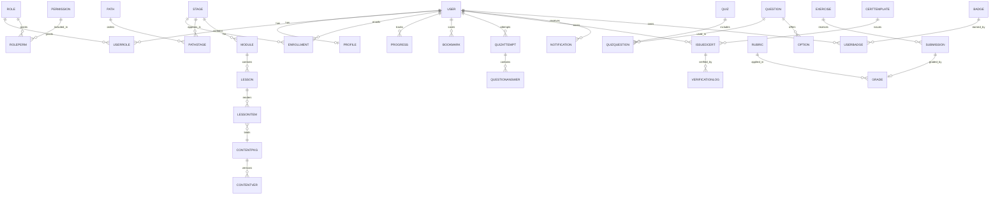

# 05 — Database Blueprint

> **Document ID:** DOC-05 · **Status:** Active · **Owner:** Data Architect (role)

| Field | Value |
|-------|-------|
| **Title** | Database Blueprint |
| **Purpose** | Defines the **logical data model** for the academy: entities, attributes (key ones), relationships, identifiers, and ownership. **This is a logical blueprint — no SQL, no physical schema, no technology choice.** Physical design happens only after OPD-001/OPD-002 decisions (DOC-14) and must conform to this blueprint. |
| **Owner** | Data Architect (role) |
| **Version** | 1.0.0 |
| **Status** | Active |
| **Dependencies** | DOC-02 (modules consuming data), DOC-03 (curriculum structure), DOC-08 (assessment rules), DOC-07 (content packages) |
| **Last Updated** | 2026-07-31 |
| **Review Cadence** | At every platform milestone; entity changes require a changelog entry (DOC-13) and ADR if structural |

## Table of Contents

- [1. Data Design Principles](#1-data-design-principles)
- [2. Identifier Conventions](#2-identifier-conventions)
- [3. Entity Groups](#3-entity-groups)
- [4. Entity Catalog](#4-entity-catalog)
- [5. Relationships](#5-relationships)
- [6. Ownership & Lifecycle](#6-ownership--lifecycle)
- [7. Audit & Compliance](#7-audit--compliance)
- [8. Logical ER Overview](#8-logical-er-overview)
- [Revision History](#revision-history)
- [Notes](#notes)
- [Cross References](#cross-references)

---

## 1. Data Design Principles

| # | Principle | Meaning |
|---|-----------|---------|
| DP-1 | **Logical first** | This document fixes *what* the data is and *how it relates*. Physical choices (engine, indexes, partitioning) are deferred to OPD-002. |
| DP-2 | **Content is data** | Curriculum content lives in versioned packages (ENT-CONTENT), never hard-coded (DOC-02 AP-3). |
| DP-3 | **Immutable identifiers** | All IDs are permanent and never reused. Retiring an entity keeps its record. |
| DP-4 | **Soft deletion** | Records are soft-deleted (with `deletedAt` semantics) except where law requires hard deletion (learner data erasure). |
| DP-5 | **Ownership by bounded context** | Each module (DOC-02 §4) owns its entities; other modules access them only through the owning module's API. |
| DP-6 | **Audit everywhere** | Every sensitive or state-changing entity carries audit linkage (ENT-AUDIT). |
| DP-7 | **Consent-aware** | Personal data records reference consent records; analytics entities never store raw PII. |
| DP-8 | **Versioned reference data** | Curricula, assessment rules, rubric versions, and certificates templates are versioned so history is reproducible. |

## 2. Identifier Conventions

| Entity class | ID pattern | Example |
|--------------|-----------|---------|
| All records | `UUID` (v7 recommended, decision deferred) | `9f2c…` |
| Human-facing entities (certificates) | Public serial `ACA-YYYY-NNNNN` | `ACA-2026-00042` |
| Curriculum entities | Semantic codes (see DOC-03 §2) | `STG-02`, `MOD-0203`, `LES-020305` |
| System | Stable slugs | `lesson-player` |

**Rules:** surrogate keys never exposed to clients except as opaque values; certificate serial numbers are the only public identifiers; display IDs (semantic codes) are unique per entity type.

## 3. Entity Groups

| Group | Description | Owner module (DOC-02) |
|-------|-------------|----------------------|
| **Identity & Access** | Users, roles, permissions, sessions | C-05, C-11 |
| **Catalog** | Paths, stages, modules, lessons, items, prerequisites | C-06 |
| **Content** | Content packages, versions, media assets, translations | C-12 |
| **Enrollment & Progress** | Enrollments, progress snapshots, activity events | C-07, C-10 |
| **Assessment** | Quizzes, questions, attempts, exercises, submissions, rubrics, grades | C-08 |
| **Certification** | Templates, issued certificates, verification, revocations | C-09 |
| **Engagement** | Reviews, ratings, forum threads/posts, badges, notifications, preferences | C-13, C-15 (future) |
| **Commerce** | Plans, subscriptions, payments, invoices, coupons | Open (OPD-005) |
| **System** | Settings, feature flags, audit log, support tickets, feedback, glossary | C-04/C-10 |

## 4. Entity Catalog

> For each entity: key attributes (representative, not exhaustive), relationships, and lifecycle. `*` = attribute is a foreign reference.

### 4.1 Identity & Access

| Entity ID | Entity | Key attributes | Notes / lifecycle |
|-----------|--------|----------------|-------------------|
| ENT-USER | User | id, email (unique), passwordHash, fullName, locale (ar default), direction (rtl), status, consentRefs*, createdAt, updatedAt | Central identity. Status: pending → active → suspended → deleted. |
| ENT-PROFILE | UserProfile | id, userId*, personaHint, avatarAssetId*, timezone, digitPreference, accessibility prefs (JSON) | 1:1 with ENT-USER. |
| ENT-ROLE | Role | id, code (student/instructor/admin/support), nameAr, nameEn | System roles seeded; custom roles later. |
| ENT-PERMISSION | Permission | id, code, description | e.g., `certificate.revoke`. |
| ENT-ROLEPERM | RolePermission | roleId*, permissionId* | Join. |
| ENT-USERROLE | UserRole | userId*, roleId*, grantedBy*, grantedAt, revokedAt | History preserved (revokedAt set, no delete). |
| ENT-SESSION | Session | id, userId*, tokenRef, deviceInfo, ipHash, issuedAt, expiresAt, revokedAt | Sessions are revoked not deleted. |
| ENT-CONSENT | Consent | id, userId*, type, version, grantedAt, revocable, revokedAt | Type: marketing, analytics, tos. |

### 4.2 Catalog

| Entity ID | Entity | Key attributes | Notes / lifecycle |
|-----------|--------|----------------|-------------------|
| ENT-PATH | LearningPath | id, code (PATH-01), titleAr, titleEn, descriptionAr, descriptionEn, status | Status: draft/active/retired. |
| ENT-PATHSTAGE | PathStage | pathId*, stageId*, sequence, required (bool) | Join with ordering + required flag (DOC-03 §12). |
| ENT-STAGE | Stage | id, code (STG-02), titleAr, titleEn, difficulty (B1…A2), effortHours, status, version | Retired stages persist. |
| ENT-MODULE | Module | id, code (MOD-0203), stageId*, sequence, titleAr, titleEn, difficulty, effortHours, status | Ordered within stage. |
| ENT-LESSON | Lesson | id, code (LES-020305), moduleId*, sequence, titleAr, titleEn, type (video/reading/practice), durationMin, status | Ordered within module. |
| ENT-LESSONITEM | LessonItem | id, lessonId*, sequence, kind (video/reading/exercise/quiz-link/embed/checkpoint), contentPackageId*, durationMin | The renderable units of a lesson. |
| ENT-PREREQ | Prerequisite | id, fromStageId*, fromModuleId*, requiredOfPathId*, type (hard/soft) | Declares DOC-03 §13 dependencies. |
| ENT-GLOSSARY | GlossaryTerm | id, termAr, termEn, definitionAr, definitionEn, appContext | Shared terminology (DOC-07 §8). |

### 4.3 Content

| Entity ID | Entity | Key attributes | Notes / lifecycle |
|-----------|--------|----------------|-------------------|
| ENT-CONTENTPKG | ContentPackage | id, code, type (lesson/exercise/quiz/stageProject), version, language (ar/en), stageId*/moduleId*, status (draft/in_review/published/retired), schemaVersion | The unit of content publishing (DOC-02 §8.1). |
| ENT-CONTENTVER | ContentVersion | id, packageId*, versionNumber, changelogNote, publishedAt, publishedBy*, contentJson (schema-defined) | Append-only history. |
| ENT-ASSET | MediaAsset | id, filename, kind (video/image/audio/file/preset), mimeType, sizeBytes, durationSec, transcodes (JSON), checksum, licenseRef, status | Stored in object storage; DB holds metadata only. |
| ENT-TRANSLATION | Translation | id, locale, scope, entityType, entityId, field, value, qualityStatus | Content i18n (Arabic primary). |

### 4.4 Enrollment & Progress

| Entity ID | Entity | Key attributes | Notes / lifecycle |
|-----------|--------|----------------|-------------------|
| ENT-ENROLLMENT | Enrollment | id, userId*, stageId*, pathId* (optional), enrolledAt, status (active/paused/completed/expired), source (self/admin/coupon) | One active enrollment per (user, stage, path context). |
| ENT-PROGRESS | Progress | id, userId*, targetType (stage/module/lesson/lessonItem), targetId, state (not_started/in_progress/completed), percent, lastActivityAt, timestamps | Aggregated snapshots for the dashboard (SCR-14). |
| ENT-EVENT | ActivityEvent | id, userId*, eventType, entityRef, payloadJson (anonymized), occurredAt, sessionId* | Raw event stream for analytics (C-10). No PII in payload. |
| ENT-BOOKMARK | Bookmark | id, userId*, lessonItemId*, positionSec, note, createdAt | Resume support (UI-5). |

### 4.5 Assessment

| Entity ID | Entity | Key attributes | Notes / lifecycle |
|-----------|--------|----------------|-------------------|
| ENT-QUIZ | Quiz | id, code, titleAr, titleEn, kind (module_quiz/stage_exam/final_exam/placement), configRef* (passing %, attempts, cooldown), status | Config references ENT-ASSESSRULE. |
| ENT-QUESTION | Question | id, quizId*, code, kind (mcq/multi/truefalse/matching/ordering/short_answer), promptAr, promptEn, difficulty, points, rubricRef* | Question bank; questions may be reused across quizzes via ENT-QUIZQUESTION. |
| ENT-QUIZQUESTION | QuizQuestion | quizId*, questionId*, sequence, pointsOverride | Join. |
| ENT-OPTION | QuestionOption | id, questionId*, textAr, textEn, isCorrect, explanationAr | For auto-graded kinds. |
| ENT-ATTEMPT | QuizAttempt | id, quizId*, userId*, startedAt, submittedAt, scorePct, passed (bool), attemptNumber, source (online/offline), integrityFlags | Append-only; never edited. |
| ENT-ANSWER | QuestionAnswer | id, attemptId*, quizQuestionId*, selectedOptionIds*, freeText, isCorrect, awardedPoints, aiReviewRef* | Per-question result. |
| ENT-EXERCISE | Exercise | id, code, lessonId*, kind, briefRef*, rubricRef*, solutionRef* | Practice tasks (DOC-07 §4). |
| ENT-SUBMISSION | Submission | id, exerciseId*, userId*, submittedAt, fileAssetIds*, status (submitted/in_review/graded/returned), gradeRef* | Learner uploads. |
| ENT-ASSESSRULE | AssessmentRule | id, code, scope, passingPct, maxAttempts, cooldownHours, version, effectiveFrom | Versioned policy source for DOC-08. |
| ENT-RUBRIC | Rubric | id, code, titleAr, titleEn, scale (1–4), criteria (JSON: criterion, weights, descriptors), version, status | Used for projects/capstone. |
| ENT-GRADE | Grade | id, submissionId*/attemptId*, rubricId*, rubricVersion, scoreAvg, perCriterion (JSON), gradedBy (agent/human id), gradedAt, feedback | Immutable once published; corrections create a new grade with reason. |

### 4.6 Certification

| Entity ID | Entity | Key attributes | Notes / lifecycle |
|-----------|--------|----------------|-------------------|
| ENT-CERTTEMPLATE | CertificateTemplate | id, code (CERT-02), titleAr, titleEn, layoutRef (asset), fieldsJson, version, status | Versioned template; reissues use latest published version. |
| ENT-CERT | IssuedCertificate | id, serial (ACA-YYYY-NNNNN), userId*, certificateId* (CERT-02), templateVersion, issuedAt, issuedBy (auto or admin), status (active/revoked), revokedAt, revokedReason | Public verification reads this. |
| ENT-VERIFICATION | VerificationLog | id, serial*, verifiedAt, result, verifierIpHash | Audit of public checks. |

### 4.7 Engagement

| Entity ID | Entity | Key attributes | Notes |
|-----------|--------|----------------|-------|
| ENT-REVIEW | Review | id, userId*, targetType (stage/module), targetId, rating (1–5), textAr, status, createdAt | One review per target per user. |
| ENT-NOTIF | Notification | id, userId*, type, channel, payloadRef*, readAt, deliveredAt, sentAt, status | In-app inbox (SCR-17). |
| ENT-NOTIFPREF | NotificationPreference | id, userId*, type, channels (JSON), quietHours | |
| ENT-BADGE | Badge | id, code (BDG-01), titleAr, titleEn, criteriaRef* | |
| ENT-USERBADGE | UserBadge | userId*, badgeId*, earnedAt, contextRef* | |
| ENT-FORUM | ForumThread / ForumPost / ForumComment | id, threadId*, userId*, bodyAr, status, moderationState | Future milestone (C-15); schema deferred to that ADR. |

### 4.8 Commerce (design placeholder — gated by OPD-005)

| Entity ID | Entity | Notes |
|-----------|--------|-------|
| ENT-PLAN | Plan | Code, nameAr/En, price, currency, billingCycle, featuresJson |
| ENT-SUB | Subscription | userId*, planId*, status, period, providerRef* |
| ENT-PAYMENT | Payment | userId*, subscriptionId*, amount, currency, providerRef*, status |
| ENT-INVOICE | Invoice | userId*, paymentRefs*, itemsJson, pdfAssetId* |
| ENT-COUPON | Coupon | code, discountJson, validity window, usage limits |

### 4.9 System

| Entity ID | Entity | Notes |
|-----------|--------|-------|
| ENT-SETTING | Setting | Key-value with scope (global/tenant), typed values, audit ref. |
| ENT-FLAG | FeatureFlag | Code, enabled, rolloutPct, ownerRef*, notes. |
| ENT-AUDIT | AuditLog | actorRef*, action, entityType, entityId, beforeJson, afterJson, occurredAt, reasonRef. Append-only. |
| ENT-TICKET | SupportTicket | userId*, subjectAr, body, status, assigneeRef*, resolutionNote. |
| ENT-FEEDBACK | Feedback | userId*, screenRef*, rating, textAr, telemetryRef (sanitized). |

## 5. Relationships

| # | Relationship | Cardinality | Notes |
|---|--------------|-------------|-------|
| R-01 | User ↔ Profile | 1:1 | Profile optional until first onboarding step |
| R-02 | User ↔ Role | M:N (via UserRole) | Multiple roles allowed; history preserved |
| R-03 | Role ↔ Permission | M:N (via RolePermission) | |
| R-04 | Stage ↔ Module | 1:N | Module has one stage; ordered by sequence |
| R-05 | Module ↔ Lesson | 1:N | Ordered by sequence |
| R-06 | Lesson ↔ LessonItem | 1:N | Ordered; each item binds one content package |
| R-07 | Path ↔ Stage | M:N (via PathStage) | required/optional flag per DOC-03 §12 |
| R-08 | Stage ↔ Prerequisite | N:M via Prerequisite | Hard vs soft (DOC-03 §13) |
| R-09 | User ↔ Stage (Enrollment) | M:N via Enrollment | Active enrollment is unique per stage+path |
| R-10 | User ↔ LessonItem (Progress) | M:N via Progress | State machine not_started/in_progress/completed |
| R-11 | LessonItem ↔ Bookmark | 1:N | Only learner-created bookmarks |
| R-12 | Quiz ↔ Question | M:N via QuizQuestion | Sequence + points override |
| R-13 | QuizAttempt → Quiz, User | N:1, N:1 | Attempts append-only |
| R-14 | QuizAttempt → QuestionAnswer | 1:N | |
| R-15 | Exercise ↔ Submission | 1:N | Learner may resubmit per DOC-08 retake policy |
| R-16 | Submission ↔ Grade | 1:1 (latest) | Grade history via immutable records |
| R-17 | CertificateTemplate → IssuedCertificate | 1:N | Template version captured on certificate |
| R-18 | IssuedCertificate ↔ VerificationLog | 1:N | Append-only verification trail |
| R-19 | ContentPackage ↔ ContentVersion | 1:N | Published package points to current version |
| R-20 | LessonItem ↔ ContentPackage | N:1 | Content and platform release independently (AP-3) |
| R-21 | User ↔ Notification | 1:N | Preferences drive channels |
| R-22 | User ↔ Badge | M:N via UserBadge | Criteria evaluated by event stream |

## 6. Ownership & Lifecycle

| Group | Owning module | Lifecycle rules |
|-------|---------------|-----------------|
| Identity & Access | C-05/C-11 | Records never hard-deleted except GDPR erasure (ENT-CONSENT-linked); suspension is a status, not a delete. |
| Catalog | C-06 | Entities progress draft → published → retired. Retired blocks new enrollments; existing learners finish. |
| Content | C-12 | Packages: draft → in_review → published → retired. Versions append-only. |
| Enrollment & Progress | C-07/C-10 | Progress is derived from events; corrected by replay, never by editing snapshots. |
| Assessment | C-08 | Attempts, answers, and grades are immutable. Corrections create new records with reason. |
| Certification | C-09 | Certificates are computed from assessment outcomes; manual issuance only with audit + reason. |
| Commerce | OPD-005 owner | Financial records append-only; refunds create reversal records. |
| System | C-04 | Audit log append-only, WORM-like; no edits, no deletes. |

**Cross-module access rule:** a module reads another module's data only through its public API/events (DOC-02 §6). Direct table access across module boundaries is a violation.

## 7. Audit & Compliance

1. **Audit events:** ENT-AUDIT records every admin action, role change, certificate action, consent change, and privacy request.
2. **Privacy:** user-identifiable data is only in Identity/Enrollment/Assessment/Certification entities. Analytics entities (ENT-EVENT) contain no raw PII (DP-7).
3. **Erasure:** a user erasure request deletes or anonymizes per policy; certificates remain but the holder name is anonymized per legal review (recorded in DOC-14).
4. **Retention:** session tokens ≤ 30 days; event payloads 24 months; financial records per local law (region decision pending OPD-003).
5. **Integrity:** certificate serials are unique and tamper-evident (hash chain design detail deferred to implementation ADR).

## 8. Logical ER Overview

*This diagram is a logical overview; the entity catalog (§4) and relationships (§5) are authoritative.*

---

## Revision History

| Version | Date | Author | Summary of Changes |
|---------|------|--------|--------------------|
| 1.0.0 | 2026-07-31 | Project Foundation Architect | Initial baseline (DOC-05): 9 entity groups, 40+ entities. |

## Notes

- No physical schema, indexes, or SQL exist for this project yet; creating them without an approved ADR (OPD-002) is prohibited.
- ENT-FORUM and Commerce entities are placeholders; their detailed design is deferred to their respective ADRs.
- Entity attributes listed are representative and non-exhaustive; implementation schemas must be traceable to this catalog.

## Cross References

| Reference | Relationship |
|-----------|--------------|
| [DOC-02 System Architecture](02_SYSTEM_ARCHITECTURE.md) | Modules own entity groups (§4 vs DOC-02 §4) |
| [DOC-03 Curriculum Blueprint](03_CURRICULUM_BLUEPRINT.md) | Catalog entities mirror curriculum IDs |
| [DOC-08 Assessment Standard](08_ASSESSMENT_STANDARD.md) | Assessment entities implement its rules |
| [DOC-14 Decision Log](14_DECISION_LOG.md) | OPD-001/002 gate physical design |
| [DOC-15 Risk Register](15_RISK_REGISTER.md) | Data risks R-T-04…R-T-06 |
