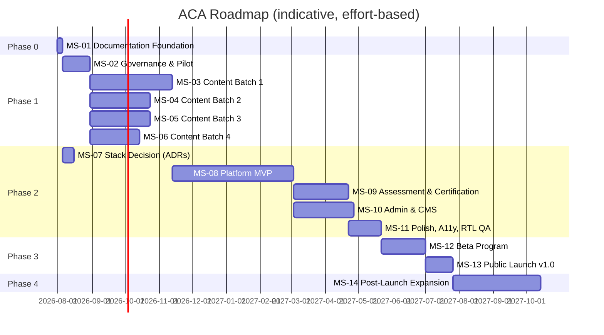

# 09 — Project Roadmap

> **Document ID:** DOC-09 · **Status:** Active · **Owner:** Project Manager (role)

| Field | Value |
|-------|-------|
| **Title** | Project Roadmap |
| **Purpose** | Breaks the entire project into ordered milestones with IDs, titles, descriptions, dependencies, priorities, estimated effort, and completion status. The roadmap is the high-level planning layer; day-to-day execution lives in the task board (DOC-11). |
| **Owner** | Project Manager (role) |
| **Version** | 1.0.2 |
| **Status** | Active |
| **Dependencies** | DOC-01 (goals), DOC-02…DOC-08 (blueprints the milestones deliver), DOC-11 (tasks), DOC-14 (decisions), DOC-15 (risks) |
| **Last Updated** | 2026-07-31 |
| **Review Cadence** | Monthly, or when a milestone completes/starts |

## Table of Contents

- [1. Roadmap Principles](#1-roadmap-principles)
- [2. Milestone Status Legend](#2-milestone-status-legend)
- [3. Milestone Definitions](#3-milestone-definitions)
- [4. Timeline Overview](#4-timeline-overview)
- [5. Milestone Release Criteria](#5-milestone-release-criteria)
- [6. Roadmap Change Control](#6-roadmap-change-control)
- [Revision History](#revision-history)
- [Notes](#notes)
- [Cross References](#cross-references)

---

## 1. Roadmap Principles

1. **Milestones are outcomes, not activity.** A milestone completes when its release criteria (§5) are met and recorded.
2. **Dependencies are explicit.** A milestone with unmet dependencies is never started (unless formally re-sequenced via §6).
3. **Effort is estimated in agent-days (AD)** — the working unit for AI-agent collaboration. 1 AD ≈ one focused agent session-day. Estimates are initial planning values, refined at milestone start.
4. **Priorities:** P0 (blocks everything), P1 (core path), P2 (important, schedule-flexible), P3 (enhancement).
5. **Status lives in this document** (per milestone) and is mirrored to tasks in DOC-11; the task board is the operational source, this document the planning source.
6. **Nothing ships without passing DOC-16 gates** — quality is part of every milestone's Definition of Done.

## 2. Milestone Status Legend

| Status | Meaning |
|--------|---------|
| 🟦 Not Started | Planned; no work begun |
| 🟨 In Progress | Work underway on its task set (DOC-11) |
| 🟧 Blocked | Dependency unmet or open decision required |
| 🟩 Completed | All release criteria verified and recorded |
| ⬛ Cancelled | Removed from plan via §6 |

## 3. Milestone Definitions

### Phase 0 — Foundation (current)

| Field | MS-01 |
|-------|-------|
| **Milestone ID** | MS-01 |
| **Title** | Documentation & Governance Foundation |
| **Description** | Create the complete documentation system: vision, architecture, curriculum blueprint, UI blueprint, database blueprint, design system, content standards, assessment standard, roadmap, agent rules, task board, handover system, changelog, decision log, risk register, and quality checklist. |
| **Dependencies** | None |
| **Priority** | P0 |
| **Estimated effort** | 12 AD |
| **Completion status** | 🟩 **Completed** (2026-07-31) — this documentation baseline **plus** its operating-document extension (DOC-17…29) **plus** the foundation closure layer (DOC-30…38, ADR-009, GATE-F1 PASS) |
| **Exit criteria met** | All 38 foundation documents exist, cross-referenced, and versioned; policy lock in force (DOC-30); release criteria signed (DOC-37); phase gate passed (DOC-31); Phase 1 eligible (DOC-38). Independent baseline review scheduled as TASK-102 (first Phase-1 task). |

### Phase 1 — Content Production

| Field | MS-02 |
|-------|-------|
| **Milestone ID** | MS-02 |
| **Title** | Governance Tooling & Pilot Content Pipeline |
| **Description** | Operationalize the governance system: template validation for docs, task-board conventions, pilot production of STG-01 + first two modules of STG-02 as reference content (validates DOC-07/08 rules). |
| **Dependencies** | MS-01 |
| **Priority** | P0 |
| **Estimated effort** | 20 AD |
| **Completion status** | 🟦 Not Started |

| Field | MS-03 |
|-------|-------|
| **Milestone ID** | MS-03 |
| **Title** | Content Batch 1 — Foundations + Photoshop |
| **Description** | Full Arabic content for STG-01 (4 modules) and STG-02 (5 modules): lessons, exercises, quizzes, stage project, stage exam, rubric anchors. All content per DOC-07/08. |
| **Dependencies** | MS-02 (validated templates) |
| **Priority** | P0 |
| **Estimated effort** | 60 AD |
| **Completion status** | 🟦 Not Started |

| Field | MS-04 |
|-------|-------|
| **Milestone ID** | MS-04 |
| **Title** | Content Batch 2 — Illustrator + InDesign |
| **Description** | Full Arabic content for STG-03 (4 modules) and STG-07 (4 modules) plus their assessments and rubric anchors. |
| **Dependencies** | MS-02 |
| **Priority** | P1 |
| **Estimated effort** | 45 AD |
| **Completion status** | 🟦 Not Started |

| Field | MS-05 |
|-------|-------|
| **Milestone ID** | MS-05 |
| **Title** | Content Batch 3 — After Effects + Premiere Pro |
| **Description** | Full Arabic content for STG-04 (4 modules) and STG-05 (4 modules) plus assessments and rubric anchors. |
| **Dependencies** | MS-02 |
| **Priority** | P1 |
| **Estimated effort** | 45 AD |
| **Completion status** | 🟦 Not Started |

| Field | MS-06 |
|-------|-------|
| **Milestone ID** | MS-06 |
| **Title** | Content Batch 4 — Lightroom + Capstone |
| **Description** | Full Arabic content for STG-06 (4 modules) and STG-08 (4 modules) including the capstone project, final exam, and graduation flow. |
| **Dependencies** | MS-02 |
| **Priority** | P1 |
| **Estimated effort** | 35 AD |
| **Completion status** | 🟦 Not Started |

### Phase 2 — Platform

| Field | MS-07 |
|-------|-------|
| **Milestone ID** | MS-07 |
| **Title** | Technology Stack Decision (ADRs) |
| **Description** | Resolve open decisions OPD-001…OPD-005 (DOC-14): language/framework, database, hosting/CDN, media pipeline, payment. Produce approved ADRs and an implementation architecture addendum. |
| **Dependencies** | MS-01 (blueprints), DOC-14 open decisions |
| **Priority** | P0 |
| **Estimated effort** | 10 AD |
| **Completion status** | 🟦 Not Started |

| Field | MS-08 |
|-------|-------|
| **Milestone ID** | MS-08 |
| **Title** | Platform MVP |
| **Description** | Learner-facing MVP: auth (SCR-02/03/04), catalog (SCR-06/07/08/09), lesson player (SCR-10), exercises (SCR-11), module quizzes (SCR-12/13), progress (SCR-14), notifications (SCR-17), search (SCR-18), RTL design tokens implemented (DOC-06), responsive per DOC-04. |
| **Dependencies** | MS-07, MS-03 (pilot content to render) |
| **Priority** | P0 |
| **Estimated effort** | 90 AD |
| **Completion status** | 🟦 Not Started |

| Field | MS-09 |
|-------|-------|
| **Milestone ID** | MS-09 |
| **Title** | Assessment & Certification Engine |
| **Description** | Implement DOC-08 fully: scoring, retakes, rubric grading UI (admin), stage projects/exams, certificates (SCR-05/15/25), verification + revocation. |
| **Dependencies** | MS-08 |
| **Priority** | P0 |
| **Estimated effort** | 40 AD |
| **Completion status** | 🟦 Not Started |

| Field | MS-10 |
|-------|-------|
| **Milestone ID** | MS-10 |
| **Title** | Admin & Content Management |
| **Description** | Admin console (SCR-20…24, 26, 27), content authoring pipeline (CMS per DOC-02 C-12), publishing workflow, analytics dashboards. |
| **Dependencies** | MS-08 |
| **Priority** | P1 |
| **Estimated effort** | 45 AD |
| **Completion status** | 🟦 Not Started |

| Field | MS-11 |
|-------|-------|
| **Milestone ID** | MS-11 |
| **Title** | Polish, Accessibility & RTL QA |
| **Description** | Full design-system implementation pass (DOC-06 tokens/components), WCAG 2.2 AA audit, RTL QA matrix, performance budget pass, dark mode. |
| **Dependencies** | MS-08, MS-09 |
| **Priority** | P1 |
| **Estimated effort** | 25 AD |
| **Completion status** | 🟦 Not Started |

### Phase 3 — Launch

| Field | MS-12 |
|-------|-------|
| **Milestone ID** | MS-12 |
| **Title** | Beta Program |
| **Description** | Closed beta with 200–500 learners (personas P-01…P-05): content usability, assessment calibration, metric baseline (DOC-01 §7), `[TBD]` items in DOC-08 resolved with data. |
| **Dependencies** | MS-09, MS-10, MS-11, MS-03…06 (at least STG-01+02 content) |
| **Priority** | P0 |
| **Estimated effort** | 30 AD |
| **Completion status** | 🟦 Not Started |

| Field | MS-13 |
|-------|-------|
| **Milestone ID** | MS-13 |
| **Title** | Public Launch v1.0 (GA) |
| **Description** | Premium launch: billing live (OPD-005), certificates public verification live, marketing site, support processes, SLOs active (DOC-01 M-16). |
| **Dependencies** | MS-12, OPD-005 decision |
| **Priority** | P0 |
| **Estimated effort** | 20 AD |
| **Completion status** | 🟦 Not Started |

### Phase 4 — Growth

| Field | MS-14 |
|-------|-------|
| **Milestone ID** | MS-14 |
| **Title** | Post-Launch Expansion |
| **Description** | Community layer (forums/peer review), gamification, English localization pilot, enterprise readiness study (SSO/SCORM/LTI), mobile native apps evaluation. Each expansion is its own sub-milestone with an ADR. |
| **Dependencies** | MS-13 |
| **Priority** | P2 |
| **Estimated effort** | 60 AD (split) |
| **Completion status** | 🟦 Not Started |

## 4. Timeline Overview

> Timeline is indicative and effort-based; exact dates are set when each milestone starts. Content batches (MS-03…06) and platform (MS-07…11) run in parallel where dependencies allow.

## 5. Milestone Release Criteria

Every milestone has a Definition of Done (recorded in its task set in DOC-11) and **must** satisfy all of these:

1. All tasks in DOC-11 marked Completed and verified.
2. Deliverables pass DOC-16 quality gates (relevant reviews per deliverable type).
3. Documentation updated: DOC-13 changelog entries, affected docs edited, ADRs recorded (DOC-14) if decisions were made.
4. Handover completed (DOC-12) for any agent-boundary crossing work.
5. Risks updated in DOC-15 (new risks added, statuses refreshed).
6. Milestone status in this document updated to 🟩 and exit criteria recorded.

## 6. Roadmap Change Control

| Change type | Process |
|-------------|---------|
| Reorder / add / remove milestone | Formal proposal on task board (TASK) + Project Manager approval + DOC-13 entry |
| Priority change | Project Manager + affected owners; DOC-13 entry |
| Effort re-estimate | Allowed at milestone start; recorded in DOC-13 |
| Scope addition | Requires blueprint impact assessment (DOC-02/03/04/05) + ADR if architectural |
| Status update (start/complete/block) | Mirrored to DOC-11 tasks; block reasons recorded |

---

## Revision History

| Version | Date | Author | Summary of Changes |
|---------|------|--------|--------------------|
| 1.0.2 | 2026-07-31 | Project Foundation Architect | MS-01 exit criteria updated: foundation closure layer (DOC-30…38), ADR-009, GATE-F1 PASS recorded (CHG-003). |
| 1.0.1 | 2026-07-31 | Project Foundation Architect | MS-01 scope updated: foundation includes the 13 operating documents (DOC-17…29) added by the extension (CHG-002). |
| 1.0.0 | 2026-07-31 | Project Foundation Architect | Initial baseline (DOC-09): 14 milestones in 5 phases. |

## Notes

- Effort units (AD = agent-days) are estimates for planning; they do not guarantee calendar duration (parallel agents change throughput).
- MS-01 is the only completed milestone; its completion is recorded here and in DOC-13 (CHG-001) and DOC-11 (TASK-001…016).

## Cross References

| Reference | Relationship |
|-----------|--------------|
| [DOC-11 Task Management](11_TASK_MANAGEMENT.md) | Operational task board per milestone |
| [DOC-13 Project Changelog](13_PROJECT_CHANGELOG.md) | Change record for roadmap updates |
| [DOC-14 Decision Log](14_DECISION_LOG.md) | ADR gates (MS-07) |
| [DOC-15 Risk Register](15_RISK_REGISTER.md) | Risks that can block milestones |
| [DOC-16 Quality Checklist](16_QUALITY_CHECKLIST.md) | Release criteria source |
