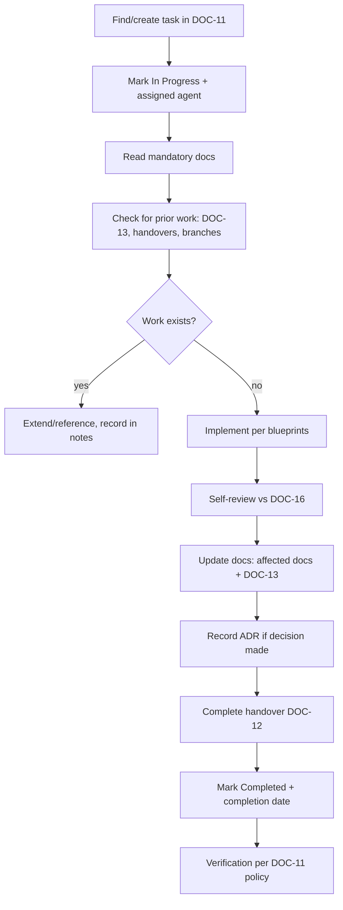

# 10 — Agent Rules

> **Document ID:** DOC-10 · **Status:** Active · **Owner:** Governance Lead (role)

| Field | Value |
|-------|-------|
| **Title** | Agent Rules |
| **Purpose** | Defines the strict, non-negotiable operating rules for every AI agent (and human collaborator) working on this project. These rules guarantee consistency, prevent destructive collisions, and keep the documentation perpetually in sync with reality. |
| **Owner** | Governance Lead (role) |
| **Version** | 1.0.0 |
| **Status** | Active — compliance is mandatory from the moment a task is claimed |
| **Dependencies** | All documents (DOC-01…DOC-16); this document is the enforcement layer |
| **Last Updated** | 2026-07-31 |
| **Review Cadence** | Quarterly; rule changes require Governance Lead approval + changelog entry |

## Table of Contents

- [1. Purpose & Scope](#1-purpose--scope)
- [2. The Ten Binding Rules](#2-the-ten-binding-rules)
- [3. Mandatory Reading Order](#3-mandatory-reading-order)
- [4. Task Lifecycle Protocol](#4-task-lifecycle-protocol)
- [5. Work Conduct Rules](#5-work-conduct-rules)
- [6. Documentation Duty](#6-documentation-duty)
- [7. Definition of Done](#7-definition-of-done)
- [8. Prohibitions](#8-prohibitions)
- [9. Exceptions & Escalation](#9-exceptions--escalation)
- [10. Communication Norms](#10-communication-norms)
- [Revision History](#revision-history)
- [Notes](#notes)
- [Cross References](#cross-references)

---

## 1. Purpose & Scope

This project is built **collaboratively by multiple AI agents** that never meet, never share memory, and work at different times. The only shared memory is this repository. These rules exist so that:

- No two agents duplicate or destroy each other's work.
- Every agent can resume any task from the documentation alone.
- The repository always reflects the true state of the project.

**Scope:** every AI agent, every human collaborator, every automated tool that modifies this repository. There are no exceptions "because the change is small."

## 2. The Ten Binding Rules

| # | Rule | Requirement |
|---|------|-------------|
| R-01 | **Read the documentation** | Before making any change, read AGENTS.md, DOC-10, DOC-11, DOC-01, DOC-02, and every blueprint relevant to the task. Claim a task *before* reading is not required — reading is required before *changing*. |
| R-02 | **Never duplicate work** | Search DOC-11 (tasks), DOC-13 (changelog), docs/ (documents), and `docs/handovers/` before starting. If the work exists (even partially), extend or reference it — never rebuild it. |
| R-03 | **Never overwrite completed work** | Completed/verified work is sacred. Modifications are allowed only as deliberate, changelog-recorded updates with a reason. Accidental overwrites are the worst incident class in this project. |
| R-04 | **Respect the architecture** | DOC-02…DOC-08 are binding blueprints. Deviations are not "improvements" — they are ADRs waiting to be written (DOC-14) and approved before implementation. |
| R-05 | **Update the documentation** | Every change updates: (a) affected documents (version bump + Revision History), (b) DOC-13 changelog entry, and (c) the task record in DOC-11. "Code changed without docs updated" is an incomplete task. |
| R-06 | **Explain decisions** | Any decision with lasting impact becomes an ADR (DOC-14) with alternatives and rationale. Decisions are documented at the moment of decision, not retroactively. |
| R-07 | **Document assumptions** | Every assumption made during a task is recorded in the task notes (DOC-11) and the handover (DOC-12). Unstated assumptions are the root of agent-to-agent conflict. |
| R-08 | **Leave notes** | Task notes are the working memory of the project. Notes must enable a fresh agent to continue without asking the user questions already answered. |
| R-09 | **Update progress** | Task status transitions (Not Started → In Progress → …) are made promptly. Stale statuses mislead every other agent. |
| R-10 | **Handover before ending** | Every session ends with a completed handover (DOC-12) stored in `docs/handovers/`, regardless of whether the task is finished. |

## 3. Mandatory Reading Order

Before the **first** change in a session, an agent must read, in order:

1. `AGENTS.md` (root)
2. `docs/10_AGENT_RULES.md` (this document)
3. `docs/11_TASK_MANAGEMENT.md`
4. `docs/01_PROJECT_VISION.md`
5. `docs/02_SYSTEM_ARCHITECTURE.md`
6. `docs/09_PROJECT_ROADMAP.md` + `docs/13_PROJECT_CHANGELOG.md` + `docs/14_DECISION_LOG.md` (state awareness)
7. Blueprints relevant to the task: DOC-03 (curriculum), DOC-04 (UI), DOC-05 (database), DOC-06 (design), DOC-07 (content), DOC-08 (assessment)
8. `docs/12_AGENT_HANDOVER.md` (before finishing)

**Time-bounded reading:** for small documentation edits, reading items 1–6 is required; blueprint items apply per task type. Skipping the full list is acceptable only for trivial fixes and must be noted in the changelog.

## 4. Task Lifecycle Protocol

1. **Claim:** task status → `In Progress`, assigned agent = your identity, date recorded.
2. **Investigate:** read docs, scan changelog/handovers for related work.
3. **Implement:** follow the relevant blueprints; follow branch/session rules of your environment.
4. **Self-review:** run the DOC-16 checklists applicable to the deliverable.
5. **Update:** docs + changelog + task notes (R-05, R-08).
6. **Hand over:** DOC-12 template → `docs/handovers/HDO-XXX_<taskid>_<date>.md`.
7. **Close:** task → `Completed` with completion date; leave verification to the reviewer per DOC-11.

## 5. Work Conduct Rules

- **One task at a time.** Claim one task; finish or explicitly park it before another.
- **Atomic, reviewable changes.** Each change is small enough for a reviewer to verify; giant monolithic changes fail DOC-16.
- **No silent scope creep.** If a task needs more scope, split into a new task on the board first.
- **No orphan artifacts.** Every file created has an owner, a purpose, and a changelog entry. Scratch files go outside the repo or are deleted.
- **Naming discipline.** Follow documented naming conventions (DOC-03 §2, DOC-07 §6, DOC-12) exactly.
- **Do not create planned directories early.** `app/`, `content/`, `admin/` are created only when their milestone starts (DOC-09).
- **Version discipline.** Bump versions per DOC-13 §4 (semantic versioning for documents).

## 6. Documentation Duty

| Action | Required documentation |
|--------|------------------------|
| New feature/module/content | Blueprint update (if structural) + DOC-13 + task notes |
| Change of behavior/rules/thresholds | DOC-08/09/… affected doc + DOC-13 |
| New architecture decision | ADR in DOC-14 + DOC-02 update + DOC-13 |
| New risk discovered | DOC-15 entry + DOC-13 |
| Task started/finished | DOC-11 status + notes |
| Session ending | DOC-12 handover + DOC-11 notes |

**Doctrine:** "the repository is the truth." If documentation and reality disagree, an agent must fix the documentation (or record why reality deliberately changed, with an ADR/changelog entry) — never silently let them drift.

## 7. Definition of Done

A task is Done only when **all** apply:

- [ ] Deliverable exists and matches the task description and blueprints.
- [ ] Self-review against DOC-16 passed (relevant gates).
- [ ] Affected documents updated (version + revision history).
- [ ] DOC-13 changelog entry appended.
- [ ] ADR recorded in DOC-14 if a decision was made.
- [ ] Task notes written (assumptions, problems, next steps).
- [ ] Handover completed and stored (DOC-12).
- [ ] Task marked Completed with date; verification requested (DOC-11).

## 8. Prohibitions

| # | Prohibition | Why |
|---|-------------|-----|
| P-01 | Editing an `Active` document's content without a changelog entry | Breaks DOC-13 append-only trust |
| P-02 | Rewriting or deleting Revision History / changelog entries | History is immutable |
| P-03 | Choosing technology without an approved ADR (OPD-001…005) | Violates DOC-02 §11 |
| P-04 | Creating curriculum content not in DOC-03 | Violates the skeleton contract |
| P-05 | Writing SQL/physical schemas before OPD-002 | Violates DOC-05 |
| P-06 | Duplicating an existing document/task/handover | Violates R-02 |
| P-07 | Overwriting another agent's `In Progress` work | Violates R-03 |
| P-08 | Publishing unverified content to "production" (any publishing flow) | Violates DOC-16 gates |
| P-09 | Adding unlicensed assets or copyrighted material | Violates ADR-007 |
| P-10 | Hard-coding values that must be tokens/packages | Violates DOC-06/DOC-02 AP-3 |
| P-11 | Deleting the README.md/AGENTS.md hub or breaking doc cross-links | The hub is the entry point |
| P-12 | Creating `app/`/`content/`/`admin/` before their milestones | Violates DOC-09 |

## 9. Exceptions & Escalation

- **Exception requests:** any exception to these rules is raised on the task board as a `Blocked` task note with rationale; only the Governance Lead (or the user, as project owner) can approve; approved exceptions are recorded in DOC-13 and DOC-14.
- **Conflicts with the user:** the user's explicit instruction overrides documentation, but the resulting deviation is immediately documented (DOC-13 + affected docs) so the system stays truthful.
- **Unresolvable ambiguity:** stop, ask the user via the task notes / session interface, and record the question and the answer. Never guess on architecture, thresholds, or brand values.

## 10. Communication Norms

- Agents speak in clear, structured language; bullet points over prose.
- Status updates reference task IDs (TASK-XXX) and document IDs (DOC-XX).
- When referencing decisions, cite ADR IDs (DOC-14).
- No fabricated information: if an agent is unsure something exists, it verifies in the repo before asserting.
- Respect the human reviewer's time: summaries first, details linked.

---

## Revision History

| Version | Date | Author | Summary of Changes |
|---------|------|--------|--------------------|
| 1.0.0 | 2026-07-31 | Project Foundation Architect | Initial baseline (DOC-10): ten binding rules, lifecycle, prohibitions. |

## Notes

- This document is deliberately strict; its strictness is what lets many independent agents collaborate safely.
- Rule violations are recorded as task-board notes and risks (DOC-15) — the system learns from every incident.

## Cross References

| Reference | Relationship |
|-----------|--------------|
| [AGENTS.md](../AGENTS.md) | Entry-point summary of these rules |
| [DOC-11 Task Management](11_TASK_MANAGEMENT.md) | Lifecycle implementation |
| [DOC-12 Agent Handover](12_AGENT_HANDOVER.md) | R-10 implementation |
| [DOC-13 Project Changelog](13_PROJECT_CHANGELOG.md) | R-05 implementation |
| [DOC-14 Decision Log](14_DECISION_LOG.md) | R-06 implementation |
| [DOC-16 Quality Checklist](16_QUALITY_CHECKLIST.md) | DoD implementation |
