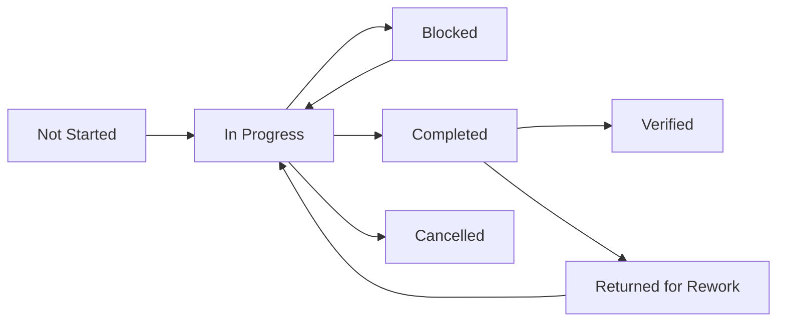

# 11 — Task Management

> **Document ID:** DOC-11 · **Status:** Active · **Owner:** Project Manager (role)

| Field | Value |
|-------|-------|
| **Title** | Task Management (Master Task Board) |
| **Purpose** | Defines the task management policy and contains the **master task board** — the operational source of truth for all work. Every task must carry the full record: ID, title, description, assigned agent, priority, dependencies, status, completion date, verification status, reviewer, and notes. |
| **Owner** | Project Manager (role) |
| **Version** | 1.0.3 |
| **Status** | Active |
| **Dependencies** | DOC-09 (milestones), DOC-10 (rules), DOC-12 (handovers), DOC-13 (changelog), DOC-16 (verification gates) |
| **Last Updated** | 2026-07-31 |
| **Review Cadence** | Continuous (every claim/transition); full sweep at milestone boundaries |

## Table of Contents

- [1. Task Lifecycle & Statuses](#1-task-lifecycle--statuses)
- [2. Task Record Fields](#2-task-record-fields)
- [3. Priority & Effort](#3-priority--effort)
- [4. Verification Workflow](#4-verification-workflow)
- [5. Master Task Board — Foundation (MS-01)](#5-master-task-board--foundation-ms-01)
- [6. Master Task Board — Content (MS-02…MS-06)](#6-master-task-board--content-ms-02ms-06)
- [7. Master Task Board — Platform (MS-07…MS-11)](#7-master-task-board--platform-ms-07ms-11)
- [8. Master Task Board — Launch & Growth (MS-12…MS-14)](#8-master-task-board--launch--growth-ms-12ms-14)
- [9. Adding & Splitting Tasks](#9-adding--splitting-tasks)
- [Revision History](#revision-history)
- [Notes](#notes)
- [Cross References](#cross-references)

---

## 1. Task Lifecycle & Statuses

| Status | Meaning | Who can set |
|--------|---------|-------------|
| **Not Started** | Defined, unclaimed | PM / any agent (creating) |
| **In Progress** | Claimed; work underway; must record assigned agent + date | Assigned agent |
| **Blocked** | Cannot proceed; must state blocker + dependency in Notes | Assigned agent |
| **Completed** | Work done per DOC-10 §7 DoD; awaiting/undergoing verification | Assigned agent |
| **Cancelled** | Removed from plan with reason (superseded, de-scoped) | PM / Governance Lead |
| **Verified** (derived flag) | Passed review per §4; reviewer + date recorded | Reviewer |

**Transitions rules:** only the assigned agent transitions `In Progress`; only a reviewer marks `Verified`; only the PM cancels or reopens. Every transition is logged in Notes (and DOC-13 when meaningful).

## 2. Task Record Fields

Every task record **must** include:

| Field | Required | Description |
|-------|----------|-------------|
| **Task ID** | ✓ | `TASK-NNN` (sequential; never reused) |
| **Title** | ✓ | Concise imperative title (Arabic not required — board language is English for tooling) |
| **Description** | ✓ | Outcome, scope, acceptance criteria summary; links to blueprints (DOC-XX) |
| **Assigned Agent** | ✓ | Agent identity or `Unassigned — claim me` |
| **Priority** | ✓ | P0 / P1 / P2 / P3 |
| **Dependencies** | ✓ | `TASK-NNN` IDs, milestone IDs, ADR IDs, or `none` |
| **Status** | ✓ | Per §1 |
| **Completion Date** | ✓ when completed | ISO date `YYYY-MM-DD` |
| **Verification Status** | ✓ | `Pending` / `In Review` / `Passed` / `Failed — returned` (with reviewer) |
| **Reviewer** | ✓ when verified | Role or agent identity |
| **Notes** | ✓ | Working memory: assumptions, problems, decisions, links to handovers (HDO-XXX) and changelog (CHG-XXX) |

## 3. Priority & Effort

| Priority | Meaning |
|----------|---------|
| P0 | Blocks milestone or launch; must be unblocked first |
| P1 | Core path work; scheduled within current milestone |
| P2 | Important; schedule-flexible |
| P3 | Enhancement / backlog |

Effort is estimated in agent-days (AD) at the milestone level (DOC-09); per-task effort is recorded in Notes at claim time.

## 4. Verification Workflow

1. Agent marks task `Completed` and requests verification (reviewer assigned by PM or per milestone plan).
2. Reviewer runs the applicable gates from DOC-16 and checks the DOC-10 §7 DoD checklist.
3. Outcome:
   - **Passed** → Verification Status `Passed`, reviewer + date recorded; milestone progress updated.
   - **Failed** → Status `Completed` → `Returned for Rework`; specific failing checklist items listed in Notes.
4. Baseline exception: foundation tasks (TASK-001…018) were verified by the Foundation Architect as baseline (no independent reviewer exists yet); an independent governance review is scheduled as part of MS-02 (TASK-102).

## 5. Master Task Board — Foundation (MS-01)

Legend: **Status:** NS = Not Started · IP = In Progress · BL = Blocked · CP = Completed · CX = Cancelled · **Verif.:** Pend = Pending · Rev = In Review · Passed · Fail = Failed/returned

| Task ID | Title | Description | Assigned | Prio | Deps | Status | Done Date | Verif. | Reviewer | Notes |
|---------|-------|-------------|----------|------|------|--------|-----------|--------|----------|-------|
| TASK-001 | Create DOC-01 Project Vision | Mission, vision, goals, audience, personas P-01…06, philosophy, metrics M-01…16, expansion | Foundation Architect | P0 | none | CP | 2026-07-31 | Passed (baseline) | Foundation Architect (baseline) | Independent review at MS-02 (TASK-102) |
| TASK-002 | Create DOC-02 System Architecture | Principles, context, components C-01…15, subsystems, boundaries, dependencies, scalability | Foundation Architect | P0 | TASK-001 | CP | 2026-07-31 | Passed (baseline) | Foundation Architect (baseline) | Tech stack left as Open Decisions OPD-001…005 |
| TASK-003 | Create DOC-03 Curriculum Blueprint | 8 stages, 33 modules, 156 lesson titles, 5 paths, gates, durations, certificates | Foundation Architect | P0 | TASK-001 | CP | 2026-07-31 | Passed (baseline) | Foundation Architect (baseline) | Skeleton only — no lesson content |
| TASK-004 | Create DOC-04 UI Blueprint | 29 screens, IA, global states, responsive rules, RTL requirements, navigation | Foundation Architect | P0 | TASK-001, 002 | CP | 2026-07-31 | Passed (baseline) | Foundation Architect (baseline) | Functional only; design deferred to DOC-06 |
| TASK-005 | Create DOC-05 Database Blueprint | 9 entity groups, 40+ entities, relationships R-01…22, ownership | Foundation Architect | P0 | TASK-002, 003 | CP | 2026-07-31 | Passed (baseline) | Foundation Architect (baseline) | Logical only — no SQL (prohibited until OPD-002) |
| TASK-006 | Create DOC-06 Design System | Tokens, brand, typography (Arabic), color, icons, a11y, RTL/responsive | Foundation Architect | P0 | TASK-001, 004 | CP | 2026-07-31 | Passed (baseline) | Foundation Architect (baseline) | Token values `[TBD]` require brand ADR before MS-11 |
| TASK-007 | Create DOC-07 Content Standards | Writing, lesson/exercise/quiz standards, translation, media, a11y, packaging | Foundation Architect | P0 | TASK-003, 008 | CP | 2026-07-31 | Passed (baseline) | Foundation Architect (baseline) | Binding for all content producers |
| TASK-008 | Create DOC-08 Assessment Standard | Types AT-01…08, scoring, thresholds, retakes, rubrics, certificates, integrity | Foundation Architect | P0 | TASK-003 | CP | 2026-07-31 | Passed (baseline) | Foundation Architect (baseline) | `[TBD]` items resolved at beta |
| TASK-009 | Create DOC-09 Project Roadmap | 14 milestones, phases, dependencies, priorities, effort (AD), statuses | Foundation Architect | P0 | TASK-001…008 | CP | 2026-07-31 | Passed (baseline) | Foundation Architect (baseline) | MS-01 marked Completed |
| TASK-010 | Create DOC-10 Agent Rules | Ten binding rules, lifecycle, DoD, prohibitions, escalation | Foundation Architect | P0 | all | CP | 2026-07-31 | Passed (baseline) | Foundation Architect (baseline) | Enforcement layer for all agents |
| TASK-011 | Create DOC-11 Task Management | Policy + master board (this document) | Foundation Architect | P0 | TASK-009, 010 | CP | 2026-07-31 | Passed (baseline) | Foundation Architect (baseline) | Board seeded with 65 tasks |
| TASK-012 | Create DOC-12 Agent Handover + template | Handover policy, template, storage convention, example HDO-001 | Foundation Architect | P0 | TASK-010 | CP | 2026-07-31 | Passed (baseline) | Foundation Architect (baseline) | Template at docs/templates/HANDOVER_TEMPLATE.md |
| TASK-013 | Create DOC-13 Project Changelog | Append-only changelog policy + CHG-001 baseline entry | Foundation Architect | P0 | all | CP | 2026-07-31 | Passed (baseline) | Foundation Architect (baseline) | History is immutable |
| TASK-014 | Create DOC-14 Decision Log | ADR policy + 8 accepted ADRs + 8 open decisions | Foundation Architect | P0 | TASK-002, 005 | CP | 2026-07-31 | Passed (baseline) | Foundation Architect (baseline) | OPD-001…008 gate technology & governance |
| TASK-015 | Create DOC-15 Risk Register | 29 risks across 6 categories + mitigations | Foundation Architect | P0 | all | CP | 2026-07-31 | Passed (baseline) | Foundation Architect (baseline) | Quarterly review cadence |
| TASK-016 | Create DOC-16 Quality Checklist | 7 review gates with checklists + workflow | Foundation Architect | P0 | TASK-010 | CP | 2026-07-31 | Passed (baseline) | Foundation Architect (baseline) | DoD source for all deliverables |
| TASK-017 | Create root entry points | README.md hub + AGENTS.md | Foundation Architect | P0 | TASK-001…016 | CP | 2026-07-31 | Passed (baseline) | Foundation Architect (baseline) | First files agents encounter |
| TASK-018 | Verify documentation baseline | Cross-check all cross-references, IDs, consistency across DOC-01…16 | Foundation Architect | P0 | TASK-001…017 | CP | 2026-07-31 | Passed (baseline) | Foundation Architect (baseline) | Independent review scheduled TASK-102 |
| TASK-019 | Create DOC-17 MASTER_INDEX | Repository map, master navigation order, full inventory DOC-01…29 | Foundation Architect | P0 | TASK-001…018 | CP | 2026-07-31 | Passed (baseline) | Foundation Architect (baseline) | Operating-docs extension (CHG-002) |
| TASK-020 | Create DOC-18 SYSTEM_MANIFEST | Component/subsystem/artifact status registry | Foundation Architect | P0 | TASK-019 | CP | 2026-07-31 | Passed (baseline) | Foundation Architect (baseline) | All components Planned (design only) |
| TASK-021 | Create DOC-19 PROJECT_STATE | Current state, snapshots, state-update protocol, next actions | Foundation Architect | P0 | TASK-019, 020 | CP | 2026-07-31 | Passed (baseline) | Foundation Architect (baseline) | Updated per task by every agent |
| TASK-022 | Create DOC-20 AI_MEMORY | Memory model: types, read/write protocols, hygiene | Foundation Architect | P0 | TASK-019, 021 | CP | 2026-07-31 | Passed (baseline) | Foundation Architect (baseline) | Operationalizes DOC-10 R-05/08 |
| TASK-023 | Create DOC-21 KNOWLEDGE_BASE | KBE format, seed entries, external refs, lessons index | Foundation Architect | P0 | TASK-019 | CP | 2026-07-31 | Passed (baseline) | Foundation Architect (baseline) | Grows during production |
| TASK-024 | Create DOC-22 LESSONS_INDEX | Registry of all 156 lessons + status (generated from DOC-03) | Foundation Architect | P0 | TASK-003, 019 | CP | 2026-07-31 | Passed (baseline) | Foundation Architect (baseline) | 156/156 match verified |
| TASK-025 | Create DOC-23 DEPENDENCIES | DEP registry: internal/external dependencies + resolution rules | Foundation Architect | P0 | TASK-019, 020 | CP | 2026-07-31 | Passed (baseline) | Foundation Architect (baseline) | Mirrors OPDs |
| TASK-026 | Create DOC-24 NAMING_CONVENTION | Single naming authority: 31 ID families, files, branches, commits | Foundation Architect | P0 | TASK-019 | CP | 2026-07-31 | Passed (baseline) | Foundation Architect (baseline) | Consolidates scattered conventions |
| TASK-027 | Create DOC-25 VERSIONING_POLICY | Version schemes + bump rules for all artifact types | Foundation Architect | P0 | TASK-013, 019 | CP | 2026-07-31 | Passed (baseline) | Foundation Architect (baseline) | Extends DOC-13 §4 |
| TASK-028 | Create DOC-26 AGENT_REGISTRY | AGT ID scheme, AGT-001 seed, human roles, onboarding rules | Foundation Architect | P0 | TASK-019 | CP | 2026-07-31 | Passed (baseline) | Foundation Architect (baseline) | AGT-002 reserved for next agent |
| TASK-029 | Create DOC-27 PROMPTS | PRMPT format, lifecycle, registry (PRMPT-001/002), review rules | Foundation Architect | P0 | TASK-019 | CP | 2026-07-31 | Passed (baseline) | Foundation Architect (baseline) | Records foundation prompts |
| TASK-030 | Create DOC-28 OPEN_DECISIONS | OPD tracker, lifecycle, resolution protocol | Foundation Architect | P0 | TASK-014, 019 | CP | 2026-07-31 | Passed (baseline) | Foundation Architect (baseline) | Tracker for OPD-001…008 |
| TASK-031 | Create DOC-29 CHECKPOINTS | Checkpoint types, checklists, CHKPT-001/002 log | Foundation Architect | P0 | TASK-016, 019 | CP | 2026-07-31 | Passed (baseline) | Foundation Architect (baseline) | Complements DOC-16 gates |
| TASK-032 | Integrate operating-docs extension | README/AGENTS update, DOC-09 MS-01 scope, DOC-11 board, DOC-12, DOC-13 CHG-002, HDO-002 | Foundation Architect | P0 | TASK-019…031 | CP | 2026-07-31 | Passed (baseline) | Foundation Architect (baseline) | Next-agent notes in DOC-19 §8 + HDO-002 |
| TASK-033 | Create DOC-30 POLICY_LOCK | Define frozen items, lock layers L1…L6, lock register LCK-01…17, change mechanisms | Foundation Architect | P0 | TASK-032 | CP | 2026-07-31 | Passed (baseline) | Foundation Architect (baseline) | Foundation-closure batch (CHG-003) |
| TASK-034 | Create DOC-31 PHASE_GATE | GATE-F1 definition, entry conditions, procedure, gate log | Foundation Architect | P0 | TASK-033 | CP | 2026-07-31 | Passed (baseline) | Foundation Architect (baseline) | GATE-F1 recorded PASS |
| TASK-035 | Create DOC-32 PHASE_1_SCOPE | P1-A scope (STG-01 + MOD-0201/0202, 28 lessons), in/out of scope, deliverables | Foundation Architect | P0 | TASK-034 | CP | 2026-07-31 | Passed (baseline) | Foundation Architect (baseline) | Locked at L6 |
| TASK-036 | Create DOC-33 BASELINE_FINAL_SUMMARY | Foundation summary, inventory, gaps, official handoff note | Foundation Architect | P0 | TASK-033…035 | CP | 2026-07-31 | Passed (baseline) | Foundation Architect (baseline) | Capstone of foundation |
| TASK-037 | Create DOC-34 AGENT_STARTUP_CHECKLIST | 13 startup items, work-period items, 8 closure items, compliance proof | Foundation Architect | P0 | TASK-033 | CP | 2026-07-31 | Passed (baseline) | Foundation Architect (baseline) | Mandatory for every agent |
| TASK-038 | Create DOC-35 REVIEW_PROTOCOL | Roles/separation, 5 change classes, flow, turnaround, disputes | Foundation Architect | P0 | TASK-034, 037 | CP | 2026-07-31 | Passed (baseline) | Foundation Architect (baseline) | Implements ADR-009 |
| TASK-039 | Create DOC-36 CHANGE_CONTROL | CCR lifecycle, approval matrix, register (CCR-001), emergency path | Foundation Architect | P0 | TASK-033, 038 | CP | 2026-07-31 | Passed (baseline) | Foundation Architect (baseline) | CCR-001 = this closure batch |
| TASK-040 | Create DOC-37 RELEASE_CRITERIA | F-01…12 + P1-01…08 criteria, GATE-F1 sign-off record | Foundation Architect | P0 | TASK-034, 039 | CP | 2026-07-31 | Passed (baseline) | Foundation Architect (baseline) | Executed by GATE-F1 |
| TASK-041 | Create DOC-38 PHASE_1_README + closure integration | Phase-1 entry point; ADR-009; CHKPT-003; CHG-003; HDO-003; README/AGENTS/MASTER_INDEX/PROJECT_STATE updates | Foundation Architect | P0 | TASK-033…040 | CP | 2026-07-31 | Passed (baseline) | Foundation Architect (baseline) | Foundation closed; Phase 1 eligible |

## 6. Master Task Board — Content (MS-02…MS-06)

| Task ID | Title | Description | Assigned | Prio | Deps | Status | Done Date | Verif. | Reviewer | Notes |
|---------|-------|-------------|----------|------|------|--------|-----------|--------|----------|-------|
| TASK-101 | MS-02: Governance tooling | Doc-template validation, link checker, task-board conventions automation | Unassigned — claim me | P0 | TASK-018 | NS | — | Pend | — | Part of MS-02 |
| TASK-102 | MS-02: Independent baseline review | External review of DOC-01…16 against MS-01 exit criteria | Unassigned — claim me | P0 | TASK-101 | NS | — | Pend | Governance Lead | Includes TASK-001…018 verification |
| TASK-103 | MS-02: Pilot content STG-01 + MOD-0201/02 | Produce pilot Arabic modules validating DOC-07/08 (lessons, exercises, quizzes) | AGT-002 (Phase 1 Content Producer) | P0 | TASK-102 (waived by user for this run — see Notes) | CP | 2026-07-31 | Pend | Content Director | Reference quality bar for MS-03…06. **Notes (2026-07-31):** claimed per DOC-34 S-07/S-13; executed under direct Project Owner instruction while TASK-102/101 remain open (deviation documented per DOC-10 §9 in CHG-004); **delivered:** 28 lessons + 6 module quizzes (16-item pools) + STG-01 exam (30 items) + placement (30-item bank) + STG-01 project/rubric under `content/` (37 files); lesson statuses = `In review` after producer self-review (Gates B/D/E) — reviewer: Content Director per DOC-35 C-1; assumptions: appVersion baseline "Photoshop 26.x (2025)" pending re-verification at MS-03/OPD-004; handover HDO-004 |
| TASK-104 | MS-03: Content Batch 1 (STG-01+02) | Full content for STG-01 (4 mod) + STG-02 (5 mod): lessons, exercises, quizzes, projects, exams, rubric anchors | Unassigned — claim me | P0 | TASK-103 | NS | — | Pend | Content Director | Largest content milestone (60 AD) |
| TASK-105 | MS-04: Content Batch 2 (STG-03+07) | Full content for Illustrator + InDesign stages | Unassigned — claim me | P1 | TASK-103 | NS | — | Pend | Content Director | |
| TASK-106 | MS-05: Content Batch 3 (STG-04+05) | Full content for After Effects + Premiere stages | Unassigned — claim me | P1 | TASK-103 | NS | — | Pend | Content Director | |
| TASK-107 | MS-06: Content Batch 4 (STG-06+08) | Full content for Lightroom + Integrated Studio incl. capstone | Unassigned — claim me | P1 | TASK-103 | NS | — | Pend | Content Director | |
| TASK-108 | Glossary & terminology pass | Build ENT-GLOSSARY term mappings (Arabic-first) across all modules | Unassigned — claim me | P1 | TASK-103 | NS | — | Pend | Content Director | Feeds DOC-07 §2.3 |

## 7. Master Task Board — Platform (MS-07…MS-11)

| Task ID | Title | Description | Assigned | Prio | Deps | Status | Done Date | Verif. | Reviewer | Notes |
|---------|-------|-------------|----------|------|------|--------|-----------|--------|----------|-------|
| TASK-201 | MS-07: ADR — app framework & language (OPD-001) | Evaluate options vs AP-1…10; produce ADR-009 | Unassigned — claim me | P0 | TASK-002, 018 | NS | — | Pend | Lead Architect | **No coding before this ADR** |
| TASK-202 | MS-07: ADR — database product (OPD-002) | Choose primary DB honoring DOC-05 logical model | Unassigned — claim me | P0 | TASK-201 | NS | — | Pend | Data Architect | **No SQL before this ADR** |
| TASK-203 | MS-07: ADR — hosting/CDN/media (OPD-003/004) | Hosting, CDN, media transcoding pipeline | Unassigned — claim me | P0 | TASK-201 | NS | — | Pend | Lead Architect | Includes data residency review |
| TASK-204 | MS-07: ADR — payment provider (OPD-005) | Billing for premium plans (DOC-01 §4.3) | Unassigned — claim me | P0 | TASK-202 | NS | — | Pend | PM + Finance role | |
| TASK-205 | MS-08: Auth & onboarding flows | SCR-02/03/04, sessions, consent, roles skeleton | Unassigned — claim me | P0 | TASK-201, 202 | NS | — | Pend | Lead Architect | |
| TASK-206 | MS-08: Catalog & enrollment | SCR-06/07/08/09, catalog module (C-06), enrollments | Unassigned — claim me | P0 | TASK-205 | NS | — | Pend | Lead Architect | |
| TASK-207 | MS-08: Lesson player | SCR-10, media playback, captions, transcript, progress, bookmarks | Unassigned — claim me | P0 | TASK-206, TASK-103 (content) | NS | — | Pend | UX Lead | |
| TASK-208 | MS-08: Quiz screens + module quizzes | SCR-11/12/13, quiz engine for AT-04, offline queue | Unassigned — claim me | P0 | TASK-206 | NS | — | Pend | Assessment Lead | |
| TASK-209 | MS-08: Progress dashboard & notifications | SCR-14/17, progress aggregation, notification service | Unassigned — claim me | P1 | TASK-207, 208 | NS | — | Pend | UX Lead | |
| TASK-210 | MS-08: Search | SCR-18, Arabic tokenization (C-14) | Unassigned — claim me | P1 | TASK-206 | NS | — | Pend | Lead Architect | |
| TASK-211 | MS-09: Assessment engine | AT-05/06/08 scoring, retakes, rubric grading workflow (admin) | Unassigned — claim me | P0 | TASK-208 | NS | — | Pend | Assessment Lead | Implements DOC-08 fully |
| TASK-212 | MS-09: Certification engine | SCR-05/15/25, issuance, serials, verification, revocation | Unassigned — claim me | P0 | TASK-211 | NS | — | Pend | Assessment Lead | |
| TASK-213 | MS-10: Admin console core | SCR-20/21, user admin, audit log viewer | Unassigned — claim me | P1 | TASK-205 | NS | — | Pend | Lead Architect | |
| TASK-214 | MS-10: CMS authoring pipeline | SCR-22/23, content packages, review & publish flow (C-12) | Unassigned — claim me | P1 | TASK-213, 202 | NS | — | Pend | Content Director | |
| TASK-215 | MS-10: Admin analytics | SCR-26, dashboards for DOC-01 metrics | Unassigned — claim me | P1 | TASK-213 | NS | — | Pend | PM | |
| TASK-216 | MS-11: Design tokens & components | Implement DOC-06 tokens, component inventory, dark mode | Unassigned — claim me | P1 | TASK-207 | NS | — | Pend | Design Lead | Brand `[TBD]`s must resolve first |
| TASK-217 | MS-11: Accessibility audit | WCAG 2.2 AA audit of all screens; fix critical issues | Unassigned — claim me | P1 | TASK-216 | NS | — | Pend | A11y Lead | |
| TASK-218 | MS-11: RTL QA matrix | Full RTL verification per DOC-04 §11/DOC-06 §9 on all breakpoints | Unassigned — claim me | P1 | TASK-216 | NS | — | Pend | UX Lead | |
| TASK-308 | Phase 9: Premium audio learning experience + dark theme polish | Frontend-only: dependency-free audio player (play/pause/stop/±10s/progress/volume/speed/mini player), lesson audio integration via `content/audio/`, reading experience (progress, ETA, resume, sticky toolbar, TOC, Arabic typography), premium dark theme (homepage-first), motion system, a11y pass, and provider-agnostic audio architecture (future TTS: OpenAI/ElevenLabs/Azure — no keys, no services) | AGT-005 (Phase 9) | P1 | Phase 8 (CHG-028) | CP | 2026-08-02 | Pend | UX Lead + A11y Lead | ADR-011; CHG-029 |
| TASK-309 | Phase 11: Learning Path & Progress Lock System | Sequential learning path (stage→module→lesson) with server-side locks on pages/APIs/client; verified lesson completion (opened + 70% reading time + reached page end + button); quiz/exam gating (module/stage completion); smart success transition with next-step suggestion; progress map trail (stage/module/lesson/percent/last visited); achievements system (first lesson, first module, half stage, stage complete, course complete); professional lock dialogs; full anti-bypass hardening | AGT-005 (Phase 11) | P1 | Phase 9 (CHG-029) | CP | 2026-08-02 | Pend | UX Lead + Data Architect | ADR-012; CHG-030; migration 002 (additive) |

## 8. Master Task Board — Launch & Growth (MS-12…MS-14)

| Task ID | Title | Description | Assigned | Prio | Deps | Status | Done Date | Verif. | Reviewer | Notes |
|---------|-------|-------------|----------|------|------|--------|-----------|--------|----------|-------|
| TASK-301 | MS-12: Beta program operations | Recruit 200–500 learners, support flow, metric baselines (DOC-01 §7) | Unassigned — claim me | P0 | TASK-211, 212, 217, 218 | NS | — | Pend | PM | Resolves DOC-08 `[TBD]` items |
| TASK-302 | MS-12: Beta data analysis & calibration | Item stats, pass-rate calibration, threshold validation | Unassigned — claim me | P0 | TASK-301 | NS | — | Pend | Assessment Lead | |
| TASK-303 | MS-13: Launch readiness | Billing live, verification public, marketing site, support, SLOs | Unassigned — claim me | P0 | TASK-301, 302 | NS | — | Pend | PM | |
| TASK-304 | MS-13: Launch & GA | Public launch v1.0, monitoring, incident response | Unassigned — claim me | P0 | TASK-303 | NS | — | Pend | PM | |
| TASK-305 | MS-14: Community & gamification | SCR-28, forums, peer review, badges (C-15) — new ADR first | Unassigned — claim me | P2 | TASK-304 | NS | — | Pend | Product owner | ADR-gated |
| TASK-306 | MS-14: English localization pilot | Translate UI strings + pilot content (per DOC-07 §7) | Unassigned — claim me | P2 | TASK-304 | NS | — | Pend | Content Director | Reverse localization from Arabic |
| TASK-307 | MS-14: Enterprise readiness study | SSO/SCORM/LTI/tenant research + ADR | Unassigned — claim me | P2 | TASK-304 | NS | — | Pend | Lead Architect | No build without ADR |

## 9. Adding & Splitting Tasks

1. New tasks get the next free `TASK-NNN` number (never reuse).
2. A task larger than ~5 AD is split into sub-tasks (suffix `.1`, `.2` or new IDs) with dependencies.
3. Task creation includes all §2 fields completed; `Notes` must state the source (new scope, split, bug, risk action).
4. Task board updates are mirrored to DOC-13 when the task is meaningful (any task with a deliverable; trivial notes-only edits exempt).

---

## Revision History

| Version | Date | Author | Summary of Changes |
|---------|------|--------|--------------------|
| 1.0.3 | 2026-07-31 | AGT-002 | TASK-103 completed (P1-A pilot content: 28 lessons + assessments delivered, status `In review`); board total 74 (42 completed) (CHG-004). |
| 1.0.2 | 2026-07-31 | Project Foundation Architect | Foundation-closure tasks added: TASK-033…041 (DOC-30…38 + ADR-009 + integration), all Completed (CHG-003). Board now holds 74 tasks (41 completed). |
| 1.0.1 | 2026-07-31 | Project Foundation Architect | Operating-docs extension tasks added: TASK-019…032 (DOC-17…29 + integration), all Completed (CHG-002). Board now holds 65 tasks. |
| 1.0.0 | 2026-07-31 | Project Foundation Architect | Initial baseline (DOC-11): policy + 51 tasks seeded across MS-01…MS-14. |

## Notes

- The board is deliberately seeded only with top-level tasks; sub-tasks are created by agents per §9 as milestones begin.
- "Assigned Agent" values use role placeholders (`Unassigned — claim me`); agents claim by replacing with their identity and recording the date.

## Cross References

| Reference | Relationship |
|-----------|--------------|
| [DOC-09 Project Roadmap](09_PROJECT_ROADMAP.md) | Milestones → task groups |
| [DOC-10 Agent Rules](10_AGENT_RULES.md) | Lifecycle rules (R-01…R-10) |
| [DOC-12 Agent Handover](12_AGENT_HANDOVER.md) | Handover links in task Notes |
| [DOC-13 Project Changelog](13_PROJECT_CHANGELOG.md) | Change records per task |
| [DOC-16 Quality Checklist](16_QUALITY_CHECKLIST.md) | Verification criteria |
