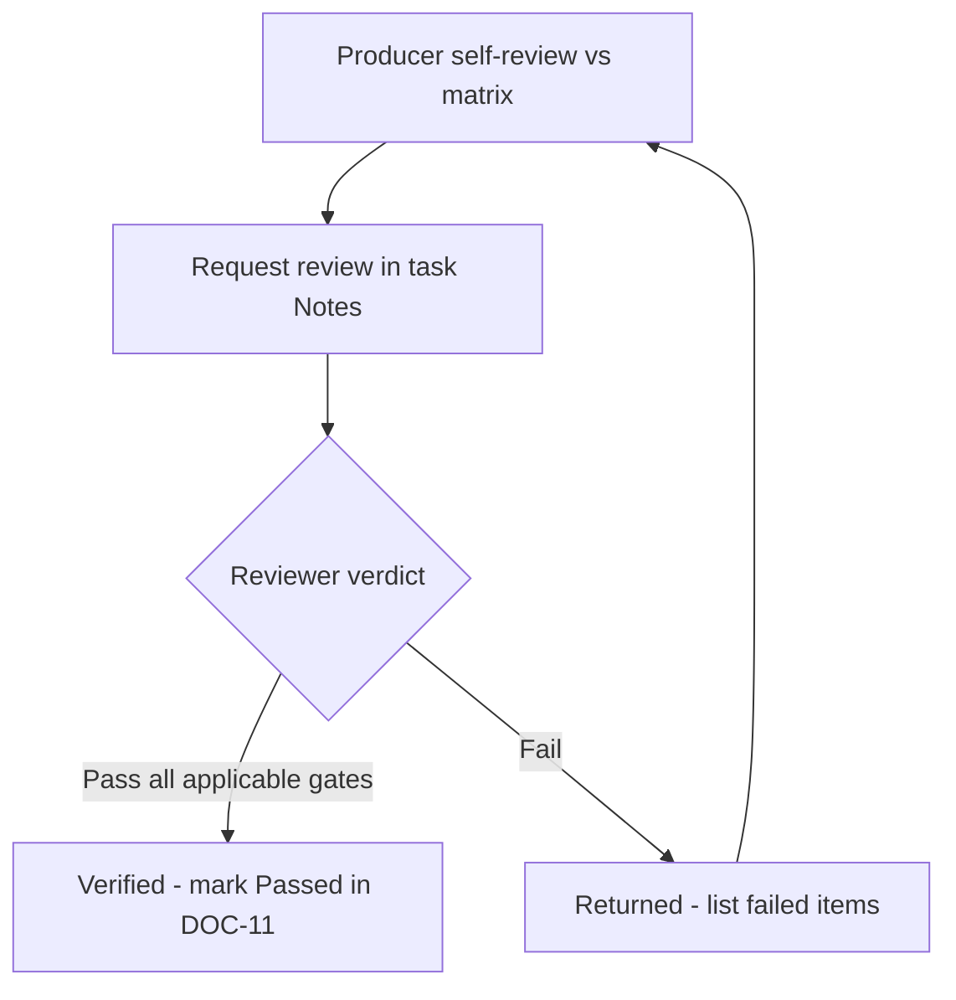

# 16 — Quality Checklist

> **Document ID:** DOC-16 · **Status:** Active · **Owner:** Quality Lead (role)

| Field | Value |
|-------|-------|
| **Title** | Quality Checklist |
| **Purpose** | Defines the mandatory quality review gates that **every** future deliverable must pass: Architecture, Educational, UX, Consistency, Accessibility, Scalability, and Documentation reviews. No deliverable is "Done" without passing its applicable gates (DOC-10 §7). |
| **Owner** | Quality Lead (role) |
| **Version** | 1.0.0 |
| **Status** | Active — gates are blocking unless explicitly waived by the Quality Lead |
| **Dependencies** | DOC-01…DOC-15 (each gate verifies conformance to these), DOC-11 (verification workflow) |
| **Last Updated** | 2026-07-31 |
| **Review Cadence** | Continuous; checklist version reviewed quarterly |

## Table of Contents

- [1. Quality Policy](#1-quality-policy)
- [2. Review Gate Model](#2-review-gate-model)
- [3. Gate A — Architecture Review](#3-gate-a--architecture-review)
- [4. Gate B — Educational Review](#4-gate-b--educational-review)
- [5. Gate C — UX Review](#5-gate-c--ux-review)
- [6. Gate D — Consistency Review](#6-gate-d--consistency-review)
- [7. Gate E — Accessibility Review](#7-gate-e--accessibility-review)
- [8. Gate F — Scalability Review](#8-gate-f--scalability-review)
- [9. Gate G — Documentation Review](#9-gate-g--documentation-review)
- [10. Deliverable → Gate Matrix](#10-deliverable--gate-matrix)
- [11. Review Workflow & Waivers](#11-review-workflow--waivers)
- [Revision History](#revision-history)
- [Notes](#notes)
- [Cross References](#cross-references)

---

## 1. Quality Policy

1. **Quality is a gate, not a wish.** Deliverables that fail a gate are returned for rework (DOC-11 §4).
2. **The checklist is binary and verifiable.** Every item is phrased as a Yes/No check with an artifact to inspect (file, test, record).
3. **Prevention over inspection.** Producers self-review against the same checklists before requesting review (DOC-10 §7).
4. **No silent waivers.** Waivers require Quality Lead approval, are time-boxed, and are recorded in the task Notes + DOC-13.
5. **Baseline exception (one-time):** the MS-01 documentation baseline (TASK-001…018) was produced and self-verified by the Foundation Architect; an independent review is scheduled as TASK-102 in MS-02 (see DOC-11 §4).

## 2. Review Gate Model

Each gate: **Gate ID — Name — Reviewer role — Applicability — Checklist** (items Y/N) — **Blocking if** conditions.

| Gate | Name | Reviewer role |
|------|------|---------------|
| A | Architecture Review | Lead Architect |
| B | Educational Review | Content Director / Assessment Lead |
| C | UX Review | UX Lead |
| D | Consistency Review | Data Architect / Quality Lead |
| E | Accessibility Review | A11y Lead |
| F | Scalability Review | Lead Architect |
| G | Documentation Review | Governance Lead |

## 3. Gate A — Architecture Review

*Applies to: code, schemas, integrations, new components, architecture doc changes.*

- [ ] A-01 Conforms to DOC-02 components, boundaries, and layer rules (no direct DB from clients, module isolation).
- [ ] A-02 Content remains data — no hard-coded curriculum/UI strings in code.
- [ ] A-03 Technology decisions have an approved ADR (DOC-14); no OPD-blocked choices.
- [ ] A-04 API/event contracts are versioned and documented.
- [ ] A-05 Security baseline applied: input validation, authN/authZ, secrets, no PII in logs.
- [ ] A-06 Observability: logs, metrics, traces emitted per DOC-02 §9.
- [ ] A-07 No premature distribution (modular monolith preserved unless ADR extraction approved).
- [ ] A-08 Dependencies added are justified, licensed, and recorded.

**Blocking if:** A-01/A-02/A-03 fail, or two or more others fail.

## 4. Gate B — Educational Review

*Applies to: all content deliverables (lessons, exercises, quizzes, projects, exams, rubrics, certificates).*

- [ ] B-01 IDs match DOC-03 exactly (LES/MOD/STG codes, no orphans).
- [ ] B-02 Lesson anatomy follows DOC-07 §3 (all ten sections present, correct order).
- [ ] B-03 Objectives are measurable and achieved by the content.
- [ ] B-04 Quiz questions follow DOC-07 §5 rules (single-concept, plausible distractors, explanations).
- [ ] B-05 Assessment thresholds/gates match DOC-08 §4 and ENT-ASSESSRULE versioning.
- [ ] B-06 Rubrics use the DOC-08 §6 scale with published Arabic descriptors.
- [ ] B-07 Content is reproducible: steps valid for declared Adobe version; assets exist and are licensed (ADR-007).
- [ ] B-08 Arabic is MSA, terminology matches the glossary, English terms glossed per DOC-07 §2.
- [ ] B-09 Duration estimates within DOC-03 §14 budgets.
- [ ] B-10 Alignment with persona/path intent (DOC-01 §5, DOC-03 §12).

**Blocking if:** B-01, B-05, or B-07 fail, or three or more others fail.

## 5. Gate C — UX Review

*Applies to: screens, flows, components, interaction changes.*

- [ ] C-01 Screen matches DOC-04 spec (ID, purpose, actions, states) — no scope drift.
- [ ] C-02 All states defined: loading, empty, error, offline (DOC-04 §4).
- [ ] C-03 One primary action per screen (UI-4); ≤ 3 steps to any screen (DOC-04 §12).
- [ ] C-04 Mobile-first: works at 360 px; breakpoint behavior per DOC-04 §10.
- [ ] C-05 RTL correctness per DOC-04 §11 / DOC-06 §9 (mirroring, logical properties, bidi isolation).
- [ ] C-06 Resumable flows: no progress loss on navigation/refresh (UI-5).
- [ ] C-07 Error messages are human, Arabic, actionable; no jargon.
- [ ] C-08 Notifications/feedback are timely, preference-respecting (SCR-16/17).

**Blocking if:** C-02, C-04, or C-05 fail, or three or more others fail.

## 6. Gate D — Consistency Review

*Applies to: data models, schemas, IDs, naming, metadata.*

- [ ] D-01 Logical model conforms to DOC-05 (entities, relationships, ownership) with traceability.
- [ ] D-02 IDs and naming conventions match DOC-03 §2 / DOC-07 §8 / DOC-12 §4.
- [ ] D-03 No duplicated entities/content; canonical source identified for each data element.
- [ ] D-04 Cross-references and links in docs resolve (no broken internal links).
- [ ] D-05 Metadata complete: version, owner, status, dates where required.

**Blocking if:** D-01 or D-03 fail.

## 7. Gate E — Accessibility Review

*Applies to: every user-facing deliverable and content item.*

- [ ] E-01 WCAG 2.2 AA checkpoints per DOC-06 §8 passed (automated scan + manual sampling).
- [ ] E-02 Keyboard operable with visible focus; logical RTL focus order.
- [ ] E-03 Contrast AA on all text/icon-surface pairs (semantic colors paired with icons/text).
- [ ] E-04 Screen-reader support: landmarks, labels, aria-live for dynamic content; Arabic SR tested.
- [ ] E-05 Video: Arabic captions + transcripts present (DOC-07 §6); player keyboard accessible.
- [ ] E-06 Reduced-motion respected (DOC-06 §7); no autoplay with sound.
- [ ] E-07 Forms: visible labels, linked errors, no placeholder-only.
- [ ] E-08 200% zoom / 320 px reflow without loss.

**Blocking if:** any E item fails for GA-bound deliverables.

## 8. Gate F — Scalability Review

*Applies to: architecture changes, data-heavy features, media features.*

- [ ] F-01 Design supports DOC-02 §10 trajectory (10k → 1M learners) without redesign.
- [ ] F-02 Media delivery plan: CDN, adaptive bitrate, caching, offline (R-P-01 mitigation).
- [ ] F-03 Stateless services / horizontal-scaling readiness; no in-memory state in critical paths.
- [ ] F-04 Event/analytics volume handled without touching transactional stores.
- [ ] F-05 Load test evidence where milestone requires (MS-13; DOC-01 M-16).
- [ ] F-06 Extraction paths preserved (module → service) per DOC-02 §10.

**Blocking if:** F-01 or F-02 fail, or F-03 + F-04 both fail.

## 9. Gate G — Documentation Review

*Applies to: every change that touches the repository.*

- [ ] G-01 CHG entry exists for the change (DOC-13), with version bumps.
- [ ] G-02 Affected documents updated and Revision History appended (DOC-10 R-05).
- [ ] G-03 ADR recorded if a decision was made (DOC-14).
- [ ] G-04 Task record complete: status, notes, completion date, verification requested (DOC-11).
- [ ] G-05 Handover completed per DOC-12 (interim or final) and linked from task Notes.
- [ ] G-06 No unrecorded assumptions (R-07): assumptions visible in Notes/ADR.
- [ ] G-07 No prohibited actions (DOC-10 §8 list) were taken.

**Blocking if:** any G item fails — documentation duty is unconditional (R-05).

## 10. Deliverable → Gate Matrix

| Deliverable type | A | B | C | D | E | F | G |
|------------------|---|---|---|---|---|---|---|
| Documentation change | — | — | — | ✓ | ✓ (content a11y) | — | ✓ |
| Curriculum/lesson content | — | ✓ | — | ✓ | ✓ | — | ✓ |
| Quiz/exam/rubric content | — | ✓ | — | ✓ | ✓ | — | ✓ |
| Screen/flow/component | ✓ | — | ✓ | ✓ | ✓ | — | ✓ |
| Data model/schema | ✓ | — | — | ✓ | — | ✓ | ✓ |
| Media asset/lesson video | — | ✓ | — | — | ✓ | ✓ | ✓ |
| Architecture/integration | ✓ | — | — | ✓ | — | ✓ | ✓ |
| Platform release (MS-08+…) | ✓ | — | ✓ | ✓ | ✓ | ✓ | ✓ |

## 11. Review Workflow & Waivers

1. Producer fills the applicable gates from §10 before requesting review.
2. Reviewer (role per §2) marks each item; failed items are listed in task Notes.
3. Pass → DOC-11 Verification Status `Passed` + reviewer/date; fail → `Failed — returned` (DOC-11 §4).
4. **Waivers:** requested in task Notes with reason + expiration; approved only by Quality Lead; recorded in DOC-13. Waived items become follow-up tasks.

---

## Revision History

| Version | Date | Author | Summary of Changes |
|---------|------|--------|--------------------|
| 1.0.0 | 2026-07-31 | Project Foundation Architect | Initial baseline (DOC-16): 7 gates, 52 checklist items, deliverable matrix, workflow. |

## Notes

- Checklist items reference their source requirements (DOC-XX §/ID) so reviewers verify against the actual standard, not memory.
- Automated tooling (lint, link checks, a11y scans) will operationalize several items in MS-02 (TASK-101) and MS-11 (TASK-217).

## Cross References

| Reference | Relationship |
|-----------|--------------|
| [DOC-02 System Architecture](02_SYSTEM_ARCHITECTURE.md) | Gate A source |
| [DOC-03 Curriculum Blueprint](03_CURRICULUM_BLUEPRINT.md) / [DOC-07 Content Standards](07_CONTENT_STANDARDS.md) / [DOC-08 Assessment Standard](08_ASSESSMENT_STANDARD.md) | Gate B source |
| [DOC-04 UI Blueprint](04_UI_BLUEPRINT.md) / [DOC-06 Design System](06_DESIGN_SYSTEM.md) | Gates C & E source |
| [DOC-05 Database Blueprint](05_DATABASE_BLUEPRINT.md) | Gate D source |
| [DOC-10 Agent Rules](10_AGENT_RULES.md) | DoD integration |
| [DOC-11 Task Management](11_TASK_MANAGEMENT.md) | Verification workflow |
| [DOC-13 Project Changelog](13_PROJECT_CHANGELOG.md) / [DOC-14 Decision Log](14_DECISION_LOG.md) | Gate G source |
