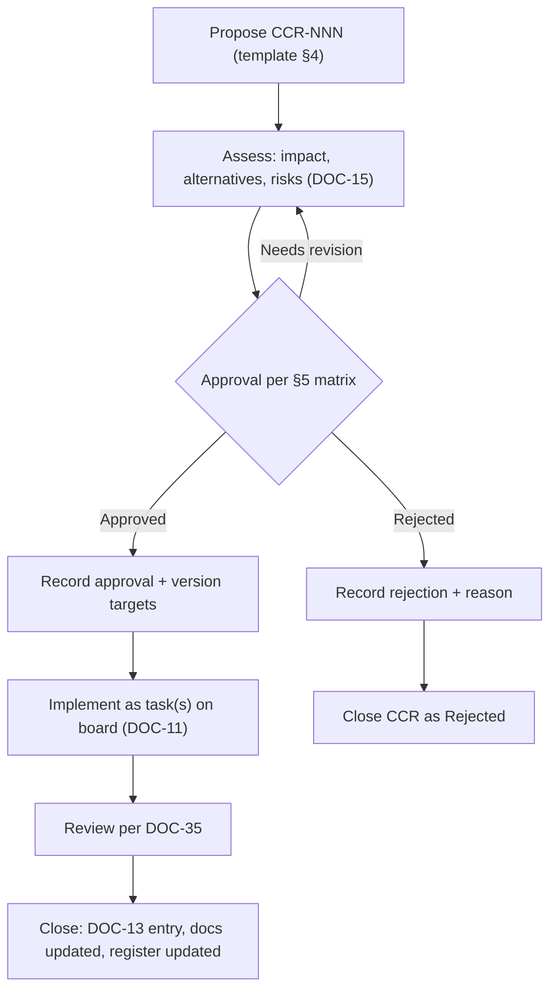

# CHANGE_CONTROL — Change Control

> **Document ID:** DOC-36 · **Status:** Active · **Owner:** Governance Lead (role)

| Field | Value |
|-------|-------|
| **Title** | Change Control |
| **Purpose** | Defines how change requests are proposed, assessed, approved, recorded, and versioned — the single process for every deliberate change that goes beyond routine task execution. It covers documentation, scope, curriculum structure, policy, and locked items. |
| **Owner** | Governance Lead (role) |
| **Version** | 1.0.0 |
| **Status** | Active |
| **Dependencies** | DOC-14 (ADR mechanism), DOC-30 (policy lock), DOC-03 §17 (CCP for curriculum), DOC-13 (changelog), DOC-25 (versioning), DOC-35 (review) |
| **Last Updated** | 2026-07-31 |
| **Review Cadence** | Quarterly; process changes via CCR/ADR |

## Table of Contents

- [1. Purpose & Scope](#1-purpose--scope)
- [2. What Requires a Change Request](#2-what-requires-a-change-request)
- [3. Change Request Lifecycle](#3-change-request-lifecycle)
- [4. Change Request Record Format](#4-change-request-record-format)
- [5. Approval Matrix](#5-approval-matrix)
- [6. Change Request Register](#6-change-request-register)
- [7. Emergency Changes](#7-emergency-changes)
- [8. Relationship to Other Mechanisms](#8-relationship-to-other-mechanisms)
- [9. Update Rules (Mandatory)](#9-update-rules-mandatory)
- [Revision History](#revision-history)
- [Notes](#notes)
- [Cross References](#cross-references)

---

## 1. Purpose & Scope

Routine task execution (producing approved content, updating registries, PATCH doc fixes) does not need a change request — the task board is its authorization. A **Change Request (CCR)** is required when a change:

- alters a **locked** provision (DOC-30 §3),
- changes **scope** (DOC-32), milestones (DOC-09), or phase contracts (DOC-31/37),
- changes **rules, thresholds, standards, or policy** (DOC-06/07/08/10/16/24/25…),
- changes **curriculum structure** (DOC-03 skeleton — the CCP path),
- is architectural (→ ADR, DOC-14),
- is a deliberate reversal of a previous decision.

Everything else flows through tasks + DOC-13 as normal.

## 2. What Requires a Change Request

| Trigger | Mechanism | See |
|---------|-----------|-----|
| Change a locked item | CCR or ADR | DOC-30 §5 |
| Add/remove/reorder curriculum units | CCR (CCP flavor) | DOC-03 §17 |
| Change scope of a phase/batch | CCR | DOC-32 §9 |
| Change assessment thresholds | CCR + ADR (versioned rules) | DOC-08 §4 |
| Change an architectural decision | ADR | DOC-14 |
| Change governance rules (DOC-10/24/25/35/36) | CCR + ADR for lock layers | DOC-30 |
| Change milestones/priorities/dates | CCR (PM approval) | DOC-09 §6 |
| Introduce a new ID family / artifact type | CCR | DOC-24 §8 |
| Reversal of any accepted decision | CCR + ADR | DOC-14 §4 |

## 3. Change Request Lifecycle



| Phase | Actor | Output |
|-------|-------|--------|
| 1. Propose | Any agent/user | CCR record (§4) with problem, options, recommendation |
| 2. Assess | Domain owner | Impact statement incl. affected docs, locked items, risks |
| 3. Approve | Per §5 matrix | Decision + conditions |
| 4. Implement | Assigned agent | Task(s) on board; work within DOC-34 checklist |
| 5. Verify | Reviewer per DOC-35 | Pass/Fail on gates |
| 6. Close | Governance Lead | DOC-13 entry; CCR status → Implemented/Rejected |

## 4. Change Request Record Format

```markdown
### CCR-NNN — <Short Title>
- **Date proposed:** YYYY-MM-DD
- **Proposer:** <agent ID / role>
- **Type:** doc / scope / curriculum (CCP) / policy / standards / process / reversal
- **Problem:** <what is wrong or why the change is needed>
- **Options considered:** <at least 2 alternatives>
- **Recommendation:** <chosen option + rationale>
- **Locked items affected (if any):** LCK-XX (DOC-30) or none
- **Impact:** <affected documents, tasks, milestones, risks>
- **Approval:** <date, approver per §5, conditions>
- **Implementation tasks:** TASK-NNN
- **Status:** Proposed / Under assessment / Approved / Rejected / Implemented / Closed
- **Changelog ref:** CHG-NNN
```

## 5. Approval Matrix

| Change type | Approver(s) | Notes |
|-------------|-------------|-------|
| Doc fix (PATCH) | No CCR — task + DOC-13 | Routine |
| Doc addition/clarification (MINOR) | Document owner | Routine, no CCR |
| Scope change (DOC-32) | Project Manager + user | CCR mandatory |
| Milestone/priority change | Project Manager | CCR; DOC-09 §6 |
| Curriculum structure (CCP) | Curriculum Director + Governance Lead | DOC-03 §17 |
| Assessment threshold | Assessment Lead + Governance Lead | Versioned rule; ADR if architectural |
| Content standards (DOC-07) | Content Director + Governance Lead | CCR |
| Design/a11y minima (DOC-06 §8) | Design Lead + Governance Lead | CCR |
| Agent rules / naming / versioning (DOC-10/24/25) | Governance Lead + user | CCR + ADR (L5 lock) |
| Architectural decision | Lead Architect + Governance Lead | ADR (DOC-14) |
| Phase contracts (DOC-31/32/36/37) | Project Manager + Governance Lead + user | CCR + ADR (L6 lock) |
| Reversal of accepted decision | Original approver + user | CCR + ADR |

**Default:** if in doubt, require the higher approval tier.

## 6. Change Request Register

| CCR | Title | Type | Status | Approval | Changelog | Notes |
|-----|-------|------|--------|----------|-----------|-------|
| CCR-001 | Foundation closure & Phase-1 authorization | process | Implemented | 2026-07-31 — Governance Lead + PM + user (GATE-F1 PASS) | CHG-003 | This batch: DOC-30…38, ADR-009 |
| CCR-002 | (next) | — | Proposed | — | — | — |

> **Register rules:** CCR IDs are permanent (`CCR-\d{3}`, DOC-24). The register is append-only; status history is preserved via DOC-13. A CCR becomes the audit reference for every non-routine change.

## 7. Emergency Changes

| Rule | Detail |
|------|--------|
| Definition | Fix of a live defect that blocks production or a legal/security issue |
| Path | Propose CCR marked `Emergency`; implement immediately with PM + domain owner approval (or user if unavailable); full assessment follows within 48 h |
| Recording | Same CCR format; DOC-13 entry with `Emergency` flag |
| Review | Retrospective review per DOC-35 within 5 working days |
| Post-hoc | If the emergency change touched a locked item, a normal CCR/ADR assessment completes the cycle (no permanent bypass) |

## 8. Relationship to Other Mechanisms

| Mechanism | Relationship to CCR |
|-----------|---------------------|
| ADR (DOC-14) | Architectural/policy decisions; a CCR may trigger an ADR; an ADR may reference the CCR that requested it |
| CCP (DOC-03 §17) | The curriculum-specific CCR flavor; a CCP is recorded as a CCR with type `curriculum (CCP)` |
| Tasks (DOC-11) | CCR implementation happens as tasks; CCR IDs are cited in task descriptions |
| Changelog (DOC-13) | Every CCR lifecycle event is recorded |
| Review (DOC-35) | Approved CCRs pass through the class-appropriate review path |
| Lock (DOC-30) | CCR is one of the two legitimate lock-change mechanisms (§5) |

## 9. Update Rules (Mandatory)

1. This document changes only via CCR/ADR (L6 lock, DOC-30 LCK-17).
2. New CCR types or approval-matrix changes require Governance Lead + user approval and a DOC-13 entry.
3. The register (§6) appends rows; existing rows are never edited (corrections create notes).

---

## Revision History

| Version | Date | Author | Summary of Changes |
|---------|------|--------|--------------------|
| 1.0.0 | 2026-07-31 | Project Foundation Architect | Initial baseline (DOC-36): triggers, lifecycle, record format, approval matrix, register (CCR-001), emergency path. |

## Notes

- Change control exists to make *deliberate* changes cheap and *accidental* changes impossible (R-03).
- A well-written CCR is 10 minutes of work and prevents hours of rework — invest in the Problem/Options/Impact fields.

## Cross References

| Reference | Relationship |
|-----------|--------------|
| [DOC-14 Decision Log](14_DECISION_LOG.md) | ADR linkage |
| [DOC-30 POLICY_LOCK](POLICY_LOCK.md) | Locked items requiring CCR/ADR |
| [DOC-03 Curriculum Blueprint](03_CURRICULUM_BLUEPRINT.md) | CCP integration (§17) |
| [DOC-13 Project Changelog](13_PROJECT_CHANGELOG.md) | Lifecycle records |
| [DOC-35 REVIEW_PROTOCOL](REVIEW_PROTOCOL.md) | Post-approval review |
| [DOC-24 NAMING_CONVENTION](NAMING_CONVENTION.md) | CCR ID format |
