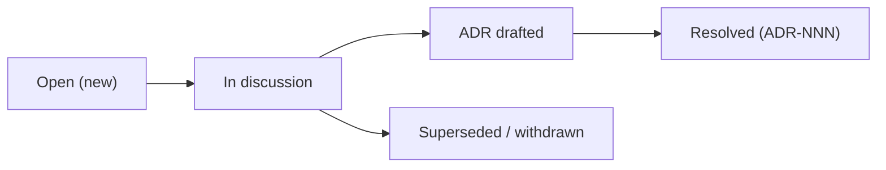

# OPEN_DECISIONS — Open Decisions Tracker

> **Document ID:** DOC-28 · **Status:** Active · **Owner:** Lead Architect (role)

| Field | Value |
|-------|-------|
| **Title** | Open Decisions Tracker |
| **Purpose** | The operational tracker for every open decision (OPD-NNN): what is being decided, what it blocks, who owns it, when it must resolve, and the exact resolution protocol. [DOC-14](14_DECISION_LOG.md) §3 is the authoritative list; this document is the working tracker that keeps decisions moving to resolution. |
| **Owner** | Lead Architect (role) |
| **Version** | 1.0.1 |
| **Status** | Active |
| **Dependencies** | DOC-14 (decision authority), DOC-09 (milestone gates), DOC-23 (what OPDs block), DOC-11 (tasks), DOC-13 (changelog) |
| **Last Updated** | 2026-07-31 |
| **Review Cadence** | Every milestone start; immediately when an OPD is created or resolved |

## Table of Contents

- [1. Purpose](#1-purpose)
- [2. OPD Lifecycle](#2-opd-lifecycle)
- [3. Tracker Format](#3-tracker-format)
- [4. Open Decisions Tracker](#4-open-decisions-tracker)
- [5. Resolution Protocol](#5-resolution-protocol)
- [6. Escalation Rules](#6-escalation-rules)
- [7. Update Rules (Mandatory)](#7-update-rules-mandatory)
- [Revision History](#revision-history)
- [Notes](#notes)
- [Cross References](#cross-references)

---

## 1. Purpose

Open decisions are the project's most common blocker (DOC-11 status `Blocked`; DOC-23 decision dependencies). DOC-14 records *what the decision is and its accepted alternatives*; this tracker answers the operational questions:

- What does this decision block, and when must it be made?
- Who drives it, and what is the next concrete action?
- Is it at risk of stalling?

**Authority rule:** a decision is only *resolved* when its ADR is recorded in DOC-14 and this tracker row is updated in the same change.

## 2. OPD Lifecycle

| Status | Meaning |
|--------|---------|
| `Open` | Decision identified; no resolution in progress |
| `In discussion` | Analysis/ADR draft underway (owner + task assigned) |
| `Resolved` | ADR accepted in DOC-14; tracker row updated |
| `Superseded` | Decision no longer needed; reason recorded |

## 3. Tracker Format

| Column | Content |
|--------|---------|
| OPD | Decision ID (`OPD-\d{3}`) |
| Decision | What must be decided |
| Blocks | What cannot proceed (components/milestones — see DOC-23) |
| Owner | Role driving the decision |
| Target | Milestone by which it must resolve |
| Next action | Concrete next step + task reference |
| Status | Open / In discussion / Resolved / Superseded |
| ADR | The ADR-NNN when resolved |

## 4. Open Decisions Tracker

| OPD | Decision | Blocks | Owner | Target | Next action | Status |
|-----|----------|--------|-------|--------|-------------|--------|
| OPD-001 | Application language & framework | All platform code (C-04…C-14); MS-08 | Lead Architect | MS-07 | Draft ADR with candidate shortlist (TASK-201) | Open |
| OPD-002 | Primary database product | SQL/physical schema; MS-08 | Data Architect | MS-07 | Evaluate candidates vs DOC-05 logical model (TASK-202) | Open |
| OPD-003 | Hosting / CDN / media delivery | Media pipeline, deployment; MS-08 | Lead Architect | MS-07 | Provider evaluation incl. MENA residency (TASK-203) | Open |
| OPD-004 | Media transcoding pipeline | Lesson video production; content pipeline | Lead Architect | MS-07 | Combine with OPD-003 evaluation (TASK-203) | Open |
| OPD-005 | Payment provider & billing | Premium monetization; MS-13 | Project Manager | MS-09 | Regional payment research (TASK-204) | Open |
| OPD-006 | Independent governance/verification model | TASK-102 (baseline review); Phase-1 scaling | Governance Lead | MS-02 | **Resolved** 2026-07-31 by ADR-009 — role-based review model adopted (DOC-35); reviewer assignment for content is defined there | Resolved (ADR-009) |
| OPD-007 | Brand identity values (colors, fonts, logo) | Design tokens; MS-11 | Design Lead | MS-11 | Brand exploration + legal review of name | Open |
| OPD-008 | Learner AI-assistance enforcement details | Integrity tooling; MS-12 | Assessment Lead | MS-12 | Refine ADR-008 framework with beta data | Open |

## 5. Resolution Protocol

| # | Step | Actor | Output |
|---|------|-------|--------|
| 5.1 | Assign owner + target | Lead Architect / Project Manager | Tracker row updated |
| 5.2 | Research + alternatives | Owner | Draft ADR (DOC-14 format) |
| 5.3 | Consultation (affected owners) | Owner | Feedback recorded in ADR draft notes |
| 5.4 | Acceptance | Lead Architect + Governance Lead (policy ADRs: user approval) | ADR-NNN in DOC-14 |
| 5.5 | Propagate | Owner | Update DOC-02/05/06/09 as needed + DOC-23 rows + this tracker + DOC-13 entry |

**Rule:** an OPD may not be marked Resolved without an ADR in DOC-14 (no "informal resolutions").

## 6. Escalation Rules

1. An OPD whose target milestone passes while still Open is **escalated** to the Project Manager and recorded as a risk in DOC-15 (decision gap).
2. OPDs blocking P0 milestones (e.g., OPD-001/002 before MS-08) are reviewed at every milestone start (DOC-29 checkpoint) and surfaced in PROJECT_STATE §6.
3. An OPD inactive for two consecutive milestones may be withdrawn (Superseded) with reason, or forced to resolution by the user as Project Owner.
4. Conflicts between decisions are resolved by the Lead Architect, recorded as a new ADR (never by editing an old one).

## 7. Update Rules (Mandatory)

1. New OPDs are registered here **and** in DOC-14 §3 in the same change (DOC-24 ID format).
2. Status changes here are paired with the corresponding DOC-14 and DOC-23 updates and a DOC-13 entry.
3. The tracker is append-only for history; corrections create notes, not edits of old rows.
4. Structure changes require Lead Architect approval + version bump per DOC-25.

---

## Revision History

| Version | Date | Author | Summary of Changes |
|---------|------|--------|--------------------|
| 1.0.1 | 2026-07-31 | Project Foundation Architect | OPD-006 marked Resolved (ADR-009, DOC-35 review model); header/tracker synced (CHG-003). |
| 1.0.0 | 2026-07-31 | Project Foundation Architect | Initial baseline (DOC-28): lifecycle, tracker for OPD-001…008, resolution protocol. |

## Notes

- This tracker is operational; DOC-14 remains the authoritative decision record. Keep both in sync in the same change.
- Resolving OPD-001…005 is milestone MS-07's core deliverable (TASK-201…204).

## Cross References

| Reference | Relationship |
|-----------|--------------|
| [DOC-14 Decision Log](14_DECISION_LOG.md) | Authoritative ADR/OPD records |
| [DOC-09 Project Roadmap](09_PROJECT_ROADMAP.md) | Milestone gates (targets) |
| [DOC-23 DEPENDENCIES](DEPENDENCIES.md) | What each OPD blocks |
| [DOC-19 PROJECT_STATE](PROJECT_STATE.md) | OPD snapshot |
| [DOC-13 Project Changelog](13_PROJECT_CHANGELOG.md) | Decision lifecycle records |
| [DOC-24 NAMING_CONVENTION](NAMING_CONVENTION.md) | OPD ID format |
