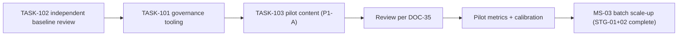

# PHASE_1_SCOPE — Phase 1 Production Scope

> **Document ID:** DOC-32 · **Status:** Active · **Owner:** Project Manager (role)

| Field | Value |
|-------|-------|
| **Title** | Phase 1 Production Scope |
| **Purpose** | Defines the **exact first production scope** for the curriculum: which stage/module/lesson group is built first, what the deliverables are, and — equally important — what is **out of scope**. It is the boundary within which Phase 1 content agents operate (DOC-10 P-04/R-04). |
| **Owner** | Project Manager (role) |
| **Version** | 1.0.0 |
| **Status** | Active |
| **Dependencies** | DOC-03 (curriculum skeleton), DOC-07 (content standards), DOC-08 (assessment standard), DOC-09 (roadmap MS-02/03), DOC-22 (lesson registry), DOC-38 (Phase 1 entry) |
| **Last Updated** | 2026-07-31 |
| **Review Cadence** | At the start of each content batch (MS-02…06); scope changes only via CCR (DOC-36) |

## Table of Contents

- [1. Purpose & Boundary Model](#1-purpose--boundary-model)
- [2. Phase 1 Definition](#2-phase-1-definition)
- [3. First Production Scope — Pilot Batch P1-A](#3-first-production-scope--pilot-batch-p1-a)
- [4. Deliverables per Lesson Unit](#4-deliverables-per-lesson-unit)
- [5. In-Scope vs Out-of-Scope](#5-in-scope-vs-out-of-scope)
- [6. Sequencing & Dependencies](#6-sequencing--dependencies)
- [7. Scope Verification](#7-scope-verification)
- [8. Completion & Status Field](#8-completion--status-field)
- [9. Update Rules (Mandatory)](#9-update-rules-mandatory)
- [Revision History](#revision-history)
- [Notes](#notes)
- [Cross References](#cross-references)

---

## 1. Purpose & Boundary Model

Phase 1 is **content production only**. This document draws the exact production boundary so that parallel agents produce the same scope without overlap and without drifting into platform, design, or assessment-engine work. The boundary model is:

- **What** — the exact stages/modules/lessons (§3)
- **How** — per DOC-07/08 standards (§4)
- **What not** — everything else (§5)

Scope changes (adding/removing/reordering units) require a **CCR** (DOC-36) — never silent expansion.

## 2. Phase 1 Definition

| Field | Value |
|-------|-------|
| Phase ID | Phase 1 |
| Name | Curriculum Content Production |
| Spans milestones | MS-02 (pilot), MS-03…MS-06 (content batches) |
| Primary output | Arabic lesson content packages (lessons, exercises, quizzes, projects, exams) per DOC-07 §8 |
| Entry gate | GATE-F1 (DOC-31) — **passed 2026-07-31** |
| Entry point | PHASE_1_README (DOC-38) |
| Exit (to Phase 2) | Defined by a future GATE-F2; not yet scheduled |

## 3. First Production Scope — Pilot Batch P1-A

**Scope rule:** the first production scope is **STG-01 (complete) + the first two modules of STG-02**, produced as the pilot batch that validates the content pipeline (per DOC-09 MS-02) before larger batches (MS-03…06).

### P1-A scope table

| Unit | Title | Lessons | Difficulty | Notes |
|------|-------|---------|-----------|-------|
| STG-01 | Foundations of Creative Computing | 16 | B1 | Complete stage (all 4 modules) |
| MOD-0101 | Welcome & Platform Orientation | 4 | B1 | LES-010101…010104 |
| MOD-0102 | Design Fundamentals | 5 | B1 | LES-010201…010205 |
| MOD-0103 | Digital Color & File Standards | 4 | B1 | LES-010301…010304 |
| MOD-0104 | Orientation Assessment & Path Selection | 3 | B1 | LES-010401…010403 |
| MOD-0201 | Photoshop Fundamentals | 6 | B1 | LES-020101…020106 |
| MOD-0202 | Retouching & Photo Editing | 6 | B2 | LES-020201…020206 |
| **P1-A total** | | **28 lessons** | B1–B2 | 6 modules |

**Stage-level deliverables for P1-A:**

| Deliverable | Requirement |
|-------------|-------------|
| 16 STG-01 lessons + 12 STG-02 lessons (content packages) | Per DOC-07 §3 anatomy, §4 exercises, §5 quizzes |
| Module quizzes (AT-04) for all 6 modules | 8–12 questions, ≥ 2× pool, passing 70% (DOC-08 §3–§5) |
| STG-01 stage project (AT-05) + rubric | Per DOC-08 §6, rubric anchors |
| STG-01 stage exam (AT-06) | 30–40 questions, passing 75% |
| Placement assessment (AT-07) for MOD-0104 | Informational; 20–30 questions |
| Media assets for all produced lessons | Original/licensed per ADR-007, DOC-07 §6 |
| Rubric anchors & grading examples | For reviewer calibration (DOC-08 §8) |

### P1-A lesson list (registry reference)

All 28 lessons are pre-registered in [DOC-22 LESSONS_INDEX](LESSONS_INDEX.md) with status `Not started`; production flips them to `In production → In review → Published` per DOC-22 §3. The exact lesson IDs:

- **STG-01:** LES-010101 … LES-010104, LES-010201 … LES-010205, LES-010301 … LES-010304, LES-010401 … LES-010403
- **STG-02:** LES-020101 … LES-020106, LES-020201 … LES-020206

## 4. Deliverables per Lesson Unit

Every produced lesson unit **must** ship as a versioned content package containing:

| # | Component | Standard |
|---|-----------|----------|
| 1 | Lesson content (video/reading sections) | DOC-07 §3 anatomy (10 sections) |
| 2 | Objectives + prerequisites metadata | DOC-07 §8 frontmatter |
| 3 | Guided practice + ≥ 1 exercise | DOC-07 §4 |
| 4 | Checkpoint questions | DOC-07 §3 (formative, AT-01) |
| 5 | Quiz items for the owning module | DOC-07 §5, pooled per DOC-08 |
| 6 | Media (video/transcripts/captions/images) | DOC-07 §6 |
| 7 | Assets license records | ADR-007, DOC-07 §6 |
| 8 | Accessibility conformance (text, images, media) | DOC-07 §9, DOC-16 Gate E |

## 5. In-Scope vs Out-of-Scope

| ✅ **IN SCOPE (P1-A)** | ❌ **OUT OF SCOPE (prohibited until their gate/milestone)** |
|--------------------------|------------------------------------------------------------|
| Content production for the 28 lessons in §3 | All other lessons: MOD-0203…0205, all of STG-03…STG-08 |
| STG-01 project/exam + placement assessment | Certificates issuance/engine (C-09 — MS-09) |
| Rubric definitions + anchors for STG-01/02 | Any platform code, UI, backend, database (MS-07/08+) |
| Arabic MSA content with glossary terminology | Any non-Arabic content edition (English/French — post-GA) |
| Original/licensed media for produced lessons | Media pipeline/tooling decisions (OPD-004 — MS-07) |
| Content metadata + package versioning | Any SQL or physical schema (OPD-002 — MS-07) |
| Documentation updates required by content work | Content outside DOC-03 skeleton (requires CCP first) |
| Pilot process learnings → KBE/PRMPT/CHKPT records | Anything not on the DOC-11 task board |

**Hard boundary rules:**
1. An agent producing P1-A content **may not** create, modify, or plan platform artifacts (`app/`, databases, UI). (DOC-10 P-03/P-05/P-12)
2. An agent may **not** extend scope to "finish the module" beyond §3 — expansion goes through a CCR.
3. Media creation must not depend on unapproved providers (OPD-003/004).

## 6. Sequencing & Dependencies

| Order | Work | Depends on | Notes |
|-------|------|-----------|-------|
| 1 | TASK-102 — independent baseline review | Gate F1 passed | Validates foundation docs |
| 2 | TASK-101 — governance tooling | TASK-102 | Link/header/ID lint (de-risks R-G-01) |
| 3 | TASK-103 — P1-A pilot content | TASK-102, 101 | First 28 lessons |
| 4 | Pilot review + calibration | TASK-103 | DOC-35 protocol; DOC-08 `[TBD]`s |
| 5 | MS-03 batch (STG-01 + STG-02 full) | Pilot validated | Scope expansion via DOC-09, not silently |

## 7. Scope Verification

| Check | Method | Where |
|-------|--------|-------|
| No out-of-scope lessons produced | LESSONS_INDEX status sweep: only P1-A rows may leave `Not started` | DOC-22 |
| All P1-A lessons registered | 28/28 rows present with package refs | DOC-22 §7 |
| Content conforms to standards | DOC-16 Gate B/E reviews per unit | DOC-16 |
| Scope respected in tasks | Task descriptions match §3 | DOC-11 |
| No platform artifacts | Repo scan: `app/`, schemas absent | DOC-18, Gate D |

## 8. Completion & Status Field

| Field | Value |
|-------|-------|
| **Scope version** | 1.0.0 (P1-A) |
| **P1-A lessons** | 28 of 28 `Not started` (2026-07-31) |
| **P1-A status** | 🟦 Not Started — authorized by GATE-F1 (DOC-31) |
| **Next batch trigger** | Pilot completion + DOC-09 MS-02 exit criteria |
| **Scope change count** | 0 |

## 9. Update Rules (Mandatory)

1. Scope changes (add/remove/reorder units, change deliverables) require a **CCR** (DOC-36) approved by PM + user; the change updates §3, §8, DOC-13, and DOC-22.
2. New batches (P1-B…: MS-03…06 scopes) are added as new sections in this document when their milestone starts.
3. Status flips in §8 follow DOC-22 registry transitions, in the same change as the underlying work.
4. This document is locked at L6 (DOC-30 LCK-16): its amendments follow DOC-36.

---

## Revision History

| Version | Date | Author | Summary of Changes |
|---------|------|--------|--------------------|
| 1.0.0 | 2026-07-31 | Project Foundation Architect | Initial baseline (DOC-32): P1-A scope = STG-01 (16 lessons) + MOD-0201/0202 (12 lessons), deliverables, in/out-of-scope boundaries. |

## Notes

- P1-A deliberately includes the first two Photoshop modules because they are the reference quality bar for the entire STG-02 batch (MS-03) and are prerequisites for later stages (DOC-03 §13).
- "Out of scope" is not a judgement — it is sequencing. Everything will be produced at its milestone.

## Cross References

| Reference | Relationship |
|-----------|--------------|
| [DOC-03 Curriculum Blueprint](03_CURRICULUM_BLUEPRINT.md) | Skeleton this scope draws from |
| [DOC-09 Project Roadmap](09_PROJECT_ROADMAP.md) | MS-02/03 batch linkage |
| [DOC-07 Content Standards](07_CONTENT_STANDARDS.md) / [DOC-08 Assessment Standard](08_ASSESSMENT_STANDARD.md) | Production standards |
| [DOC-22 LESSONS_INDEX](LESSONS_INDEX.md) | Lesson registry transitions |
| [DOC-35 REVIEW_PROTOCOL](REVIEW_PROTOCOL.md) | Content review flow |
| [DOC-38 PHASE_1_README](PHASE_1_README.md) | Phase 1 entry point |
| [DOC-36 CHANGE_CONTROL](CHANGE_CONTROL.md) | Scope-change mechanism |
