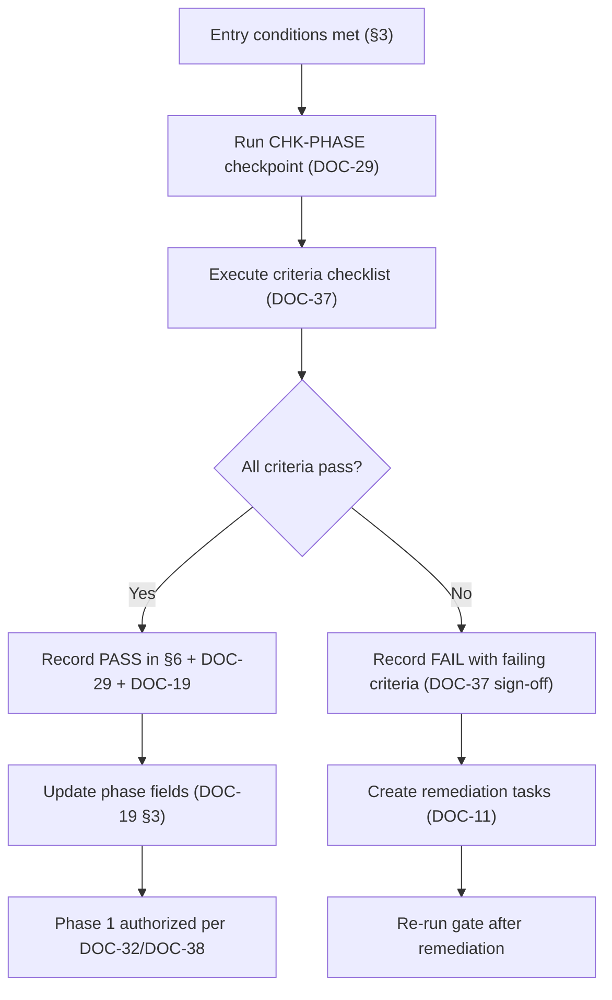

# PHASE_GATE — Phase Gate (Foundation → Phase 1)

> **Document ID:** DOC-31 · **Status:** Active · **Owner:** Project Manager (role)

| Field | Value |
|-------|-------|
| **Title** | Phase Gate — Foundation to Phase 1 |
| **Purpose** | Defines the exact gate between the documentation-foundation phase and Phase 1 (content production): the conditions that must hold, who verifies them, how the gate is run, and what happens if it fails. It makes the phase transition **unambiguous and auditable**. |
| **Owner** | Project Manager (role) |
| **Version** | 1.0.0 |
| **Status** | Active |
| **Dependencies** | DOC-37 (release criteria — the gate's checklist), DOC-29 (checkpoints), DOC-32 (Phase 1 scope), DOC-19 (project state), DOC-14/36 (change mechanisms) |
| **Last Updated** | 2026-07-31 |
| **Review Cadence** | At every phase transition; this document itself changes only via CCR/ADR |

## Table of Contents

- [1. Purpose & Model](#1-purpose--model)
- [2. Gate Definition](#2-gate-definition)
- [3. Gate Entry Conditions](#3-gate-entry-conditions)
- [4. Gate Procedure](#4-gate-procedure)
- [5. Gate Criteria (Checklist)](#5-gate-criteria-checklist)
- [6. Gate Decision & Recording](#6-gate-decision--recording)
- [7. What Happens After the Gate Passes](#7-what-happens-after-the-gate-passes)
- [8. Failure & Re-entry](#8-failure--re-entry)
- [9. Update Rules (Mandatory)](#9-update-rules-mandatory)
- [Revision History](#revision-history)
- [Notes](#notes)
- [Cross References](#cross-references)

---

## 1. Purpose & Model

A **phase gate** is a formal, recorded decision point: the project may not move from one phase to the next until the gate passes. This project has one gate now:

**GATE-F1: Foundation → Phase 1 (content production).**

The gate is defined by:
- **Entry conditions** (§3) — what must be true *before* the gate can even be run;
- **Criteria** (§5) — the checklist the gate verifies (detailed in DOC-37);
- **Procedure** (§4) — who runs it and how;
- **Decision & recording** (§6) — how the outcome is captured and who signs.

The gate is deliberately **not** "the docs are good enough" — it is a verifiable checklist executed against the repository.

## 2. Gate Definition

| Field | Value |
|-------|-------|
| Gate ID | `GATE-F1` |
| From | Phase 0 — Foundation (documentation) |
| To | Phase 1 — Content production (MS-02 pilot → MS-03…06 batches) |
| Gate owner | Project Manager |
| Gate verifier | Governance Lead + Quality Lead (independent of producers) |
| Final approver | User (Project Owner) |
| Criteria source | DOC-37 (RELEASE_CRITERIA) |
| Checkpoint type | CHK-PHASE (DOC-29) |
| Result record | This document §6 + DOC-29 log + DOC-19 phase fields |

## 3. Gate Entry Conditions

The gate may only be *run* (not yet passed) when **all** hold:

| # | Entry condition | Verified by |
|---|-----------------|-------------|
| E-1 | All foundation documents DOC-01…DOC-38 exist and are header-compliant | Governance Lead |
| E-2 | No unrecorded repository changes (changelog DOC-13 current through CHG-003+) | Governance Lead |
| E-3 | A gate session is scheduled with PM + Governance Lead + Quality Lead | Project Manager |
| E-4 | No open `Blocked` P0 task that is foundational (DOC-11) | Project Manager |
| E-5 | OPD-006 (review model) resolved by an ADR (ADR-009) | Lead Architect |

If E-1…E-5 do not hold, the gate is not run; the gaps are raised as tasks first.

## 4. Gate Procedure

| Step | Actor | Output |
|------|-------|--------|
| 4.1 Schedule gate session | PM | Date + attendees on task board |
| 4.2 Run CHK-PHASE checkpoint | Quality Lead | CHKPT-NNN record (DOC-29) |
| 4.3 Execute DOC-37 criteria | Governance Lead + Quality Lead | Filled sign-off table (DOC-37 §6) |
| 4.4 Decision | PM + approvers | PASS / FAIL with evidence |
| 4.5 Record | PM | §6 record + DOC-29 + DOC-19 + DOC-13 |

## 5. Gate Criteria (Checklist)

The full, itemized criteria live in [DOC-37 RELEASE_CRITERIA](RELEASE_CRITERIA.md) §4–§5 (foundation-complete F-01…F-12, Phase-1-eligible P1-01…P1-08). This gate executes **both sets**:

1. **Foundation-complete criteria (F-01…F-12)** — the foundation is finished and locked.
2. **Phase-1-eligible criteria (P1-01…P1-08)** — the project is ready to produce content safely.

Every criterion is answered `Pass / Fail / N/A` with evidence (file, task, record). A single Fail blocks the gate.

## 6. Gate Decision & Recording

### Gate log

| Gate ID | Date | Verdict | Verifier | Approver | Evidence (CHKPT/CHG) | Notes |
|---------|------|---------|----------|----------|----------------------|-------|
| GATE-F1 | 2026-07-31 | **PASS** | Governance Lead + Quality Lead | Project Owner (user) | CHKPT-003; CHG-003; DOC-37 sign-off | Foundation closed; Phase 1 eligible per DOC-32/DOC-38. TASK-102 remains as scheduled independent review within Phase 1. |

> Future gates (e.g., GATE-F2: Phase 1 → Phase 2) are appended here when defined, with their own criteria sources.

**Recording rules:**
1. The gate record is written by the PM on the day of the gate.
2. The verdict updates: DOC-29 (CHKPT log), DOC-19 (§3 phase fields), DOC-09 (milestone statuses), DOC-13 (changelog entry).
3. A PASS with waivers is not allowed — a waived criterion is a Fail (DOC-16 §11 waiver rules apply only to deliverable gates, not phase gates).

## 7. What Happens After the Gate Passes

1. **Phase field** in DOC-19 flips to `Phase 1 — Content production (in progress)`.
2. **Phase 1 agents** follow [PHASE_1_README](PHASE_1_README.md) (DOC-38) and produce strictly within [PHASE_1_SCOPE](PHASE_1_SCOPE.md) (DOC-32).
3. **First tasks** to claim: TASK-102 (independent baseline review) → TASK-101 (governance tooling) → TASK-103 (pilot content).
4. **Content creation is authorized only inside the scope** — everything outside DOC-32 §3 remains prohibited until its own milestone/gate.
5. The **policy lock** (DOC-30) takes full effect: foundation provisions are frozen per its register.

## 8. Failure & Re-entry

- On FAIL: the failing criteria are listed in DOC-37 §6 sign-off; remediation tasks are created (DOC-11); the gate is re-run after remediation.
- Re-entry is **not automatic**: the PM must re-schedule and re-record. There is no "silent pass" on a later commit.
- If a failing criterion has a dependency on an OPD, the OPD is escalated per DOC-28 §6.

## 9. Update Rules (Mandatory)

1. This document changes only via CCR/ADR (it is locked at L6 in DOC-30 LCK-15).
2. Gate records (§6) are append-only; a new gate adds a row, never edits history.
3. Any procedure change requires PM + Governance Lead approval and a DOC-13 entry.

---

## Revision History

| Version | Date | Author | Summary of Changes |
|---------|------|--------|--------------------|
| 1.0.0 | 2026-07-31 | Project Foundation Architect | Initial baseline (DOC-31): GATE-F1 defined, entry conditions, procedure, criteria linkage, PASS recorded. |

## Notes

- The GATE-F1 PASS recorded above closes the foundation phase; Phase 1 eligibility is effective immediately, subject to the DOC-32 scope and DOC-38 entry point.
- This gate is about *state*, not ego: failing a gate is a normal project event, never a blame event.

## Cross References

| Reference | Relationship |
|-----------|--------------|
| [DOC-37 RELEASE_CRITERIA](RELEASE_CRITERIA.md) | The criteria checklist this gate executes |
| [DOC-29 CHECKPOINTS](CHECKPOINTS.md) | CHK-PHASE checkpoint record |
| [DOC-32 PHASE_1_SCOPE](PHASE_1_SCOPE.md) | What Phase 1 may produce |
| [DOC-38 PHASE_1_README](PHASE_1_README.md) | Phase 1 entry point |
| [DOC-19 PROJECT_STATE](PROJECT_STATE.md) | Phase fields updated by the gate |
| [DOC-30 POLICY_LOCK](POLICY_LOCK.md) | Lock LCK-15 covers this gate |
| [DOC-36 CHANGE_CONTROL](CHANGE_CONTROL.md) | Mechanism to amend this gate |
