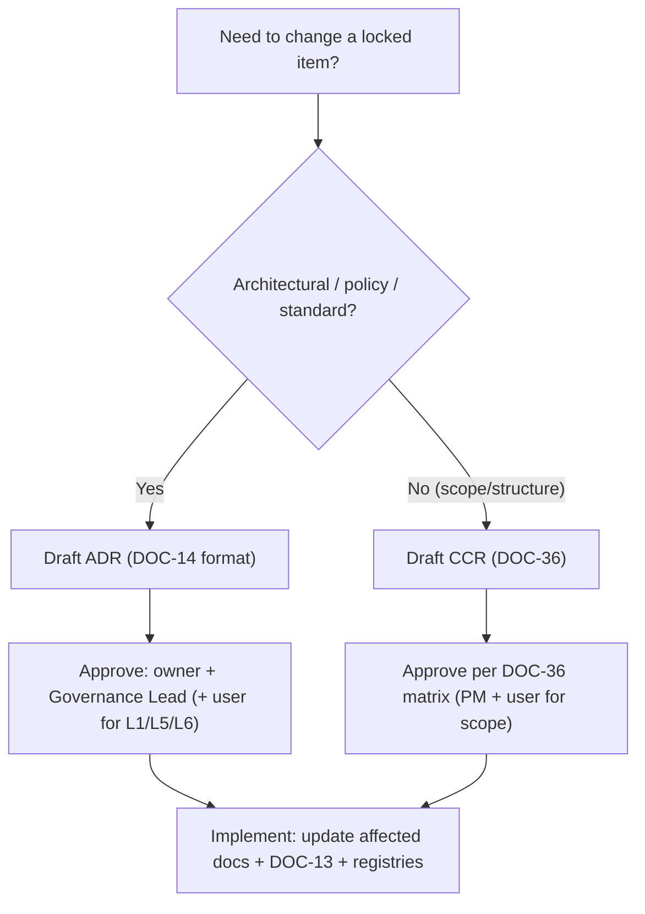

# POLICY_LOCK — Policy Lock

> **Document ID:** DOC-30 · **Status:** Active · **Owner:** Governance Lead (role)

| Field | Value |
|-------|-------|
| **Title** | Policy Lock |
| **Purpose** | Defines exactly what is now **frozen** in the foundation and must **not** be reinterpreted, weakened, or bypassed by future agents unless an explicit ADR (DOC-14) is created and approved. This document is the boundary between "settled decisions" and "open space". |
| **Owner** | Governance Lead (role) |
| **Version** | 1.0.0 |
| **Status** | Active (locked layer) |
| **Dependencies** | DOC-01…DOC-29 (the documents whose key provisions are locked), DOC-14 (ADR mechanism), DOC-36 (change control) |
| **Last Updated** | 2026-07-31 |
| **Review Cadence** | Yearly, or when an ADR changes a locked item (then this document is updated in the same change) |

## Table of Contents

- [1. Purpose & What "Locked" Means](#1-purpose--what-locked-means)
- [2. Lock Layers](#2-lock-layers)
- [3. Locked Items Register](#3-locked-items-register)
- [4. What Is NOT Locked](#4-what-is-not-locked)
- [5. How to Change a Locked Item](#5-how-to-change-a-locked-item)
- [6. Consequences of the Lock](#6-consequences-of-the-lock)
- [7. Update Rules (Mandatory)](#7-update-rules-mandatory)
- [Revision History](#revision-history)
- [Notes](#notes)
- [Cross References](#cross-references)

---

## 1. Purpose & What "Locked" Means

The foundation phase is now closed. The documents DOC-01…DOC-38 constitute the project's constitution. **"Locked"** means:

1. **Binding** — every future agent and human collaborator must operate within the locked provisions; they are the contract for all work.
2. **Non-reinterpretable** — an agent may not "interpret" a locked provision in a way that changes its meaning, scope, or threshold to fit a task. Ambiguity is resolved by asking the owner or the user — never by silent reinterpretation.
3. **Changeable only by explicit decision** — the sole legitimate change path is an **ADR** (DOC-14) or, for non-architectural scope changes, a **CCR** (DOC-36) approved by the designated authority. There is no "quick fix" path around the lock.

**Why this document exists:** the project is built by many agents with no shared memory. The lock prevents the slow erosion of decisions through thousands of small, plausible-sounding deviations (risk R-G-01).

## 2. Lock Layers

| Layer | Scope | Locked documents |
|-------|-------|------------------|
| L1 — Core identity | Mission, Arabic-first commitment, quality-first, outcome-based education | DOC-01 §1–§2 |
| L2 — Architecture invariants | Architecture principles (AP-1…10), modular-monolith decision, content-as-data, RTL-first, boundaries | DOC-02 §1, §6; ADR-001…006 |
| L3 — Curriculum skeleton | Stage/module/lesson **structure and IDs** (8 stages, 33 modules, 156 lessons), dependency graph, completion gates | DOC-03 §2–§15 |
| L4 — Standards | Content standards, assessment thresholds, design/accessibility minima | DOC-06 §8, DOC-07, DOC-08 §4–§6 |
| L5 — Governance | Agent rules, naming/ID formats, versioning policy, quality gates, memory model | DOC-10, DOC-16, DOC-24, DOC-25, DOC-20 |
| L6 — Phase contracts | Phase gate, first-phase scope, change control, release criteria | DOC-31, DOC-32, DOC-36, DOC-37 |

## 3. Locked Items Register

| Lock ID | Locked item | Layer | Change mechanism | Approving authority |
|---------|-------------|-------|------------------|---------------------|
| LCK-01 | Product is Arabic-first (UI + content in MSA; English secondary) | L1 | ADR | Governance Lead + user |
| LCK-02 | Premium, outcome-based positioning (DOC-01 §1, §6) | L1 | ADR | Governance Lead + user |
| LCK-03 | Modular monolith; no premature microservices (AP-4) | L2 | ADR | Lead Architect |
| LCK-04 | Content is data, never hard-coded (AP-3, ADR-006) | L2 | ADR | Lead Architect |
| LCK-05 | RTL-first with logical CSS properties (AP-2, ADR-003) | L2 | ADR | Lead Architect |
| LCK-06 | Curriculum skeleton: STG-01…08, 33 modules, 156 lessons, IDs immutable | L3 | CCP via CCR (DOC-36) | Curriculum Director + Governance Lead |
| LCK-07 | Completion gates and thresholds (DOC-03 §15, DOC-08 §4) | L3/L4 | ADR | Assessment Lead + Governance Lead |
| LCK-08 | Content production standards (DOC-07 templates, §3–§8) | L4 | ADR | Content Director + Governance Lead |
| LCK-09 | Assessment thresholds: 70% module, 75% stage, 80% final; rubric 1–4 | L4 | ADR (versioned per DOC-08 §4) | Assessment Lead |
| LCK-10 | WCAG 2.2 AA baseline (DOC-06 §8) | L4 | ADR | Design Lead + Governance Lead |
| LCK-11 | Ten binding agent rules (DOC-10 §2) | L5 | ADR | Governance Lead + user |
| LCK-12 | ID formats and naming (DOC-24) | L5 | ADR | Governance Lead |
| LCK-13 | Versioning policy (DOC-25) | L5 | ADR | Governance Lead |
| LCK-14 | Quality gates A…G (DOC-16) are blocking | L5 | ADR | Quality Lead + Governance Lead |
| LCK-15 | Phase gate and release criteria (DOC-31, DOC-37) | L6 | ADR | Project Manager + Governance Lead + user |
| LCK-16 | First production scope (DOC-32) | L6 | CCR (scope change) | Project Manager + user |
| LCK-17 | Change-control process itself (DOC-36) | L6 | ADR | Governance Lead |

**Note:** Locked items remain *documents*; they may evolve, but only through the explicit mechanisms in §5. Evolution through ADR is not "breaking the lock" — it is the lock's designed release valve.

## 4. What Is NOT Locked

The following are explicitly open and require no ADR to change (record via DOC-13 + normal document updates):

| Area | Why open |
|------|----------|
| Technology stack decisions (OPD-001…005) | Deliberately deferred to MS-07 (ADR-004) |
| Brand token values `[TBD]` (DOC-06) | Awaiting brand work (OPD-007) |
| DOC-08 `[TBD]` items (final-exam retake cap, AI-disclosure details) | Awaiting beta data |
| Effort estimates, durations, roadmap dates | Planning inputs; re-estimated at milestone start (DOC-09 §6) |
| Lesson content, exercises, quizzes (within DOC-03 skeleton + DOC-07 standards) | This is Phase 1's work |
| Media assets, presets, illustrations | Production artifacts per DOC-07 §6 |
| Checklist items in DOC-16 (additions only) | Can be strengthened without ADR; weakening requires ADR |
| Task board rows (DOC-11) | Operational; managed by PM |

## 5. How to Change a Locked Item

| Step | Action | Reference |
|------|--------|-----------|
| 1 | Identify the locked item and its lock ID (§3) | This document |
| 2 | Choose the mechanism: ADR (architecture/policy/standard) or CCR (scope/structure) | DOC-14 / DOC-36 |
| 3 | Get approval from the listed authority (§3) | — |
| 4 | Record: ADR in DOC-14 (or CCR in DOC-36), changelog entry in DOC-13 | DOC-14, DOC-36, DOC-13 |
| 5 | Propagate: update all affected documents + this register (§3) + MASTER_INDEX/DEPENDENCIES as needed | DOC-17, DOC-23 |
| 6 | Version bump per DOC-25 | DOC-25 |

**Approval floors:** L1 and L5 items require the user (Project Owner) as final approver. L2 requires the Lead Architect. L3/L4 require the domain owner. All lock changes require the Governance Lead's sign-off that the change record is complete.

## 6. Consequences of the Lock

1. **Foundation documents are not editable "because it's easier".** Every edit to a locked provision triggers §5 or is rejected.
2. **No agent may claim "the document is wrong" as license to work around it** — the correct response is a CCR/ADR proposal, or a task note flagging the issue.
3. **TASK-102 (independent baseline review) may recommend corrections**; corrections that alter locked provisions are processed through §5 (minor factual fixes go straight to DOC-13 as PATCH, per DOC-25).
4. **Violations** are recorded as task-board notes + risk entries (DOC-15), following DOC-10 escalation.

## 7. Update Rules (Mandatory)

1. This document changes only when: (a) an ADR/CCR modifies a locked item (then §3 is updated in the same change), or (b) a new lock is created.
2. Every change to this document requires a DOC-13 entry and a version bump (MAJOR for a lock change, MINOR for additions).
3. New lock layers or lock IDs are assigned by the Governance Lead; the numbering continues from LCK-18.
4. Any conflict between a locked provision and an older document statement is resolved in favor of the lock; the conflicting document is corrected.

---

## Revision History

| Version | Date | Author | Summary of Changes |
|---------|------|--------|--------------------|
| 1.0.0 | 2026-07-31 | Project Foundation Architect | Initial baseline (DOC-30): 17 locked items across 6 layers; change mechanisms; non-locked areas. |

## Notes

- The lock is a *commitment device*, not a bureaucracy: it exists because many independent agents cannot re-litigate settled decisions every session.
- When in doubt about whether something is locked, treat it as locked and open a CCR/ADR question — never silently proceed.

## Cross References

| Reference | Relationship |
|-----------|--------------|
| [DOC-14 Decision Log](14_DECISION_LOG.md) | ADR mechanism for lock changes |
| [DOC-36 CHANGE_CONTROL](CHANGE_CONTROL.md) | CCR mechanism for scope/structure changes |
| [DOC-13 Project Changelog](13_PROJECT_CHANGELOG.md) | Records every lock change |
| [DOC-10 Agent Rules](10_AGENT_RULES.md) | Rules the lock constrains |
| [DOC-37 RELEASE_CRITERIA](RELEASE_CRITERIA.md) | Foundation-complete criteria incl. lock compliance |
| [DOC-24 NAMING_CONVENTION](NAMING_CONVENTION.md) | Lock ID format (LCK-NN) |
