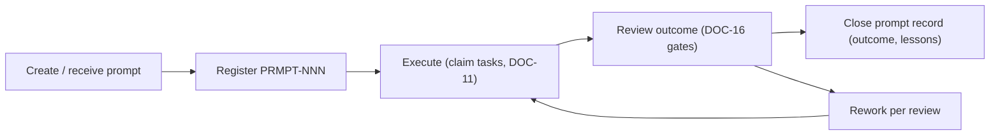

# PROMPTS — Prompt Registry

> **Document ID:** DOC-27 · **Status:** Active · **Owner:** Governance Lead (role)

| Field | Value |
|-------|-------|
| **Title** | Prompt Registry |
| **Purpose** | Defines how agent prompts are recorded, reviewed, and reused. Every significant prompt that produced project work gets a PRMPT-NNN record so that (a) the intent behind any work is recoverable, (b) proven prompt patterns are reused, and (c) prompt quality is reviewed like any other deliverable. |
| **Owner** | Governance Lead (role) |
| **Version** | 1.0.2 |
| **Status** | Active |
| **Dependencies** | DOC-11 (tasks a prompt produces), DOC-13 (changelog), DOC-26 (agent registry), DOC-24 (ID formats) |
| **Last Updated** | 2026-07-31 |
| **Review Cadence** | Prompt review at each milestone; registry maintained continuously |

## Table of Contents

- [1. Purpose](#1-purpose)
- [2. Prompt Lifecycle](#2-prompt-lifecycle)
- [3. Prompt Record Format](#3-prompt-record-format)
- [4. Prompt Registry](#4-prompt-registry)
- [5. Prompt Review Rules](#5-prompt-review-rules)
- [6. Update Rules (Mandatory)](#6-update-rules-mandatory)
- [Revision History](#revision-history)
- [Notes](#notes)
- [Cross References](#cross-references)

---

## 1. Purpose

Prompts are the instructions that drive agent work. They are **intellectual artifacts** — a well-structured prompt (clear mission, constraints, guardrails, output requirements) produces consistent, reviewable work; an unstructured one produces drift. This registry:

1. records every significant prompt (intent, scope, constraints, outcome),
2. defines the review criteria for prompts,
3. builds a library of proven patterns (e.g., the foundation prompt that produced DOC-01…29).

**Scope:** "significant" = any prompt that resulted in (or requested) repository changes, decisions, or deliverables. Trivial chat messages do not need records.

## 2. Prompt Lifecycle



| Phase | Action | Location |
|-------|--------|----------|
| Register | Record the prompt per §3 before or at execution start | This document |
| Execute | Work proceeds as tasks on the board | DOC-11 |
| Review | Outcome reviewed against DOC-16 gates + §5 criteria | DOC-16 + this document |
| Close | Outcome + lessons appended; record is final (append-only) | This document |

## 3. Prompt Record Format

```markdown
### PRMPT-NNN — <Short Title>
- **Date:** YYYY-MM-DD
- **Requester:** <human role / agent ID>
- **Executor:** <AGT-NNN or role>
- **Intent:** <what the prompt asked to achieve, 1–3 sentences>
- **Constraints / Guardrails:** <scope limits, prohibitions, non-goals>
- **Related tasks:** TASK-NNN, …
- **Outcome:** <result summary, link to deliverables>
- **Review result:** Passed / Returned (with date + reviewer)
- **Reusable pattern?:** yes/no — <what to reuse>
- **Lessons:** <what future prompters should learn>
```

**Full prompt text** is deliberately not duplicated here when it is very long; the record captures intent + constraints, and references the session/handover where the full text lives (HDO-NNN).

## 4. Prompt Registry

### PRMPT-001 — Documentation Foundation (Baseline)
- **Date:** 2026-07-31
- **Requester:** Project Owner (user)
- **Executor:** AGT-001 (Project Foundation Architect)
- **Intent:** Create the complete documentation and governance baseline for a premium Arabic-first Adobe Creative Academy: 16 documents (vision, architecture, curriculum skeleton, UI, database, design, content, assessment, roadmap, agent rules, tasks, handover, changelog, decisions, risks, quality), plus task management, handover system, changelog, decision log, risk register, and quality checklist.
- **Constraints / Guardrails:** Documentation only — no code, lessons, quizzes, UI, or databases; enterprise-grade Markdown; every document must carry a standard header block; numbers/IDs must be consistent.
- **Related tasks:** TASK-001…018
- **Outcome:** 16 documents + README + AGENTS.md + template + HDO-001 (see DOC-13 CHG-001).
- **Review result:** Passed (baseline self-verification; independent review = TASK-102)
- **Reusable pattern?:** yes — the "role + numbered deliverables + guardrails + output requirements" structure; the fixed header block for documents.
- **Lessons:** Explicit numeric claims must be verified programmatically; ID schemes early prevent cross-doc drift.

### PRMPT-002 — Operating Documents Extension (this change)
- **Date:** 2026-07-31
- **Requester:** Project Owner (user)
- **Executor:** AGT-001 (Project Foundation Architect)
- **Intent:** Extend the foundation with 13 project-operating documents (MASTER_INDEX, SYSTEM_MANIFEST, PROJECT_STATE, AI_MEMORY, KNOWLEDGE_BASE, LESSONS_INDEX, DEPENDENCIES, NAMING_CONVENTION, VERSIONING_POLICY, AGENT_REGISTRY, PROMPTS, OPEN_DECISIONS, CHECKPOINTS) that make the repository a true single source of truth; then update project-state and handover documents to mark the extension complete and leave notes for the next agent before Phase 1.
- **Constraints / Guardrails:** Same standard header block; no duplication of existing content; cross-link without breaking existing references; no lessons/content/code/SQL; do not merge anything.
- **Related tasks:** TASK-019…031
- **Outcome:** 13 operating documents (DOC-17…29), README/AGENTS updates, CHG-002, HDO-002. See DOC-13 CHG-002.
- **Review result:** Passed (baseline-style verification by AGT-001; independent review scheduled TASK-102)
- **Reusable pattern?:** yes — "registry documents" pattern (fixed format + status authority + update rules) and the mirror-snapshot pattern in PROJECT_STATE.
- **Lessons:** Registry documents must name their authority and update rules explicitly; snapshots must reference their source to avoid drift.

### PRMPT-003 — Foundation Closure & Phase-1 Authorization
- **Date:** 2026-07-31
- **Requester:** Project Owner (user)
- **Executor:** AGT-001 (Project Foundation Architect)
- **Intent:** Close the foundation phase properly: create the final governance layer (policy lock, phase gate, Phase-1 scope, baseline summary, startup checklist, review protocol, change control, release criteria, Phase-1 readme); update state/index/entry documents; mark the foundation complete and leave Phase 1 startable without ambiguity.
- **Constraints / Guardrails:** Documentation only; no lessons/content/code/SQL; no merge; standard header block; cross-links without breaking existing references; mark foundation complete and update changelog + handover.
- **Related tasks:** TASK-033…041
- **Outcome:** 9 closure documents (DOC-30…38), ADR-009 (OPD-006 resolved), GATE-F1 PASS, CHKPT-003, CHG-003, HDO-003; Phase 1 eligible.
- **Review result:** Passed (baseline-style verification by AGT-001; independent review scheduled TASK-102)
- **Reusable pattern?:** yes — the "gate + criteria + scope + entry point" quartet (DOC-31/37/32/38) as the standard phase-transition kit.
- **Lessons:** Phase transitions need a gate record (not just a status flip); the policy lock must be written *before* the gate passes, so "locked" is never retroactive.

### PRMPT-004 — P1-A Pilot Content Production
- **Date:** 2026-07-31
- **Requester:** Project Owner (user)
- **Executor:** AGT-002 (Phase 1 Content Producer)
- **Intent:** Produce the first approved production slice P1-A (STG-01 + MOD-0201 + MOD-0202 = 28 lessons) with full lesson content per lesson ID, title, goals, explanation, exercise, mini assignment, quiz questions, answer key, resources, time, prerequisites, completion status — Arabic-first, beginner-friendly, motivating; register lessons, update state/handover/changelog; mark completion; leave next-agent notes.
- **Constraints / Guardrails:** Scope = P1-A only; no UI/backend/SQL; no foundation-doc changes except status/registries/handover/changelog; obey PHASE_1_README/SCOPE + AGENT_STARTUP_CHECKLIST + DOC-07/08.
- **Related tasks:** TASK-103
- **Outcome:** 28 lessons + 6 module quizzes + STG-01 exam + placement + project/rubric in `content/` (37 files); LESSONS_INDEX 28 rows In review; CHG-004; HDO-004; state/registries updated.
- **Review result:** Producer self-review passed (DOC-16 Gates B/D/E); **awaiting Content Director review** (DOC-35 C-1).
- **Reusable pattern?:** yes — the 12-element lesson template (ID/title/goals/explanation/exercise/mini-assignment/quiz/answers/resources/time/prereqs/status) + per-module quiz pool (16 items) + rubric-graded stage project.
- **Lessons:** (1) Arabic-first lesson anatomy per DOC-07 §3 works well at scale; (2) quiz pools of 2× per DOC-07 §5.3 are feasible per module; (3) appVersion must be declared per lesson and re-verified at media production.

> Next records (PRMPT-005+) will be added for follow-up content-production prompts (MS-03+), platform prompts (MS-07/08), etc.

## 5. Prompt Review Rules

| # | Rule |
|---|------|
| 5.1 | Every PRMPT record is reviewed when its work is verified (DOC-16): intent vs outcome must match; mismatches are analyzed and recorded. |
| 5.2 | Prompt quality criteria: clear mission, explicit non-goals, named standards to follow, defined output format, defined review gate. A prompt failing these criteria is marked for improvement in its record. |
| 5.3 | Reusable patterns are promoted to a "prompt pattern library" note in §4 or DOC-21 (KBE) — never stored only in an agent's context. |
| 5.4 | Prompt records are append-only; corrections add entries. |
| 5.5 | Prompts that produce repeated defects are escalated to Governance Lead for pattern revision (recorded in DOC-13). |

## 6. Update Rules (Mandatory)

1. Register a PRMPT record before executing significant work (or immediately after receiving the instruction).
2. Every PRMPT record links its related tasks (DOC-11) and outcome deliverables; the closing entry happens at task verification.
3. Records use the §3 format; ID format per DOC-24 (`PRMPT-\d{3}`).
4. Registry structure changes require Governance Lead approval + DOC-13 entry + version bump (DOC-25).

---

## Revision History

| Version | Date | Author | Summary of Changes |
|---------|------|--------|--------------------|
| 1.0.2 | 2026-07-31 | AGT-002 | PRMPT-004 added (P1-A pilot content production, CHG-004). |
| 1.0.1 | 2026-07-31 | Project Foundation Architect | PRMPT-003 added (foundation closure, CHG-003). |
| 1.0.0 | 2026-07-31 | Project Foundation Architect | Initial baseline (DOC-27): lifecycle, record format, PRMPT-001/002, review rules. |

## Notes

- This registry focuses on intent and constraints, not verbatim transcripts — full prompt text lives in session context/handovers (HDO-NNN).
- The two seed records document the foundation prompts; production prompts will dominate the registry from MS-02 onward.

## Cross References

| Reference | Relationship |
|-----------|--------------|
| [DOC-10 Agent Rules](10_AGENT_RULES.md) | Rules prompts must embed |
| [DOC-11 Task Management](11_TASK_MANAGEMENT.md) | Tasks produced by prompts |
| [DOC-16 Quality Checklist](16_QUALITY_CHECKLIST.md) | Outcome review gates |
| [DOC-26 AGENT_REGISTRY](AGENT_REGISTRY.md) | Executor identity |
| [DOC-24 NAMING_CONVENTION](NAMING_CONVENTION.md) | PRMPT ID format |
