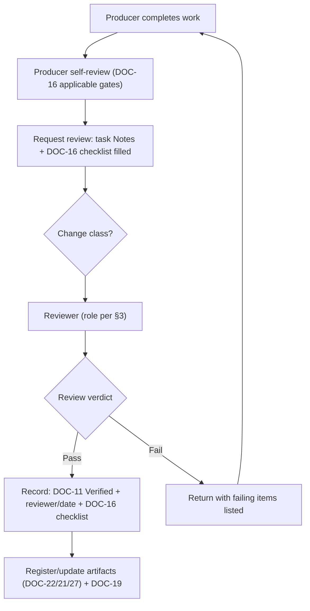

# REVIEW_PROTOCOL — Review Protocol

> **Document ID:** DOC-35 · **Status:** Active · **Owner:** Quality Lead (role)

| Field | Value |
|-------|-------|
| **Title** | Review Protocol |
| **Purpose** | Defines the review flow for all change classes: foundation changes, Phase 1 content changes, and future content changes (and, by extension, platform changes). It assigns reviewers, defines producer/reviewer separation, sets turnaround targets, and specifies how review outcomes are recorded. It implements ADR-009 (review model). |
| **Owner** | Quality Lead (role) |
| **Version** | 1.0.0 |
| **Status** | Active |
| **Dependencies** | DOC-16 (quality gates A…G), DOC-14 (ADR-009), DOC-11 (verification workflow), DOC-36 (change control), DOC-29 (checkpoints) |
| **Last Updated** | 2026-07-31 |
| **Review Cadence** | Quarterly; protocol changes via CCR/ADR |

## Table of Contents

- [1. Purpose & Model](#1-purpose--model)
- [2. Roles & Separation of Duties](#2-roles--separation-of-duties)
- [3. Change Classes & Review Paths](#3-change-classes--review-paths)
- [4. Review Flow (Generic)](#4-review-flow-generic)
- [5. Class-Specific Requirements](#5-class-specific-requirements)
- [6. Turnaround Targets & Sampling](#6-turnaround-targets--sampling)
- [7. Disputes & Escalation](#7-disputes--escalation)
- [8. Recording Review Outcomes](#8-recording-review-outcomes)
- [9. Update Rules (Mandatory)](#9-update-rules-mandatory)
- [Revision History](#revision-history)
- [Notes](#notes)
- [Cross References](#cross-references)

---

## 1. Purpose & Model

Every change to the repository passes through a defined review. This protocol ensures:

1. **Independence** — the reviewer of a change is never its producer (ADR-009).
2. **Proportionality** — review depth matches change class (§3).
3. **Traceability** — every review outcome is recorded with the reviewer's identity and date.
4. **Speed** — turnaround targets keep multi-agent production moving (§6).

**Model:** producer → self-review (DOC-16) → reviewer (role owner, distinct from producer) → outcome recorded (DOC-11 verification + DOC-16 checklist) → disputes escalate to Quality Lead.

## 2. Roles & Separation of Duties

| Role | Acts as | May not |
|------|---------|---------|
| Producer | The agent/entity that made the change | Review its own change (except self-review) |
| Reviewer | The role owner for the change class (§3) | Review work it produced; review without applying the DOC-16 checklist |
| Quality Lead | Protocol owner, dispute arbiter, sampling | Skip the protocol for its own changes |
| Governance Lead | Protocol governance, documentation compliance | Approve its own doc changes alone (needs second reviewer) |
| Project Manager | Task-verification coordinator | Verify its own tasks without a second reviewer |

**Independence rule (ADR-009 §3):** if only one agent is available, it may self-review **only** with explicit user approval and a note in DOC-13; the work is then flagged for independent re-review (like TASK-102).

## 3. Change Classes & Review Paths

| Class | Definition | Review path | Reviewer | Depth |
|-------|-----------|-------------|----------|-------|
| **F-1 Foundation change** | Edit to DOC-01…38 (docs only) | Self-review → reviewer → gate G; locked items additionally via CCR/ADR (DOC-30 §5) | Governance Lead (docs) + domain owner (blueprints) | Full DOC-16 applicable gates |
| **C-1 Phase-1 content** | New/edited lesson, exercise, quiz, rubric, exam within DOC-32 scope | Self-review → Gate B/E → Gate D/G | Content Director + Assessment Lead (quizzes/rubrics) + A11y (media) | Full content gates |
| **C-2 Future content** | Content beyond P1-A (STG-03…08 etc., at their milestones) | Same as C-1 (gates may be extended per milestone) | Content Director + domain owners | Full content gates |
| **P-1 Platform change** | Code, schema, integrations (MS-07+) | Full gates A/C/D/E/F/G (defined at MS-07) | Lead Architect + UX + Data + A11y | Full |
| **G-1 Governance change** | Rules, naming, versioning, review/change-control docs | Self-review → Governance Lead + domain owner; user for L1/L5/L6 (DOC-30) | Governance Lead + user (as needed) | Full |

## 4. Review Flow (Generic)

| Step | Actor | Detail |
|------|-------|--------|
| 4.1 | Producer | Fills the DOC-16 §10 matrix rows applicable to the deliverable |
| 4.2 | Producer | Marks task `Completed`, requests review, assigns reviewer per §3 |
| 4.3 | Reviewer | Executes applicable gates; checks DOC-10 §7 DoD (incl. changelog, docs, handover) |
| 4.4 | Reviewer | Verdict + evidence; updates DOC-11 Verification Status (`Passed` / `Failed — returned`) |
| 4.5 | Producer | On failure: rework, then re-submit (new cycle) |

## 5. Class-Specific Requirements

### 5.1 Foundation changes (F-1)
- PATCH-level fixes (typos, links): single reviewer (Governance Lead), no ADR needed; recorded in DOC-13.
- MINOR/MAJOR changes touching locked items: CCR (DOC-36) or ADR (DOC-14) **before** implementation; reviewer checks the change record exists.
- Revision History newest-first and version bump are part of the review checklist (DOC-25).

### 5.2 Phase-1 content (C-1)
- Every lesson unit reviewed for: DOC-07 anatomy (§3), quiz rules (§5), rubric alignment (DOC-08 §6), reproducibility against declared Adobe version, media licensing (ADR-007), accessibility (DOC-07 §9).
- Rubric-graded artifacts (stage project, exam) reviewed by Assessment Lead; rubric anchors must exist before grading starts (DOC-08 §8).
- Review evidence links the DOC-22 lesson row status (`In review → Published`).

### 5.3 Future content (C-2) and platform (P-1)
- Same protocol; P-1 additionally requires the MS-07-defined implementation checklist and DOC-16 Gate F (scalability).

### 5.4 Governance changes (G-1)
- Requires a CCR or ADR, and review by the Governance Lead plus the affected domain owner; L1/L5/L6 (DOC-30) additionally require user approval.

## 6. Turnaround Targets & Sampling

| Class | Review turnaround target | Sampling |
|-------|--------------------------|----------|
| F-1 docs (PATCH) | ≤ 1 working day | 100% |
| F-1 docs (MINOR/MAJOR) | ≤ 3 working days | 100% |
| C-1 content unit | ≤ 72 h per unit | 100% of quiz/rubric items; 10% double-review by Content Director |
| C-2 future content | Per batch plan (MS-03…06) | Per batch plan |
| P-1 platform | Per MS-07 definition | Per MS-07 definition |

**Quality Lead sampling:** monthly, sample ≥ 3 reviewed items per reviewer for grading consistency (DOC-08 §8); calibration results feed DOC-15.

## 7. Disputes & Escalation

| Dispute | First step | Escalate to | Final |
|---------|-----------|-------------|-------|
| Producer disagrees with reviewer verdict | Re-submit with rebuttal notes in task Notes | Quality Lead | Governance Lead + user |
| Reviewer conflict of interest | Reassign reviewer (PM) | Quality Lead | — |
| Protocol ambiguity | Interpret per §1–§3; record interpretation | Governance Lead | User (if lock-adjacent) |

**Rule:** a dispute never stalls production silently — the task stays `In Progress`/`Blocked` with the dispute visible in Notes (DOC-11).

## 8. Recording Review Outcomes

| Record | Location | Content |
|--------|----------|---------|
| Task verification | DOC-11 (Verification Status, Reviewer, date) | Passed / Failed — returned |
| Gate checklists | DOC-16 (filled by reviewer, linked from task Notes) | Per-gate item results |
| Content status | DOC-22 (lesson row) | In review → Published |
| Checkpoint | DOC-29 (CHKPT-NNN) | Milestone/phase-level review |
| Changelog | DOC-13 | The change + its review evidence |

## 9. Update Rules (Mandatory)

1. Protocol changes require a CCR/ADR (locked L6, DOC-30 LCK-15); MINOR additions (new classes) allowed via CCR with Quality Lead approval.
2. Every change recorded in DOC-13 with version bump (DOC-25).
3. ADR-009 (DOC-14) remains the authority for the review model; this document is its operating detail.

---

## Revision History

| Version | Date | Author | Summary of Changes |
|---------|------|--------|--------------------|
| 1.0.0 | 2026-07-31 | Project Foundation Architect | Initial baseline (DOC-35): roles & separation, 5 change classes, generic flow, class-specific requirements, turnaround/sampling, disputes. |

## Notes

- Review is a quality investment, not a bottleneck: the §6 targets are commitments to keep production flowing.
- Independence (producer ≠ reviewer) is the single most important rule — it is what makes DOC-16 gates trustworthy.

## Cross References

| Reference | Relationship |
|-----------|--------------|
| [DOC-16 Quality Checklist](16_QUALITY_CHECKLIST.md) | Gates executed by reviewers |
| [DOC-14 Decision Log](14_DECISION_LOG.md) | ADR-009 (review model authority) |
| [DOC-11 Task Management](11_TASK_MANAGEMENT.md) | Verification workflow |
| [DOC-36 CHANGE_CONTROL](CHANGE_CONTROL.md) | Change classes ↔ approval paths |
| [DOC-22 LESSONS_INDEX](LESSONS_INDEX.md) | Content status transitions |
| [DOC-30 POLICY_LOCK](POLICY_LOCK.md) | Lock boundaries for review |
